

  

# **Universidad Peruana de Ciencias Aplicadas**
## Carrera de Ingeniería de Software

Ciclo: 2024 - 1

Curso: Aplicaciones Web

Sección: SW53

Profesor: Alex Humberto Sánchez Ponce

“Informe de Trabajo Final”

Startup: CargoWatch

Producto: CargoApp

|          Integrantes          |      Código      |
|:-----------------------------:|:-------------------:|
|   Delgado Corrales, Piero Gonzalo   |    U202210749    |
|  Matos Fernandez, Christian Andre   |    U202214162    |
|   Paredes Puente, Sebastián Roberto  |    U202217239    |
|  Salinas Torres, Salvador Antonio   |    U20221B127    |
|   Valverde Mozo, Andre Gabriel   |    U202218899    |

Abril 2024

<table>
  <thead>
    <tr>
        <th>Versión</th>
        <th>Fecha</th>
        <th>Autor</th>
        <th>Descripción de modificación</th>
    </tr>
  </thead>
  <tbody>
  <tr>
      <td><strong>TB1</strong></td>
      <td>Miércoles 10 de Abril</td>
      <td>
        <ul>
          <li>Delgado Corrales, Piero Gonzalo</li>
          <li>Matos Fernandez, Christian Andre</li>
          <li>Paredes Puente, Sebastián Roberto</li>
          <li>Salinas Torres, Salvador Antonio</li>
          <li>Valverde Mozo, Andre Gabriel</li>
        </ul>
      </td>
      <td>
        Se han incluído los siguientes capítulos:
        <ul>
          <li>Capítulo I: Introducción</li>
          <li>Capítulo II: Requirements Elicitation & Analysis</li>
          <li>Capítulo III: Requirements Specification</li>
          <li>Capítulo IV: Product Design</li>
          <li>Avance del Capítulo V: Product Implementation, Validation & Deployment hasta el punto 5.2.1.8</li>
          <li>Avance de Conclusiones, Bibliografía y Anexos</li>
        </ul>
      </td>
  </tr>
  </tbody>
</table>

# **Project Report Collaboration Insights**
URL Project Report (Github): [https://github.com/Grupo-2-Apps-Web/Project-Report](https://github.com/Grupo-2-Apps-Web/Project-Report)

# **Tabla de Contenido**

- [Registro de Versiones](#registro-de-versiones)
- [Student Outcome](#student-outcome)
- [Capítulo I: Introducción](#Capítulo-I-Introducción)
  - [1.1. Startup Profile](#11-startup-profile)
    - [1.1.1. Descripción de la Startup](#111-descripción-de-la-startup)
    - [1.1.2. Perfiles de integrantes del equipo](#112-perfiles-de-integrantes-del-equipo)
  - [1.2. Solution Profile](#12-solution-profile)
    - [1.2.1. Antecedentes y problemática](#121-antecedentes-y-problemática)
    - [1.2.2. Lean UX Process](#122-lean-ux-process)
      - [1.2.2.1. Lean UX Problem Statements](#1221-lean-ux-problem-statements)
      - [1.2.2.2. Lean UX Assumptions](#1222-lean-ux-assumptions)
      - [1.2.2.3. Lean UX Hypothesis Statements](#1223-lean-ux-hypothesis-statements)
      - [1.2.2.4. Lean UX Canvas](#1224-lean-ux-canvas)
  - [1.3. Segmentos objetivo](#13-segmentos-objetivo)
- [Capítulo II: Requirements Elicitation & Analysis](#Capítulo-II-Requirements-Elicitation--Analysis)
  - [2.1. Competidores](#21-competidores)
    - [2.1.1. Análisis competitivo](#211-análisis-competitivo)
    - [2.1.2. Estrategias y tácticas frente a competidores](#212-estrategias-y-tácticas-frente-a-competidores)
  - [2.2. Entrevistas](#22-entrevistas)
    - [2.2.1. Diseño de entrevistas](#221-diseño-de-entrevistas)
    - [2.2.2. Registro de entrevistas](#222-registro-de-entrevistas)
    - [2.2.3. Análisis de entrevistas](#223-análisis-de-entrevistas)
  - [2.3. Needfinding](#23-needfinding)
    - [2.3.1. User Personas](#231-user-personas)
    - [2.3.2. User Task Matrix](#232-user-task-matrix)
    - [2.3.3. User Journey Mapping](#233-user-journey-mapping)
    - [2.3.4. Empathy Mapping](#234-empathy-mapping)
    - [2.3.5. As-is Scenario Mapping](#235-as-is-scenario-mapping)
  - [2.4. Ubiquitous Language](#23-ubiquitous-language)
- [Capítulo III: Requirements Specification](#Capítulo-III-Requirements-Specification)
  - [3.1. To-Be Scenario Mapping](#31-to-be-scenario-mapping)
  - [3.2. User Stories](#32-user-stories)
  - [3.3. Impact Mapping](#33-impact-mapping)
  - [3.4. Product Backlog](#34-product-backlog)
- [Capítulo IV: Product Design](#Capítulo-IV-Product-Design)
  - [4.1. Style Guidelines](#41-style-guidelines)
    - [4.1.1. General Style Guidelines](#411-general-style-guidelines)
    - [4.1.2. Web Style Guidelines](#412-web-style-guidelines)
  - [4.2. Information Architecture](#42-information-architecture)
    - [4.2.1. Organization Systems](#421-organization-systems)
    - [4.2.2. Labeling Systems](#422-labeling-systems)
    - [4.2.3. SEO Tags and Meta Tags](#423-seo-tags-and-meta-tags)
    - [4.2.4. Searching Systems](#424-searching-systems)
    - [4.2.5. Navigation Systems](#425-navigation-systems)
  - [4.3. Landing Page UI Design](#43-landing-page-ui-design)
    - [4.3.1. Landing Page Wireframe](#431-landing-page-wireframe)
    - [4.3.2. Landing Page Mock-up](#432-landing-page-mock-up)
  - [4.4. Web Applications UX/UI Design](#44-web-applications-uxui-design)
    - [4.4.1. Web Applications Wireframes](#441-web-applications-wireframes)
    - [4.4.2. Web Applications Wireflow Diagrams](#442-web-applications-wireflow-diagrams)
    - [4.4.3. Web Applications Mock-ups](#443-web-applications-mock-ups)
    - [4.4.4. Web Applications User Flow Diagrams](#444-web-applications-user-flow-diagrams)
  - [4.5. Web Applications Prototyping](#45-web-applications-prototyping)
  - [4.6. Domain-Driven Software Architecture](#46-domain-driven-software-architecture)
    - [4.6.1. Software Architecture Context Diagram](#461-software-architecture-context-diagram)
    - [4.6.2. Software Architecture Container Diagrams](#462-software-architecture-container-diagrams)
    - [4.6.3. Software Architecture Components Diagrams](#463-software-architecture-components-diagrams)
  - [4.7. Software Object-Oriented Design](#47-software-object-oriented-design)
    - [4.7.1. Class Diagrams](#471-class-diagrams)
    - [4.7.2. Class Dictionary](#472-class-dictionary)
  - [4.8. Database Design](#48-database-design)
    - [4.8.1. Database Diagram](#481-database-diagram)
- [Capítulo V: Product Implementation, Validation & Deployment](#Capítulo-V-Product-Implementation-Validation--Deployment)
  - [5.1. Software Configuration Management](#51-software-configuration-management)
    - [5.1.1. Software Development Environment Configuration](#511-software-development-environment-configuration)
    - [5.1.2. Source Code Management](#512-source-code-management)
    - [5.1.3. Source Code Style Guide & Conventions](#513-source-code-style-guide--conventions)
    - [5.1.4. Software Deployment Configuration](#514-software-deployment-configuration)
  - [5.2. Landing Page, Services & Applications Implementation](#52-landing-page-services--applications-implementation)
    - [5.2.1. Sprint n](#521-sprint-n)
      - [5.2.1.1. Sprint Planning n](#5211-sprint-planning-n)
       -[5.2.1.2. Sprint Backlog n](#5212-sprint-backlog-n)
      - [5.2.1.3. Development Evidence for Sprint Review](#5213-development-evidence-for-sprint-review)
      - [5.2.1.4. Testing Suite Evidence for Sprint Review](#5214-testing-suite-evidence-for-sprint-review)
      - [5.2.1.5. Execution Evidence for Sprint Review](#5215-execution-evidence-for-sprint-review)
      - [5.2.1.6. Services Documentation Evidence for Sprint Review](#5216-services-documentation-evidence-for-sprint-review)
      - [5.2.1.7. Software Deployment Evidence for Sprint Review](#5217-software-deployment-evidence-for-sprint-review)
      - [5.2.1.8. Team Collaboration Insights during Sprint](#5218-team-collaboration-insights-during-sprint)
  - [5.3. Validation Interviews](#53-validation-interviews)
    - [5.3.1. Diseño de Entrevistas](#531-diseño-de-entrevistas)
    - [5.3.2. Registro de Entrevistas](#532-registro-de-entrevistas)
    - [5.3.3. Evaluaciones según heurísticas](#533-evaluaciones-según-heurísticas)
  - [5.4. Video About-the-Product](#54-video-about-the-product)
- [Conclusiones](#conclusiones)
  - [Conclusiones y recomendaciones](#conclusiones-y-recomendaciones)
- [Video About-the-Team](#video-about-the-team)
- [Bibliografía](#bibliografía)
- [Anexos](#anexos)

# Capítulo I Introducción
## 1.1 Startup Profile
### 1.1.1 Descripción de la Startup

CargoWatch es una startup dedicada a abordar los desafíos de transparencia y eficiencia en el transporte de carga para empresas. Nuestro producto CargoApp resuelve la falta de visibilidad y transparencia en el proceso logístico al proporcionar seguimiento en tiempo real de la ubicación y estado de la carga durante el transporte.

**Misión:**

En CargoWatch, nuestra misión es brindar transparencia y confianza a través de nuestra plataforma. Buscamos simplificar y optimizar las operaciones logísticas para nuestros clientes, permitiéndoles gestionar sus envíos de manera eficiente y segura.

**Visión:**

Nuestra visión es liderar la innovación tecnológica en seguimiento de transporte de carga, siendo reconocidos por nuestra innovación, confiabilidad y compromiso con la excelencia en el servicio.

  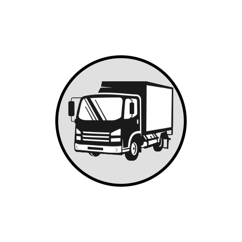

### 1.1.2 Perfiles de integrantes del equipo

<table>
  <tr>
    <td valign="top" width="450px">
      
<strong>Delgado Corrales, Piero Gonzalo (U202210749)</strong> Estoy cursando el quinto ciclo de la carrera de Ingeniería de Software. Entre mis habilidades técnicas está la programación en lenguaje C++, un conocimiento variado de estructuras de datos y sus aplicaciones. Del mismo modo, el último ciclo he aprendido sobre diseño de páginas web mediante el uso de HTML y CSS, y herramientas como Figma. Soy una persona responsable e intento mantener una buena organización para gestionar las entregas de trabajos eficientemente.

    </td>
    <td height="200px" align="center">
      
    </td>
  </tr>
  <tr>
    <td>
      
<strong>Salinas Torres, Salvador Antonio (U20221B127)</strong> Soy estudiante de quinto ciclo de la carrera de Ingeniería de Software. Poseo conocimientos en programación orientada a objetos en C++ y Python, desarrollo web usando HTML, CSS y JavaScript, y gestión de base de datos en SQL Server. Considero que soy una persona responsable y siempre organizo el tiempo para hacerlos tranquilamente antes de la fecha de entrega.

    </td>
    <td height="200px" align="center">
      
    </td>
  </tr>
  <tr>
    <td>
      
<strong>Paredes Puente, Sebastián Roberto (U202217239)</strong> Mi nombre es Sebastian Roberto Paredes Puente, soy estudiante de ingeniería de software en la UPC. Dentro de mis habilidades se encuentran el analizar información, programar en lenguaje C++, además, he cursado cursos de programación con el lenguaje de Python, SQL server y HTML. Con respecto a mis habilidades blandas, poseo adaptabilidad, pensamiento creativo, trabajo en equipo, gestión del tiempo y capacidad analítica para la resolución de problemas. Me considero una persona responsable con respecto a diversos trabajos grupales; además, tengo puntualidad a la hora de entregar trabajos y/o proyectos.

    </td>
    <td height="200px" align="center">
      
    </td>
  </tr>
  <tr>
    <td>
      
<strong>Matos Fernandez, Christian Matos (U202217239)</strong> Me llamo Christian Matos, y estoy en mi quinto ciclo de Ingeniería de Software. Poseo experiencia en programación en lenguajes como Python, C++, y JavaScript. Disfruto contribuir con mis habilidades y trabajar en equipo para alcanzar nuestros objetivos comunes.

    </td>
    <td height="200px" align="center">
      
    </td>
  </tr>
  <tr>
    <td>
      
<strong>Valverde Mozo, Andre Gabriel (U202218899)</strong> Mi perfil se basa en ser alguien que busca soluciones creativas a todo problema, todo es posible al fin y al cabo. Considero que tengo una buena capacidad de análisis de problemas y un pensamiento rápido en dichos casos. Me encanta todo lo que es la programación ya que es una forma de arte para mi, solo que lo puedo hacer realidad frente a mis ojos.

    </td>
    <td height="200px" align="center">
      
    </td>
  </tr>
</table>

## 1.2. Solution Profile

### 1.2.1 Antecedentes y problemática

En el ámbito del transporte de carga para empresas, se observa una creciente demanda de incrementar la transparencia y eficiencia en las operaciones logísticas. Sin embargo, los proveedores de servicios de transporte se enfrentan a desafíos considerables al intentar ofrecer evidencia de carga y seguimiento en tiempo real de las unidades de transporte, lo que puede resultar en inquietudes y desconfianza por parte de los clientes.

5 “W”s + 2 "H"'s

**WHAT (QUÉ)**
- **¿Cual es el problema?**  
  El problema radica en la falta de transparencia y visibilidad en el proceso de transporte de carga, lo que conduce a malentendidos, desconfianza y preocupaciones por parte de los clientes. Los proveedores de servicios de transporte y sus clientes enfrentan dificultades para obtener información actualizada y precisa sobre la ubicación y el estado de la carga durante el transporte. Esto puede generar una gestión ineficiente de la cadena de suministro, afectar la satisfacción del cliente y obstaculizar la comunicación efectiva entre ambas partes.
  
- **¿Cuál es la relación con la persona en cuestión?**  
  La relación con la persona en cuestión está determinada por su papel en el proceso de transporte de carga. Si actúa como proveedor de servicios de transporte, su relación es directa con la eficiencia y transparencia en la entrega de mercancías. Si es cliente, depende de esa transparencia para asegurar la entrega oportuna y en buenas condiciones de sus productos. La falta de transparencia afecta directamente la relación entre proveedores y clientes, pudiendo generar gestión deficiente de la cadena de suministro e insatisfacción del cliente.

**WHEN (CUÁNDO)**
- **¿Cuándo sucede el problema?**  
  El problema de falta de transparencia y visibilidad en el proceso de transporte de carga puede surgir en cualquier momento durante el transporte, desde la carga inicial de la mercancía hasta su entrega final. Este problema puede manifestarse en diferentes etapas del proceso de transporte, lo que incluye la falta de información sobre la ubicación y el estado de la carga en tiempo real, así como la incapacidad para acceder a datos precisos sobre los gastos asociados y los tiempos de entrega estimados.
  
- **¿Cuando utiliza el cliente el producto?**  
  El cliente utiliza el producto, la aplicación de seguimiento de transporte de carga, para monitorear en tiempo real la ubicación y el estado de su carga durante el transporte, así como para revisar los registros de gastos asociados y comunicarse con el proveedor de servicios de transporte.

**WHERE (DÓNDE)**
- **¿Dónde está el cliente cuando usa el producto?**  
  El cliente puede usar el producto, la aplicación de seguimiento de transporte de carga, desde cualquier lugar donde tenga acceso a un dispositivo móvil o una computadora con conexión a internet. Esto puede ser en su oficina, en su hogar, o incluso mientras está en movimiento, permitiéndole monitorear el transporte de su carga desde cualquier ubicación conveniente para él.
  
- **¿A dónde se dirige?**  
  El cliente se dirige a la aplicación de seguimiento de transporte de carga para obtener información en tiempo real sobre el progreso y la ubicación de su carga durante el transporte. La aplicación le proporciona la visibilidad necesaria para monitorear el estado de su mercancía y tomar decisiones informadas sobre la gestión de la cadena de suministro, asegurando una entrega oportuna y eficiente.
  
- **¿Dónde surge el problema?**  
  El problema surge en el proceso de interacción entre proveedores de transporte y clientes, donde la comunicación y la visibilidad son clave.

**WHO (QUIÉN)**
- **¿Quienes están involucrados?**  
  Los involucrados incluyen a los proveedores de servicios de transporte de carga, que son responsables de la entrega de la mercancía, y a los clientes que envían o reciben las mercancías a través de estos servicios.
  
- **¿A quienes les sucede el problema?**  
  El problema de falta de transparencia y visibilidad en el proceso de transporte de carga afecta tanto a los proveedores de servicios de transporte como a sus clientes.
  
- **¿Quién lo utilizará?**  
  El producto, la aplicación de seguimiento de transporte de carga, será utilizado tanto por proveedores de servicios de transporte como por sus clientes.

**WHY (PORQUÉ)**
- **¿Cuál es la causa del problema?**  
  La causa del problema radica en la falta de herramientas efectivas para proporcionar transparencia y visibilidad en el proceso de transporte de carga, lo que dificulta la comunicación y la toma de decisiones informadas tanto para los proveedores de servicios de transporte como para sus clientes.
**HOW (CÓMO)**
- **¿Cómo nos conocieron los compradores?**  
  Los compradores pueden conocer el producto a través de diversos canales, como recomendaciones de otros clientes, publicidad en línea, marketing en redes sociales, búsquedas en internet, participación en eventos de la industria o mediante asociaciones con empresas de transporte de carga.
  
- **¿Cómo prefieren los clientes acceder a nuestro contenido?**  
  Los clientes prefieren acceder al contenido a través de una aplicación móvil intuitiva y fácil de usar, que les permita monitorear en tiempo real el progreso del transporte de carga, revisar los registros de gastos y comunicarse con los proveedores de servicios de transporte de manera conveniente desde sus dispositivos móviles.
  
- **¿Que llevó a la persona a llegar a esta situación?**  
  La falta de transparencia y visibilidad en el transporte de carga puede ser el resultado de herramientas de comunicación y seguimiento inadecuadas entre proveedores y clientes.

**HOW MUCH (CUÁNTO)**
- **¿Cuánto presupuesto se necesita para realizar el proyecto?**  
  Determinar el presupuesto exacto requerido para el proyecto de seguimiento de transporte de carga dependerá de varios factores, como el alcance del desarrollo de la aplicación, la complejidad de las características requeridas, los costos de desarrollo de software, integración de tecnologías de seguimiento, mantenimiento continuo y otros gastos asociados. Sería necesario realizar un análisis detallado del proyecto para estimar con precisión el presupuesto necesario.

### 1.2.2 Lean UX Process.

#### 1.2.2.1. Lean UX Problem Statements.

En el sector de transporte de carga para empresas, existe una necesidad creciente de mejorar la transparencia y eficiencia en las operaciones logísticas. Actualmente, los proveedores de servicios de transporte enfrentan desafíos significativos para proporcionar evidencia de carga y seguimiento en tiempo real de las unidades de transporte, lo que puede generar preocupaciones y desconfianza por parte de los clientes.

Los clientes de los proveedores de servicios de transporte carecen de visibilidad sobre el estado y la ubicación de sus envíos durante el proceso de transporte de carga. La falta de información en tiempo real sobre el recorrido de las unidades de transporte y los gastos asociados puede resultar en preocupaciones, incertidumbre y falta de confianza en el servicio proporcionado. Esta falta de transparencia y visibilidad puede conducir a una experiencia del cliente insatisfactoria, aumentar el riesgo de disputas y reclamaciones, y afectar negativamente la reputación de los proveedores de servicios de transporte. Además, la incapacidad para registrar y documentar adecuadamente los gastos asociados con el transporte de carga puede resultar en una gestión ineficiente de costos y una rentabilidad reducida para los proveedores de servicios de transporte.

¿Cómo podemos garantizar la entrega de evidencia fotográfica al momento de cargar la mercancía de manera confiable? ¿Cuáles son los principales puntos de dolor para los clientes al no poder rastrear el estado y la ubicación de sus envíos durante el transporte de carga? ¿Qué sistemas o herramientas se utilizan actualmente para mostrar el recorrido de las unidades de transporte a los clientes? ¿Cómo podemos mejorar la eficiencia en la captura y registro de los gastos asociados con el transporte de carga, como gasolina diesel, peajes y viáticos del conductor? ¿Qué información específica esperan los clientes recibir sobre el recorrido de sus envíos para sentirse seguros y confiados con el servicio?

1.2.2.2. Lean UX Assumptions

**Business Outcomes:**

- **Creemos que nuestros clientes necesitan:**

  Nuestros clientes necesitan una aplicación que les proporcione seguimiento en tiempo real de su carga, evidencia fotográfica al cargar mercancía, registro automático de gastos, visualización detallada del recorrido, comunicación directa y la integración de documentos importantes.

- **Estas necesidades se pueden resolver con:**

  Estas necesidades se pueden resolver con una aplicación de seguimiento de carga que incluya tecnología GPS, funciones de carga de imágenes, registro automático de gastos, mapeo del recorrido, comunicación integrada y almacenamiento de documentos.

- **Nuestros clientes iniciales son (o serán):**
  
  Nuestros clientes iniciales son empresas de transporte de carga, empresas de logística y cualquier entidad que requiera supervisar y gestionar el transporte de mercancías de manera eficiente y transparente.

- **El valor #1 que un cliente quiere de nuestro servicio es:**

  El valor número uno que un cliente desea de nuestro servicio es la transparencia en el transporte de su carga, incluyendo la capacidad de rastreo en tiempo real, evidencia fotográfica de la carga, y acceso fácil a información detallada sobre el progreso y el estado de su envío.

- **El cliente también puede obtener estos beneficios adicionales:**

  Además de la transparencia en el transporte de carga, el cliente puede obtener beneficios adicionales como mayor eficiencia operativa, reducción de costos, satisfacción del cliente, toma de decisiones estratégicas basadas en datos y cumplimiento normativo.

- **Vamos a adquirir la mayoría de nuestros clientes a través de:**

  Vamos a adquirir la mayoría de nuestros clientes a través de estrategias de marketing digital, asociaciones con empresas de logística y transporte, y mediante la participación en ferias y eventos de la industria logística y de transporte de carga.

- **Haremos dinero a través de:**

  A través de tarifas por transacción, donde cobramos una pequeña comisión por cada carga transportada utilizando nuestra plataforma. Esto incentivaría a nuestros clientes a utilizar activamente nuestra aplicación para gestionar sus envíos, y a medida que su volumen de negocios aumenta, también aumentan nuestros ingresos.

- **Nuestra competencia principal en el mercado será:**

  Nuestra competencia principal en el mercado será otras plataformas de seguimiento de transporte de carga que ofrecen funcionalidades similares, así como empresas de logística establecidas que puedan proporcionar soluciones internas de seguimiento de carga a sus clientes.

- **Los venceremos debido a:**

  Los venceremos debido a nuestra solución integral, personalizable y fácil de usar, junto con un servicio al cliente excepcional y capacidad de adaptación a las necesidades del mercado.

- **Nuestro mayor riesgo de producto es:**

  Nuestro mayor riesgo de producto es la falta de adopción por parte de los clientes debido a la competencia en el mercado y la percepción de falta de valor distintivo en nuestras características.

- **Resolveremos esto a través de:**

  Resolveremos esto a través de mejoras constantes en nuestra oferta, una campaña de marketing sólida y un compromiso firme con la satisfacción del cliente.

**User Outcomes:**

- **¿Quién será nuestro usuario?**

  Nuestro usuario será cualquier entidad involucrada en el transporte de carga, como empresas de logística y transporte, así como gestores de flotas y operadores logísticos.

- **¿Dónde encaja nuestro producto en su vida?**

  Nuestro producto encaja en la vida de los usuarios al ofrecer una solución integral y eficiente para supervisar y gestionar el transporte de carga, desde la planificación hasta el seguimiento en tiempo real y la gestión de documentos.

- **¿Qué problemas tiene nuestro producto y cómo se pueden resolver?**

  Algunos problemas potenciales de nuestro producto podrían incluir dificultades técnicas y desafíos en la adopción por parte de los usuarios. Estos pueden abordarse mediante pruebas exhaustivas, mejoras continuas y una estrategia de marketing efectiva.

- **¿Cómo y cuándo es usado nuestro producto?**

  Nuestro producto es utilizado por nuestros clientes durante todo el proceso de transporte de carga, desde la planificación y coordinación inicial hasta el seguimiento en tiempo real durante el viaje y la gestión de documentos una vez que se completa la entrega. Se utiliza en momentos clave como la programación de envíos, la supervisión del progreso del transporte y la resolución de problemas o incidencias que puedan surgir en cualquier etapa del proceso logístico.

- **¿Qué problemas tiene nuestro producto?**

  Algunos problemas potenciales de nuestro producto pueden incluir dificultades técnicas, resistencia a la adopción por parte de los usuarios y competencia en el mercado.

- **¿Qué características son importantes?**

  Algunas características importantes pueden incluir seguimiento en tiempo real, evidencia fotográfica, registro de gastos, comunicación integrada, integración de documentos y análisis de datos.

#### 1.2.2.3. Lean UX Hypothesis Statements.

Creemos que la implementación de sistemas de seguimiento en tiempo real en nuestra cadena de suministro mejorará la visibilidad de la carga. 

Sabremos que esto es cierto cuando veamos una reducción significativa en los tiempos de respuesta a consultas de ubicación de la carga por parte de los clientes.

Creemos que la capacitación del personal en protocolos de comunicación estandarizados aumentará la transparencia en nuestras operaciones logísticas. 

Sabremos que esto es cierto cuando veamos una disminución en los malentendidos y una mejora en la precisión de la información proporcionada a los clientes sobre el estado de sus envíos.

Creemos que la adopción de una plataforma de gestión de la cadena de suministro centralizada aumentará la eficiencia operativa y la colaboración entre los diferentes actores.
 
Sabremos que esto es cierto cuando veamos una mejora en la coordinación entre los proveedores de servicios de transporte, almacenes y clientes, reflejada en una reducción en los retrasos y errores en la entrega de la carga.

Creemos que la retroalimentación regular de los clientes sobre la visibilidad de la carga nos proporcionará información valiosa para mejorar nuestros procesos. 

Sabremos que esto es cierto cuando veamos un aumento en la satisfacción del cliente y una mayor confianza en nuestra capacidad para proporcionar información precisa y oportuna sobre sus envíos.

Creemos que la colaboración estrecha con nuestros proveedores de servicios de transporte para implementar tecnologías de seguimiento avanzadas mejorará la trazabilidad de la carga. 

Sabremos que esto es cierto cuando veamos una disminución en los casos de pérdida o daño de la carga durante el transporte, así como una mayor precisión en los plazos de entrega estimados proporcionados a los clientes.

#### 1.2.2.4. Lean UX Canvas.

  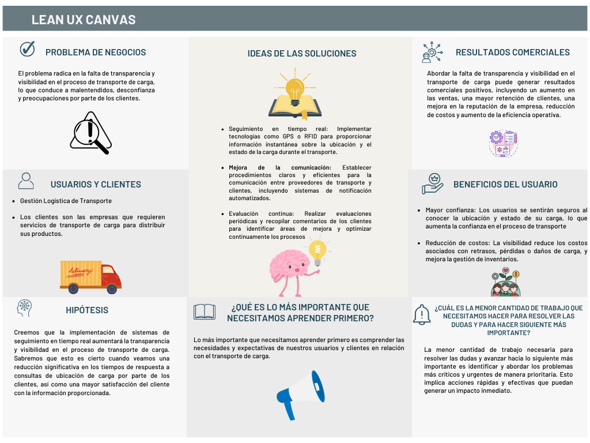

## 1.3. Segmentos objetivo.

| Segmento objetivo                        | Empresas de gestión de logística de transporte |
|-----------------------------------------|-------------------------------------------------|
| Edad                                    | Entre 25 y 50 años                              |
| Ubicación                               | Lima, Perú                                      |
| Sexo                                    | Masculino o Femenino                            |
| Formación educativa                     | Matriculados en instituciones de educación superior |
| Poder adquisitivo                       | Moderado y Alto                                 |
| Clase social                            | Media y Alta                                    |

| Segmento objetivo                        | Clientes que requieren servicios de transporte |
|-----------------------------------------|-------------------------------------------------|
| Edad                                    | Entre 25 y 50 años                              |
| Ubicación                               | Lima, Perú                                      |
| Sexo                                    | Masculino o Femenino                            |
| Formación educativa                     | Matriculados en instituciones de educación superior |
| Poder adquisitivo                       | Medio y Alto                                    |
| Clase social                            | Media y Alta                                    |

# Capítulo II Requirements Elicitation & Analysis

## 2.1 Competidores

Para realizar el análisis competitivo hemos tomado en consideración competidores directos e indirectos:

* LogiNext Mile: empresa que ofrece un software de optimización de rutas y planificación de entregas que automatiza y mejora la eficiencia de las operaciones de entrega, garantizando entregas más rápidas y una experiencia superior para el cliente mediante la integración de preferencias del cliente. 

  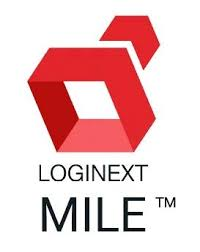

* Drivin: empresa que busca incrementar la eficiencia de operaciones logísticas como planificación de rutas, sistema de notificaciones y monitoreo a tiempo real.

  

* SimpliRoute: aplicación que utiliza tecnología IA para optimizar rutas de entrega incorporando variables como límite de carga por vehículo, horarios y restricciones territoriales.

  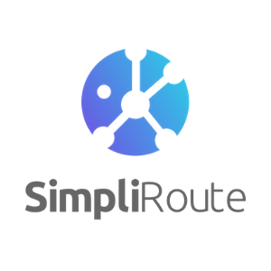

### 2.1.1 Análisis competitivo

<table>
  <tr>
    <th colspan="6" valign="top">Competitive Analysis Landscape</th>
  </tr>
  <tr>
    <td colspan="2" valign="top">¿Por qué llevar a cabo este análisis?</td>
    <td colspan="4" valign="top">El objetivo de este análisis es identificar las características de los competidores y encontrar maneras de diferenciarnos.</td>
  </tr>
  <tr>
    <td colspan="2" rowspan="2" valign="top">Startup y Competidores</td>
    <td valign="top">CargoWatch</td>
    <td valign="top">LogiNext Mile</td>
    <td valign="top">Drivin</td>
    <td valign="top">SimpliRoute</td>
  </tr>
  <tr>
    <td valign="top"></td>
    <td valign="top"></td>
    <td valign="top"></td>
    <td valign="top"></td>
  </tr>
  <tr>
    <td rowspan="2" valign="top">Perfil</td>
    <td valign="top">Overview</td>
    <td valign="top">Plataforma innovadora que ofrece seguimiento en tiempo real y transparencia en el transporte de carga para empresas</td>
    <td valign="top">Software integral para optimizar y automatizar operaciones de entrega, incluyendo planificación de rutas y seguimiento en tiempo real</td>
    <td valign="top">Plataforma para mejorar la eficiencia logística interconectando módulos como planificación de rutas y monitoreo en tiempo real</td>
    <td valign="top">Aplicación de optimización de rutas de entrega con enfoque en variables como límites de carga y horarios, utilizando tecnología IA</td>
  </tr>
  <tr>
    <td valign="top">Ventaja competitiva ¿Qué valor ofrece a los clientes?</td>
    <td valign="top">Seguimiento en tiempo real y reportes detallados de gastos como el cálculo de los costos de combustible durante el transporte de carga</td>
    <td valign="top">Entregas más rápidas, menores costos y una experiencia superior para el cliente</td>
    <td valign="top">Optimización operativa para entregas rápidas y precisas</td>
    <td valign="top">Optimización avanzada de rutas mediante IA para reducir costos y tiempos de entrega</td>
  </tr>
  <tr>
    <td rowspan="2" valign="top">Perfil de Marketing</td>
    <td valign="top">Mercado objetivo</td>
    <td valign="top">Empresas logísticas de transporte terrestre</td>
    <td valign="top">Empresas logísticas de transporte terrestre</td>
    <td valign="top">Empresas logísticas de transporte terrestre</td>
    <td valign="top">Empresas logísticas de transporte terrestre</td>
  </tr>
  <tr>
    <td valign="top">Estrategias de marketing</td>
    <td valign="top">Transparencia, seguridad e innovación</td>
    <td valign="top">Digitalización, optimización y automatización</td>
    <td valign="top">Empresa joven, dinámica y flexible</td>
    <td valign="top">Confianza, innovación y simple</td>
  </tr>
  <tr>
    <td rowspan="3" valign="top">Perfil de Producto</td>
    <td valign="top">Productos & Servicios</td>
    <td valign="top">Plataforma de seguimiento a tiempo real Reporte detallado de gastos Análisis de datos Comunicación integrada</td>
    <td valign="top">Automatización de operaciones de entrega Integraciones con terceros</td>
    <td valign="top">Distintos módulos interconectados como optimizador de ruta, gestión de documentos, disponibilidad de vehículos, etc.</td>
    <td valign="top">Algoritmo de optimización de rutas Servicio de integración de herramientas de logística</td>
  </tr>
  <tr>
    <td valign="top">Precios & Costos</td>
    <td valign="top">20$ / mes</td>
    <td valign="top">50$ / mes</td>
    <td valign="top">35$ / mes</td>
    <td valign="top">Lite (40$ / mes) Pro  (Personalizado) Corporate (Personalizado)</td>
  </tr>
  <tr>
    <td valign="top">Canales de distribución (Web y/o Móvil)</td>
    <td valign="top">Web y/o móvil</td>
    <td valign="top">Web y/o móvil</td>
    <td valign="top">Web y/o móvil</td>
    <td valign="top">Web y/o móvil</td>
  </tr>
  <tr>
    <td rowspan="4" valign="top">Análisis SWOT</td>
    <td valign="top">Fortalezas</td>
    <td valign="top">Reportes detallados de gastos, lo que permite a los usuarios analizar y controlar sus costos operativos de manera efectiva</td>
    <td valign="top">Enfoque en entregas más rápidas, menores costos y una experiencia superior para el cliente</td>
    <td valign="top">Amplia gama de servicios para mejorar la eficiencia logística</td>
    <td valign="top">Utilización de tecnología IA para optimizar rutas de entrega</td>
  </tr>
  <tr>
    <td valign="top">Debilidades</td>
    <td valign="top">Funcionalidades similares a la competencia en el mercado de otras plataformas de seguimiento de carga</td>
    <td valign="top">Riesgo de dependencia tecnológica y vulnerabilidades a posibles fallas del sistema</td>
    <td valign="top">Dependencia de la tecnología para la entrega de sus servicios, lo que podría resultar en vulnerabilidades si hay fallas técnicas</td>
    <td valign="top">Dependencia de la tecnología IA, lo que puede generar preocupaciones sobre la confiabilidad y la precisión de las soluciones</td>
  </tr>
  <tr>
    <td valign="top">Oportunidades</td>
    <td valign="top">Creciente demanda de transparencia en la cadena de suministro al aumentar la preocupación por la seguridad</td>
    <td valign="top">Expansión internacional para atender a mercados globales en crecimiento</td>
    <td valign="top">Posibilidad de expandir sus servicios hacia nuevos segmentos del mercado logístico</td>
    <td valign="top">Desarrollo de alianzas estratégicas con otras empresas para ofrecer soluciones integradas de logística</td>
  </tr>
  <tr>
    <td valign="top">Amenazas</td>
    <td valign="top">Creciente amenaza de ataques cibernéticos podría comprometer la seguridad de los datos almacenados en la plataforma</td>
    <td valign="top">Rápida evolución de la tecnología que requiere una continua inversión en investigación y desarrollo para mantenerse competitivo</td>
    <td valign="top">Cambios en las regulaciones gubernamentales que podrían afectar la operación de sus servicios de logística</td>
    <td valign="top">Competidores que desarrollan tecnologías similares de optimización de rutas utilizando IA</td>
  </tr>
</table>

### 2.1.2 Estrategias y tácticas frente a competidores
**Estrategias**

<u>Diferenciación del producto</u>: desarrollaremos características únicas y valor agregado para destacarnos de la competencia en el mercado de seguimiento de carga. Por ejemplo, el reporte de gastos a partir del seguimiento a tiempo real.

<u>Diversificación de servicios</u>: ampliaremos la gama de servicios ofrecidos además del seguimiento a tiempo real como el reporte de gastos y comunicación con los proveedores de servicio.

<u>Personalización de servicios</u>: ofreceremos opciones personalizadas para satisfacer necesidades específicas de los clientes dentro de los planes de pago.

**Tácticas**

<u>Implementación de retroalimentación de usuarios</u>: Analizaremos los comentarios de los usuarios para identificar áreas de mejora y priorizar el desarrollo de características que satisfagan las necesidades del mercado.

<u>Monitoreo de la competencia</u>: Realizaremos un seguimiento de las estrategias y tácticas tomadas por los competidores para evaluar oportunidades y estándares en la industria.

<u>Optimización de los motores de búsqueda</u>: Usaremos palabras clave relevantes, metatags adecuadas y contenido de calidad además de campañas de marketing en los motores de búsqueda para posicionarnos mejor y aumentar la visibilidad.

## 2.2 Entrevistas

### 2.2.1 Diseño de entrevistas

__Clientes que requieren servicios de transporte__:
  * ¿Qué tan importante es el servicio de transporte para la empresa donde trabaja?

  * ¿Qué tipos de transporte son necesarios para su empresa?

  * ¿Cuál cree que son los desafíos más grandes para encontrar un buen servicio de transporte para su empresa?

  * ¿Cree que una aplicación de seguimiento en tiempo real sería útil para usted en el proceso de transporte de carga?

  * ¿Considera que esta aplicación agregaría valor a su experiencia con el servicio de transporte de carga?

  * ¿Cómo cree que esta aplicación podría mejorar la transparencia y la confianza en el proceso de transporte de carga?

  * ¿Estaría dispuesto a probar una aplicación de seguimiento en tiempo real si se ofreciera como parte del servicio de transporte?

  * ¿Qué características adicionales le animaría a utilizar una aplicación de seguimiento en tiempo real para gestionar sus envíos de carga?

  * ¿Cómo cree que esta aplicación podría simplificar o mejorar sus operaciones logísticas?

  * ¿Qué expectativas tendría respecto al diseño y la usabilidad de la aplicación?

__Empresas de gestión de logística de transporte__:

  * ¿Hace cuánto tiempo que ofrece servicios de transporte?

  * ¿Cuáles son los principales desafíos que enfrentan al proporcionar servicios de transporte de carga?

  * ¿Qué tecnologías o herramientas utilizan actualmente para gestionar y rastrear envíos de carga?

  * ¿Cómo garantizan la transparencia y visibilidad en el proceso de transporte de carga para sus clientes?

  * ¿Qué medidas toman para optimizar la eficiencia operativa y reducir los costos en el transporte de carga?

  * ¿Cuál es su enfoque en términos de sostenibilidad y reducción de emisiones en el transporte de carga?

  * ¿Qué tipo de clientes suelen atender y cuáles son sus requisitos específicos?
  
  * ¿Cómo manejan las situaciones de emergencia o imprevistos durante el transporte de carga?
  
  * ¿Cuáles son los criterios que utilizan para evaluar y seleccionar socios o proveedores en su cadena de suministro?

### 2.2.2 Registro de entrevistas

**Entrevista 1 - Cliente que requiere transporte**

**Entrevistador:** Salvador Salinas

**Entrevistado:** Anderson Gonza

**Link de la entrevista:** <https://youtu.be/bfqZ8sSGn7I>

  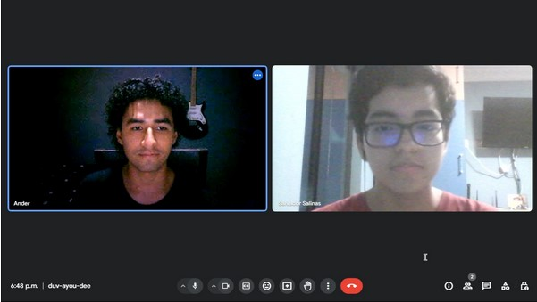

**Resumen de la entrevista:** 

Anderson Gonza es trabajador de una empresa que maneja grandes cargas para transportar, por lo que conoce lo difícil que puede llegar a ser encontrar a otra empresa que sea capaz de ofrecer un buen servicio de transporte para sus cargas. Se le comentó sobre la idea de una aplicación para hacer seguimiento a la carga de transporte y le pareció interesante. Comentó que sería muy útil para tener transparencia y confiabilidad al momento de realizar envíos. Además, mencionó que las notificaciones serían de mucha utilidad para conocer sobre los eventos importantes que sucedan en el proceso de transporte de un envío.

**Entrevista 2 - Cliente que requiere transporte**

**Entrevistador:** Piero Delgado

**Entrevistado:** Joaquin Rivadeneyra

**Link de la entrevista: <https://youtu.be/UriDWwVIwxw>**

  

**Resumen de la entrevista:** 

La entrevista fue realizada a Joaquín, un emprendedor que utiliza servicios de transporte de mercancías. Destacó la importancia del transporte terrestre para satisfacer la demanda de los clientes y la necesidad de movilizar la mercancía de manera rápida y segura. Mencionó los desafíos que afronta en el proceso como la confiabilidad en la entrega, la disponibilidad de vehículos adecuados y los costos competitivos. Joaquín consideraría útil una aplicación de seguimiento en tiempo real para mejorar la confiabilidad y el control sobre las entregas. También expresó interés en características como notificaciones de entrega, alertas de retrasos y comunicación directa con el transportista. Él espera que la aplicación simplifique las operaciones logísticas al proporcionar una herramienta centralizada para gestionar todos los envíos, optimizando procesos y reduciendo errores. Además, se destacó la importancia de un diseño intuitivo y fácil de usar para la aplicación.

**Entrevista 3 - Cliente que requiere transporte**

**Entrevistador:** Andre Valverde

**Entrevistado:** Rodrigo Guerra

**Link de la entrevista: <https://youtu.be/CFWmt8VZmZs>** 

  

**Resumen de la entrevista:** 

La entrevista fue con Rodrigo Guerra, un emprendedor que depende de servicios de transporte de mercancías. Destacó la importancia crítica del transporte para su negocio, enfatizando la necesidad de opciones variadas y confiables. Identificó desafíos como la falta de visibilidad y control de costos. Mostró interés en una aplicación de seguimiento en tiempo real para mejorar la transparencia y eficiencia. Expresó disposición a probarla si ayuda a mejorar la logística y destacó la importancia de una interfaz intuitiva y un diseño moderno.

**Entrevista 4 - Empresa de gestión logística de transporte**

**Entrevistador:** Christian Matos

**Entrevistado:** Valeria Cardenas

**Link de la entrevista: <https://youtu.be/g3N4MNTBP0A>**

  

**Resumen de la entrevista:** 

Valeria Cardenas, con dos años de experiencia como administradora en el sector de transporte de carga, afronta los retos geográficos e infraestructurales del país. Su enfoque se centra en la transparencia y la sostenibilidad, mediante el uso de GPS para el seguimiento de envíos, la selección de socios de alta calidad y la renovación de flotas a través de programas de capacitación para el transporte de materiales peligrosos. Asimismo, enfrenta estos desafíos gestionando envíos con herramientas como Excel y rastreo satelital, priorizando la eficiencia y la puntualidad. Además, promueve la sostenibilidad mediante la restricción de unidades antiguas y la formación del personal. 

**Entrevista 5 - Empresa de gestión logística de transporte**

**Entrevistador: Sebastian Paredes**

**Entrevistado: Miriam Puente**

**Link de la entrevista: <https://youtu.be/mCPfsJyBJNM>**

  

**Resumen de la entrevista:** 

Miriam Puente, administradora con 6 años de experiencia en transporte de carga, destaca los desafíos geográficos y de infraestructura en el país. Utilizan GPS para rastrear envíos debido a costos. Garantizan transparencia al escoger socios de calidad. Optimizan eficiencia con pruebas mecánicas y documentación en regla. Enfoque en sostenibilidad con renovación de flotas y capacitación para transporte de materiales peligrosos. Atienden clientes mineros e infraestructura con requisitos específicos. Manejan emergencias con unidades de reemplazo y conductores en reserva. Evalúan proveedores en calidad, referencias y tiempo de servicio.

**Entrevista 6 - Empresa de gestión logística de transporte**

**Entrevistador: Sebastian Paredes**

**Entrevistado: Roberto Paredes**

**Link de la entrevista: <https://youtu.be/6dreqpKNg7U>**

  

**Resumen de la entrevista:** 

Roberto Paredes, empresario con 16 años de experiencia en transporte de carga, destaca los desafíos de infraestructura y regulación. Utilizan Excel y rastreo satelital para gestionar envíos. Garantizan transparencia con eficiencia y puntualidad. Optimizan la eficiencia con capacitación y ahorro en costos. Enfoque en sostenibilidad mediante restricción de unidades antiguas. Atienden clientes de construcción con cargas especiales. Manejan emergencias con unidades de respaldo. Seleccionan proveedores serios y formales.

### 2.2.3 Análisis de entrevistas

**Cliente que requiere transporte**

**Segmento demográfico:**

Edad: personas de 25 a 50 años de edad

Sexo: Masculino y Femenino

Ocupación: Administrativo en área de logística

**Segmento Geográfico:**

País: Perú

Idioma: Español

**Segmento Psicográfico:**

Clase social: NSE A, NSE B.

**Segmento Conductual:**

Conocimientos: Conocimiento básico del manejo de una aplicación web.

Actitudes: Personas con interés en tener buen contacto con empresas de gestión logística para hacer seguimiento a los envíos que manejan.

Gracias a las entrevistas realizadas, comprendimos que para los clientes suele ser difícil encontrar una empresa de gestión logística en la cual poder confiar para hacer los envíos que son importantes para ellos. Así, al comentarle sobre nuestra idea de aplicación web para poder hacer seguimiento a los envíos de forma segura, indicaron que les pareció muy buena idea ya que brinda mejor transparencia y confiabilidad.

**Empresa de gestión logística**

**Segmento demográfico:**

Edad: personas de 25 a 50 años de edad

Sexo: Masculino y Femenino

Ocupación: Trabajador en gestión logística

**Segmento Geográfico:**

País: Perú

Idioma: Español

**Segmento Psicográfico:**

Clase social: NSE A, NSE B.

**Segmento Conductual:**

Conocimientos: Conocimiento básico del manejo de una aplicación web.

Actitudes: Personas con interés en tener buen contacto con empresas a las cuales ofrecer el servicio de transporte para sus cargas y brindar seguimiento de los envíos.

Gracias a las entrevistas realizadas, comprendimos que para las empresas suele ser difícil llevar un registro eficiente y detallado. Así, al comentarle sobre nuestra idea de aplicación web para poder hacer seguimiento a los envíos de forma segura, indicaron que les pareció muy buena idea ya que les permite registrar un informe completo y detallado que será útil para ellos y para sus clientes.

## 2.3. Needfinding

### 2.3.1. User Personas

__Segmento: Empresas de gestión logística de transporte__

  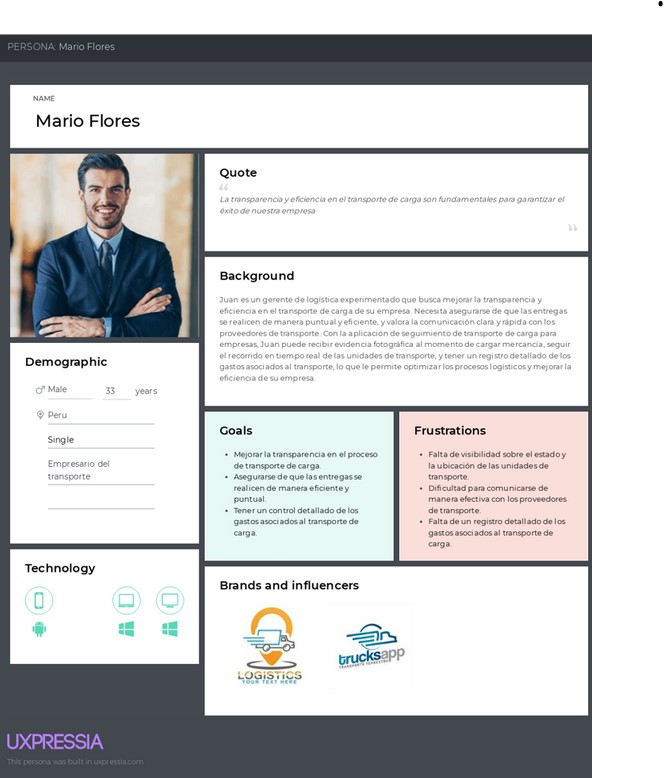

__Segmento: Clientes que requieren servicios de transporte__

  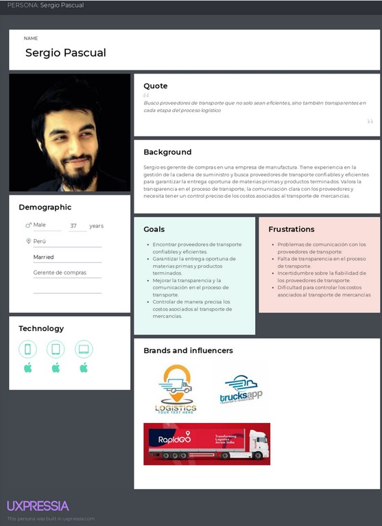

### 2.3.2. User Task Matrix

<table>
<tr><th rowspan="2" valign="top"><b>User Task</b></th><th colspan="2" valign="top">Empresas de gestión logística de transporte</th></tr>
<tr><td valign="top"><b>Frecuencia</b></td><td valign="top"><b>Importancia</b></td></tr>
<tr><td valign="top">Registrar una nueva carga en el sistema</td><td valign="top">Siempre</td><td valign="top">Medio</td></tr>
<tr><td valign="top">Asignar un proveedor de transporte a una carga</td><td valign="top">Siempre</td><td valign="top">Medio</td></tr>
<tr><td valign="top">Seguir el estado y la ubicación de una carga en tiempo real</td><td valign="top">A veces</td><td valign="top">Alta</td></tr>
<tr><td valign="top">Verificar la evidencia fotográfica de la carga al ser cargada</td><td valign="top">Siempre</td><td valign="top">Alta</td></tr>
<tr><td valign="top">Revisar los registros de gastos asociados al transporte de una carga</td><td valign="top">A veces</td><td valign="top">Alta</td></tr>
<tr><td valign="top">Facilitar la comunicación con los clientes</td><td valign="top">Siempre</td><td valign="top">Medio</td></tr>
<tr><td valign="top">Planificar rutas de transporte más eficientes</td><td valign="top">A veces</td><td valign="top">Medio</td></tr>
</table>

<table>
<tr><th rowspan="2" valign="top"><b>User Task</b></th><th colspan="2" valign="top">Clientes que requieren servicios de transporte</th></tr>
<tr><td valign="top"><b>Frecuencia</b></td><td valign="top"><b>Importancia</b></td></tr>
<tr><td valign="top">Solicitar un servicio de transporte para una carga</td><td valign="top">Siempre</td><td valign="top">Medio</td></tr>
<tr><td valign="top">Verificar el estado y la ubicación de una carga en tiempo real</td><td valign="top">A veces</td><td valign="top">Alta</td></tr>
<tr><td valign="top">Recibir notificaciones sobre el progreso de una entrega</td><td valign="top">Siempre</td><td valign="top">Alta</td></tr>
<tr><td valign="top">Comunicarse con el proveedor de transporte para resolver problemas</td><td valign="top">A veces</td><td valign="top">Medio</td></tr>
<tr><td valign="top">Verificar la evidencia fotográfica de la carga al ser cargada</td><td valign="top">Siempre</td><td valign="top">Alta</td></tr>
<tr><td valign="top">Solicitar cotizaciones para servicios de transporte</td><td valign="top">Siempre</td><td valign="top">Medio</td></tr>
<tr><td valign="top">Revisar los registros de gastos asociados a una entrega</td><td valign="top">A veces</td><td valign="top">Alta</td></tr>
</table>

### 2.3.3. User Journey Mapping

Usuario **Empresas de gestión logística de transporte**

  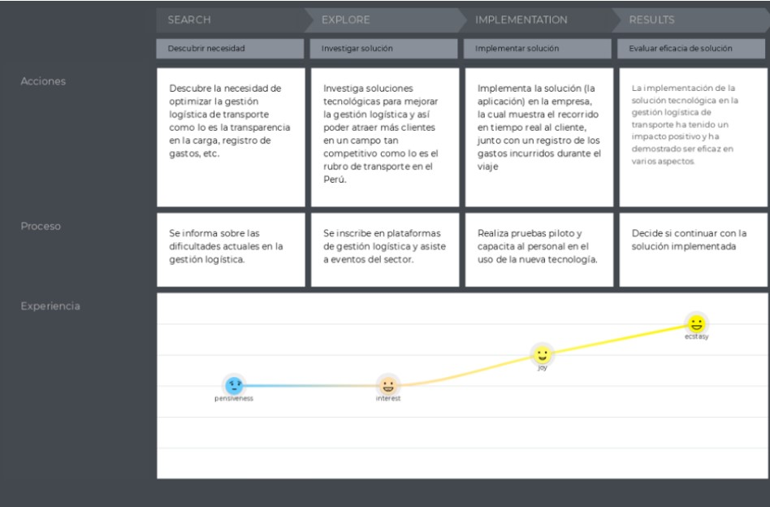

Usuario **Clientes que requieren servicios de transporte**

  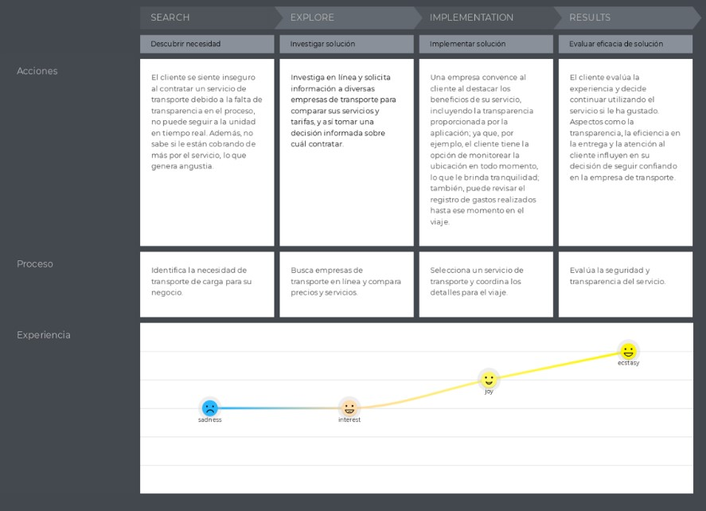

### 2.3.4. Empathy Mapping

Usuario **Empresas de gestión logística de transporte**

  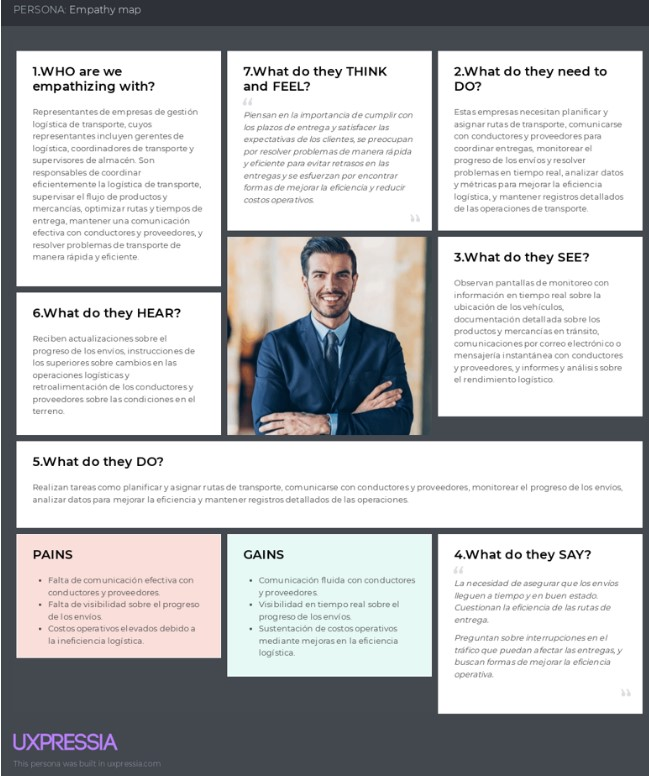

Usuario **Clientes que requieren servicios de transporte**

  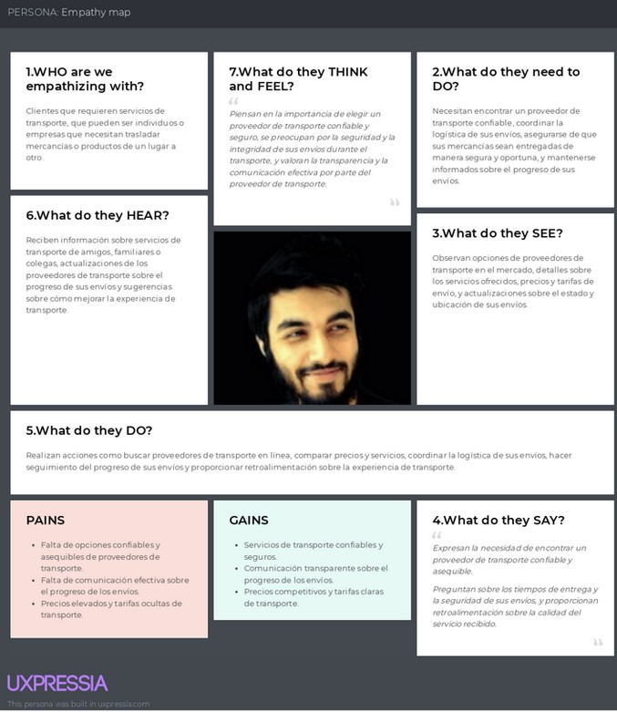

### 2.3.5. As-is Scenario Mapping

__Segmento Empresas de gestión logística de transporte__

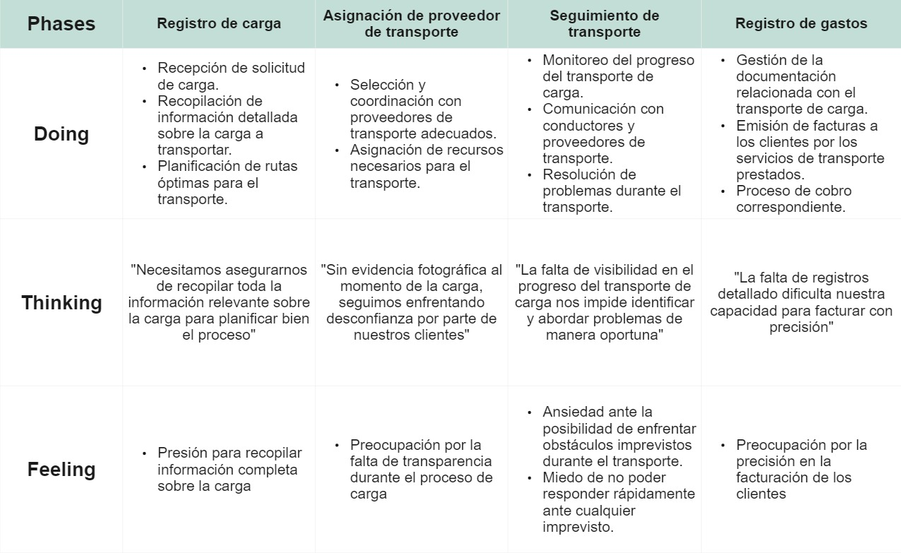

__Segmento Clientes que requieren servicios de transporte__

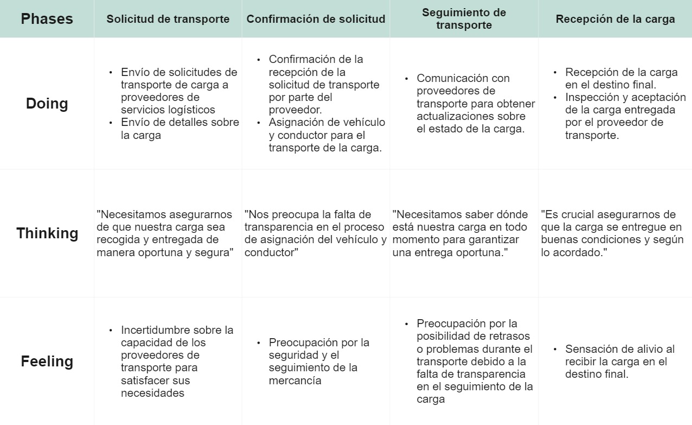

## 2.4. Ubiquitous Language

En esta sección, se definirán términos utilizados a lo largo del proyecto para que se pueda comprender para todos los miembros del equipo y agentes interesado:

- **Transport Provider (Proveedor de transporte):** Empresa o entidad encargada de transportar la carga.
- **Photographic Evidence (Evidencia fotográfica):** Imágenes que muestran la carga al ser cargada, utilizadas para verificar su estado.
- **Expense Record (Registro de gastos):** Documentación que detalla los costos asociados al transporte de una carga.
- **Transport Routes (Rutas de transporte):** Caminos o trayectos planificados para el transporte de la carga, con el objetivo de ser eficientes.
- **Customer Communication (Comunicación con los clientes):** Interacción con los clientes para proporcionar información sobre el estado de la carga y resolver cualquier problema.
- **Route Planning (Planificación de rutas):** Proceso de establecer las mejores rutas de transporte para optimizar el proceso.
- **Real-time Tracking (Seguimiento en tiempo real):** Monitorización constante de la ubicación y el estado de la carga durante su transporte.
- **Transport Coordinator (Coordinador de transporte):** Persona encargada de gestionar y coordinar el transporte de la carga.
- **Fleet Operator (Operador de flota):** Persona encargada de manejar y supervisar la flota de vehículos utilizados para el transporte de la carga.
- **Freight Transport (Transporte de carga):** El transporte de bienes o mercancías de un lugar a otro, generalmente a gran escala y a largas distancias.

# Capítulo III Requirements Specification

## 3.1. To-Be Scenario Mapping

__Segmento Empresas de gestión logística de transporte__

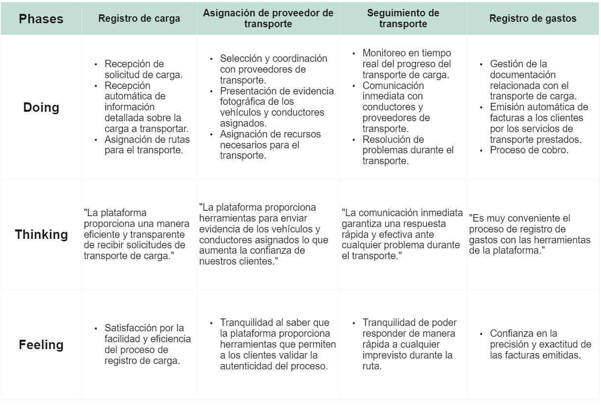

__Segmento Clientes que requieren servicios de transporte__

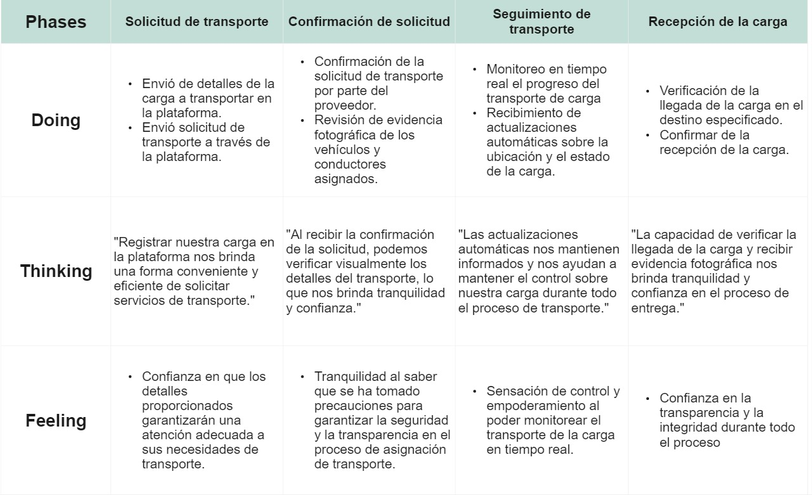

## 3.2. User Stories

## 3.3. Impact Mapping

## 3.4. Product Backlog

# Capítulo IV Product Design
## 4.1. Style Guidelines
### 4.1.1 General Style Guidelines

Color: 
Una paleta de colores que inspire confianza, profesionalismo y dinamismo, como tonos de azul oscuro para la confianza y la seguridad, combinados con tonos de verde o naranja para representar la eficiencia y la innovación en el transporte.
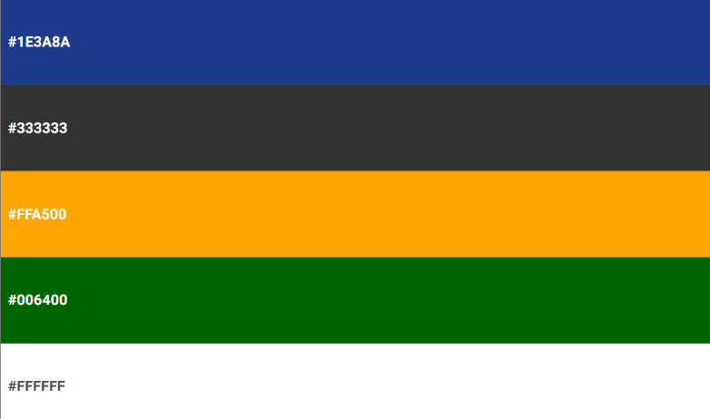

Typography: 
Utilizamos diversas tipografías para lograr un diseño cohesivo y legible. Roboto regular y Roboto light se usan para los titulares, proporcionando una lectura clara y directa. Para párrafos, se ha seleccionado Rubik regular, aportando comodidad en la lectura extendida, mientras que los links llevan Rubik light italic, añadiendo un toque distintivo. Para los campos de entrada, usamos Open Sans regular, que proporciona claridad y profesionalismo, y para botones, Rubik medium, garantizando una llamada a la acción clara y destacada.
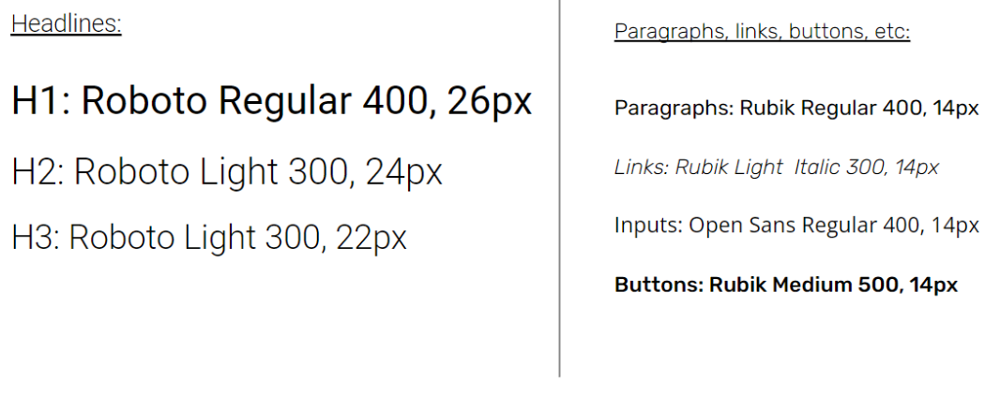

Branding: 
El logotipo de CargoApp es una representación simbólica y poderosa de la marca, que comunica eficazmente su compromiso con la excelencia en el transporte de carga y su enfoque integral en satisfacer las necesidades de los clientes en cada etapa del proceso logístico.

Spacing:
El spacing mantiene: 
* Botones: padding de 16px vertical y 32px horizontal 
* Margin entre texto 16px 
* Margin entre elementos 24px 
* Margin entre secciones 72px

### 4.1.2. Web Style Guidelines
<u>Paleta de colores:</u>

<u>Tipografía:</u>

<u>Grid System:</u>
Ofrece un esquema visual que garantiza la coherencia y la armonización en la disposición y alineación de los elementos de la página en distintos tamaños de pantalla.

<u>Buttons:</u>
Los botones representan un componente fundamental en la interfaz de usuario de CargoApp, ya que ofrecen una forma clara y visualmente destacada para que los usuarios realicen acciones importantes. Hemos establecido un estilo de botón coherente que refleja la identidad visual de la plataforma y promueve una experiencia de usuario intuitiva y uniforme.

<u>Input System:</u>
Hemos desarrollado un sistema de ingreso uniforme que asegura una experiencia de usuario intuitiva y uniforme en todos los aspectos de la interfaz.

## 4.2. Information Architecture
### 4.2.1. Organization Systems
En CargoApp, hemos tomado decisiones específicas sobre cómo organizar la información para garantizar una experiencia de usuario fluida y efectiva. Para lograr esto, hemos optado por una combinación de sistemas de organización y esquemas de categorización de contenido.

En cuanto a la organización de la información, hemos decidido utilizar la jerarquía visual para destacar la importancia relativa de diferentes elementos en la interfaz de usuario. Esto nos permite guiar a los usuarios hacia la información más relevante y acciones clave de manera intuitiva.

Además, vamos a implementar la organización secuencial en aquellas áreas de la aplicación donde los usuarios realizan tareas específicas en un orden predefinido. Esto les permite avanzar paso a paso de manera clara y sin confusiones.

Por otro lado, hemos adoptado un enfoque matricial en secciones donde se presentan datos estructurados y comparativos. Esto facilita a los usuarios la visualización y comprensión de información compleja de manera más eficiente.

En cuanto a los esquemas de categorización de contenido, hemos elegido organizar la información de forma alfabética en áreas donde la búsqueda y la referencia rápida son prioritarias. Para la organización cronológica, la empleamos en casos donde la secuencia temporal es fundamental para comprender la información, como registros de eventos o seguimiento de actividades.

La organización por tópicos se utiliza para agrupar información relacionada por temas específicos, facilitando a los usuarios encontrar contenido relevante de manera contextualizada. Además, hemos segmentado el contenido según la audiencia, adaptándolo a las necesidades y roles específicos de diferentes grupos de usuarios dentro de la plataforma.

### 4.2.2. Labeling Systems
<table>
  <tr>
    <th>Titulo</th>
    <th>Descripción</th>
  </tr>
  <tr>
    <td>Mis Envíos</td>
    <td>Este botón te permite acceder y gestionar tus envíos activos y pasados, así como cualquier información relacionada con ellos, como el estado del envío, detalles de seguimiento y documentos asociados.</td>
  </tr>
  <tr>
    <td>Buscar Envío</td>
    <td>Al seleccionar este botón, puedes ingresar el número de seguimiento de un envío para obtener información detallada sobre su ubicación y estado actual.</td>
  </tr>
  <tr>
    <td>Perfil del Conductor</td>
    <td>Este botón te lleva al perfil del conductor asignado a tu envío, donde puedes ver su información personal, historial de conducción y valoraciones de otros usuarios.</td>
  </tr>
  <tr>
    <td>Contacto de Emergencia</td>
    <td>Al hacer clic aquí, puedes acceder rápidamente a los números de contacto de emergencia para comunicarte con el equipo de soporte en caso de problemas durante el transporte.</td>
  </tr>
  <tr>
    <td>Calendario de Entregas</td>
    <td>Este botón te permite ver un calendario con todas tus entregas programadas, facilitando la planificación y organización de tus actividades diarias de envío.</td>
  </tr>
  <tr>
    <td>Configuración de la Cuenta</td>
    <td>Al seleccionar este botón, puedes acceder a la configuración de tu cuenta para gestionar tus preferencias de notificación, información de contacto y otros ajustes relacionados con tu cuenta de CargoApp.</td>
  </tr>
</table>

### 4.2.3. SEO Tags and Meta Tags
Aquí detallamos los SEO Tags y Meta Tags que utilizaremos en las principales páginas de nuestra experiencia, tanto en el sitio web estático (Landing Page) como en la Aplicación Web. Los valores asignados incluirán al menos el Title, los Meta Tags Description, Keywords y Author:

<u>Landing Page:</u>
* Title: [Nombre de la Empresa] - Transporte de Carga Eficiente y Transparente
* Description: Descubra cómo nuestro servicio de transporte de carga mejora la transparencia y eficiencia en sus operaciones logísticas. Ofrecemos seguimiento en tiempo real, evidencia fotográfica y más.
* Keywords: transporte de carga, logística, transparencia, eficiencia, seguimiento en tiempo real, evidencia fotográfica, servicios de transporte.
* Author: [Nombre de la Empresa]

<u>Aplicación Web:</u>
* Title: [Nombre de la Empresa] - Inicio
* Description: Bienvenido a nuestra Aplicación Web para transporte de carga. Gestione sus envíos, acceda al seguimiento en tiempo real, y optimice sus operaciones logísticas con nuestras herramientas integradas.
* Keywords: aplicación web, transporte de carga, seguimiento en tiempo real, gestión de envíos, operaciones logísticas.
* Author: [Nombre de la Empresa]

### 4.2.4. Searching Systems
En esta sección, detallamos los sistemas de búsqueda que implementaremos en nuestro producto digital para ayudar a los usuarios a encontrar rápidamente la información que necesitan sin sentirse abrumados por el volumen de datos disponible.

<u>Opciones de Búsqueda:</u>

* Barra de Búsqueda: Implementaremos una barra de búsqueda visible y accesible en todas las páginas del producto digital. Esto permitirá a los usuarios buscar información específica ingresando palabras clave o frases relevantes.
* Filtros Avanzados: Proporcionaremos filtros avanzados que permitirán a los usuarios refinar sus búsquedas según diferentes criterios, como fecha, categoría, ubicación, etc. Estos filtros ayudarán a los usuarios a encontrar información más relevante y específica.
* Búsqueda por Categorías: Organizaremos la información en categorías claras y definidas para que los usuarios puedan explorar y buscar información dentro de áreas específicas de interés.
* Búsqueda por Etiquetas: Utilizaremos etiquetas o palabras clave para etiquetar y organizar el contenido, lo que facilitará a los usuarios encontrar información relacionada con temas específicos.

<u>Visualización de Resultados:</u>
Después de realizar una búsqueda, los resultados se presentarán de manera clara y ordenada, mostrando los elementos más relevantes en la parte superior. Cada resultado incluirá un título, una descripción breve y enlaces directos a la página o sección relevante dentro del producto digital. Además, los resultados podrán ser ordenados según relevancia, fecha u otros criterios, según las preferencias del usuario.

### 4.2.5 Navigation Systems
Para ofrecer a nuestros usuarios una experiencia fluida y completa al explorar nuestra landing page, hemos diseñado un sistema de navegación estratégico que garantiza accesibilidad y claridad en todo momento.

<u>Barra de Navegación:</u>
Implementaremos una barra de opciones ubicada estratégicamente en la parte superior de la página. Esta barra servirá como un índice que acompañará al usuario durante todo su recorrido por la landing page. Permitirá a los usuarios navegar fácilmente entre las diferentes secciones, facilitando el retorno a secciones anteriores sin perderse en la navegación.

<u>Descripciones Concisas:</u>
Cada sección de la landing page estará acompañada de descripciones breves y concisas. Evitaremos abrumar al usuario con información excesiva, asegurando que cada mensaje sea claro y fácil de entender. Esto permitirá una experiencia de navegación más ágil y agradable para nuestros usuarios.

<u>Punto de Acceso Clave:</u>
Al finalizar el recorrido en nuestra landing page, hemos establecido el inicio de sesión o registro como puntos de acceso clave a las funcionalidades principales de nuestro servicio. Al iniciar sesión o registrarse, los usuarios desbloquearán características y funcionalidades adicionales, como recomendaciones personalizadas y asistencia especializada. Esta decisión tiene como objetivo proporcionar una experiencia personalizada y efectiva desde el momento en que los usuarios se unen a nuestro servicio.

## 4.3. Landing Page UI Design
### 4.3.1. Landing Page Wireframe
El Landing Page consiste en cinco secciones: Inicio, Acerca de, Sobre Nosotros, Características y Contacto. Con relación al diseño inclusivo, las imágenes contienen textos alternativos y los colores tienen un contraste específico que permite destacar los textos e imágenes. El tamaño de los títulos y la corta cantidad de texto permite un mejor enfoque y menor aburrimiento. Además, se muestra la barra de navegación para ayudar al usuario a navegar fácilmente por la página web y también el pie de página en la parte inferior.

Página de inicio: Muestra la frase que representa el propósito de nuestra startup y de la aplicación.
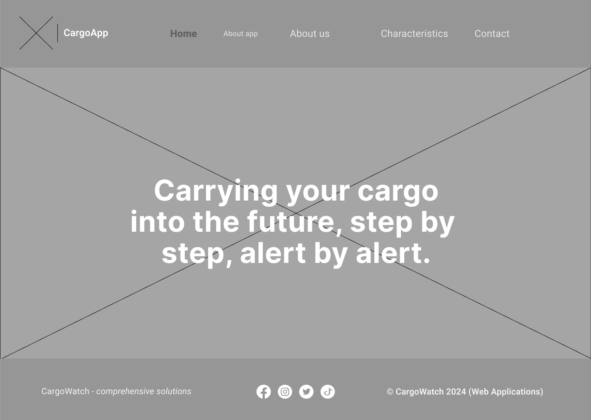
Página Acerca de: Contiene información sobre la problemática que abordamos.
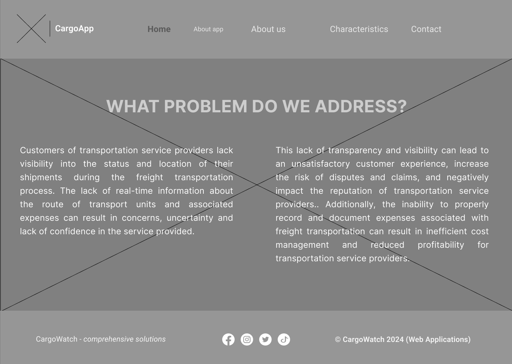
Página Sobre Nosotros: Contiene información sobre la startup, nuestra misión y visión.
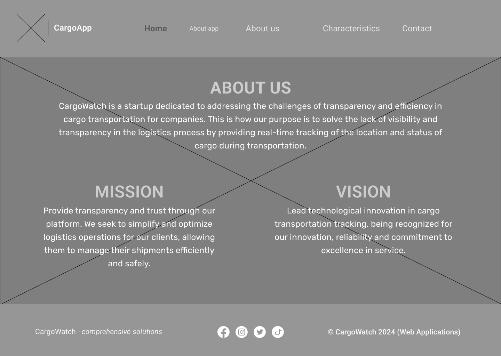
Página Características: Contiene información sobre las principales características que ofrecemos a los segmentos objetivo a través de la aplicación web.
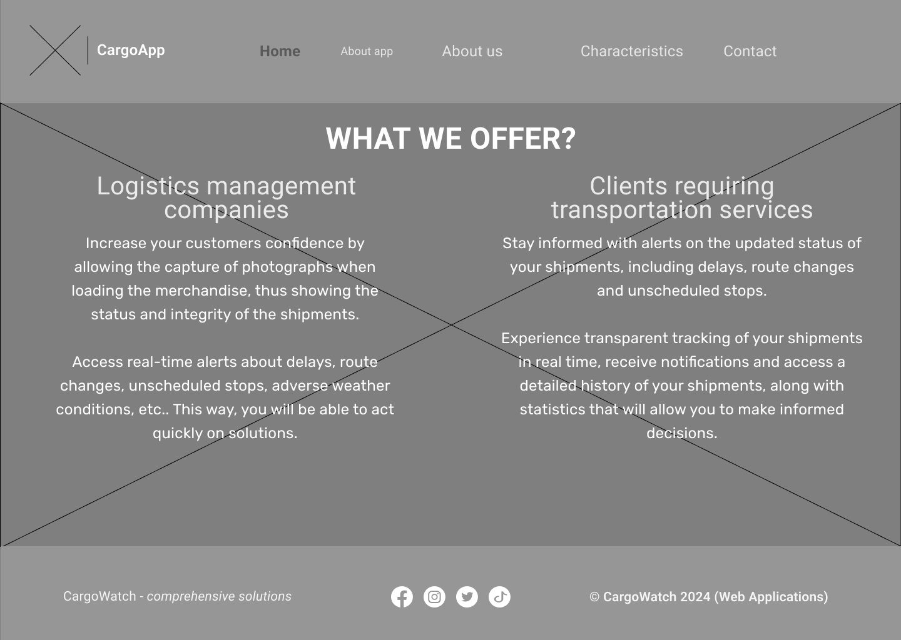
Página Contacto: Contiene el formulario a través del cual los usuarios pueden realizar consultas, quejas o recomendaciones para mejorar nuestra aplicación web.
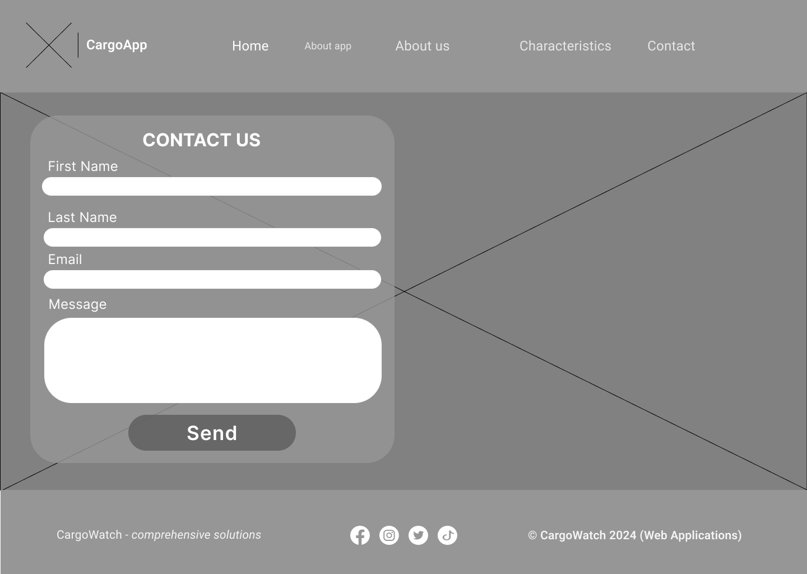

### 4.3.2. Landing Page Mock-up
A partir de lo trabajado en los Wireframes, utilizamos la misma estructura para cada una de las páginas, pero ahora se trabajó con la paleta de colores establecida, tipografía y los demás recursos a utilizar como imágenes de fondo.

Página de inicio:
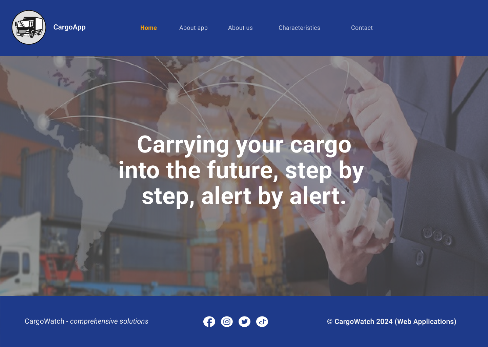
Página Acerca de:
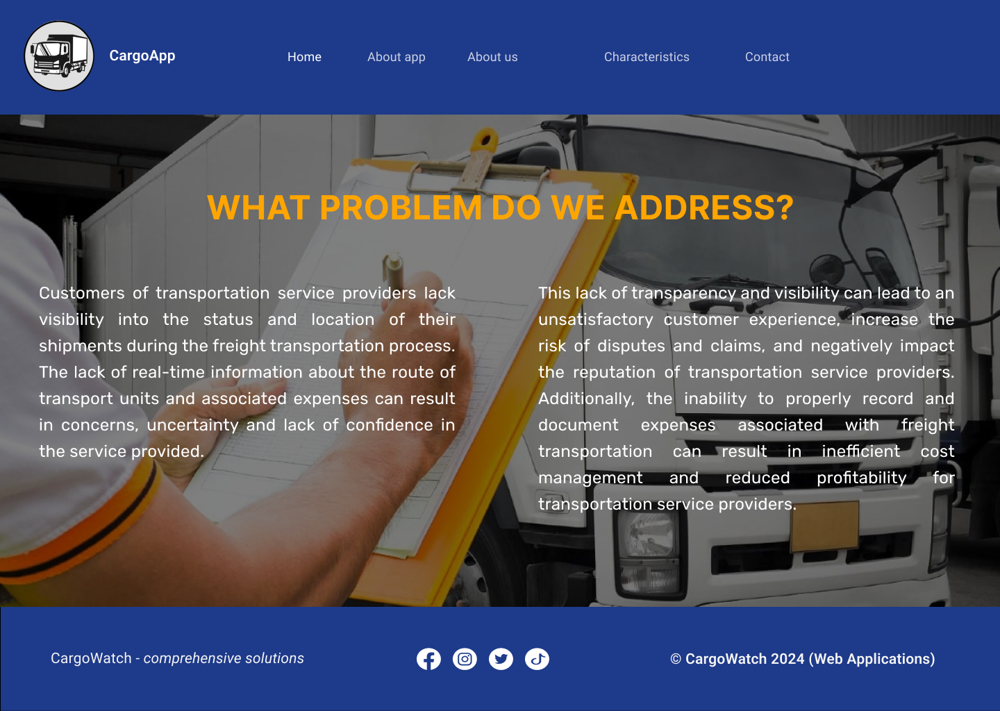
Página Sobre Nosotros:
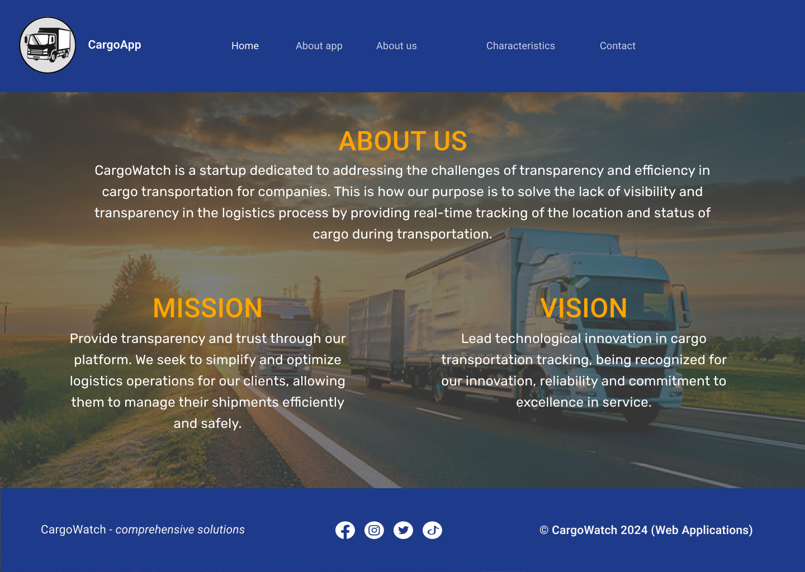
Página Características:
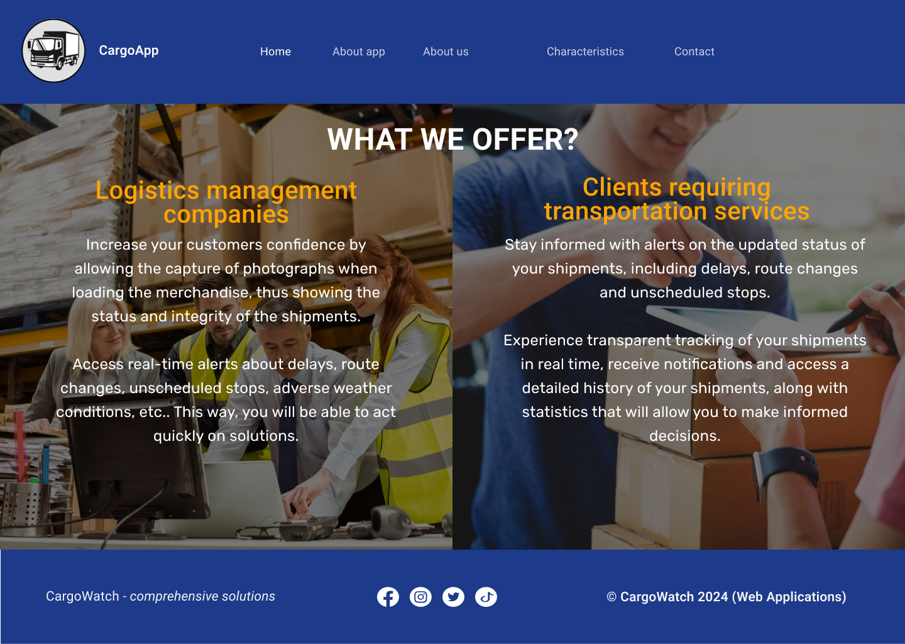
Página Contacto:
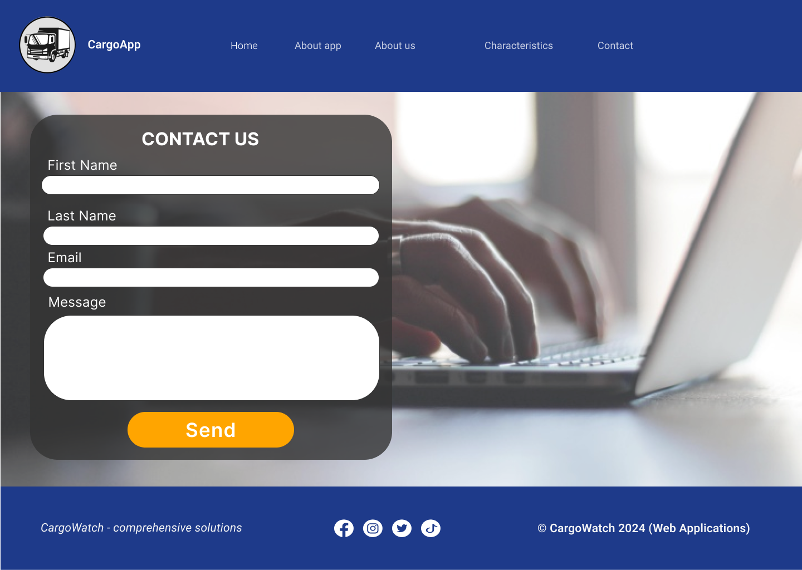

## 4.4. Web Applications UX/UI Design
### 4.4.1. Web Applications Wireframes
El Web Application consiste en cinco secciones para el cliente: Historial, Gastos, GPS, Estadísticas y Configuración. Asimismo, consta de tres secciones para los empresarios de las empresas de gestión logística. Finalmente, ambos segmentos constan del mismo menú de inicio de sesión y registro.

-Sección de Inicio de sesión:

Fallo en las credenciales:
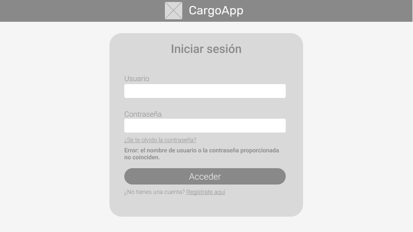
Fallo repetido:
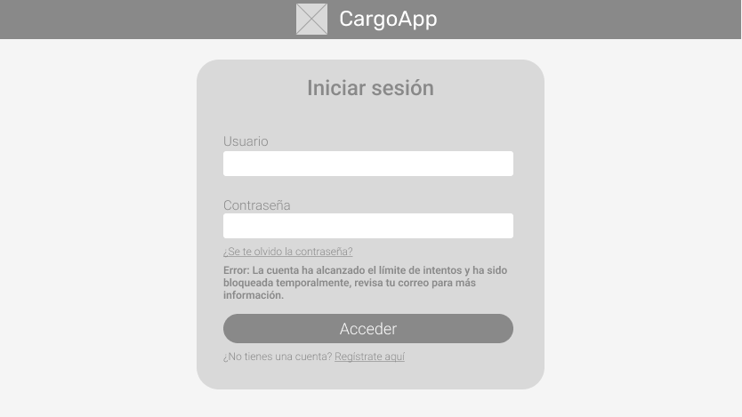
Recuperación de contraseña:
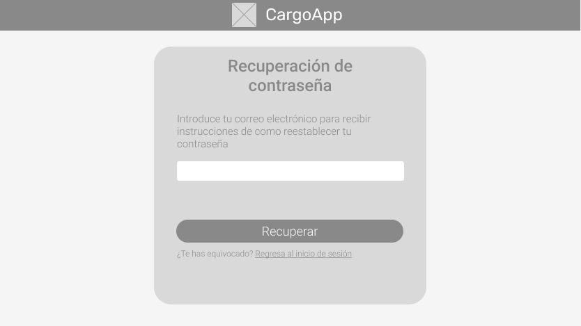

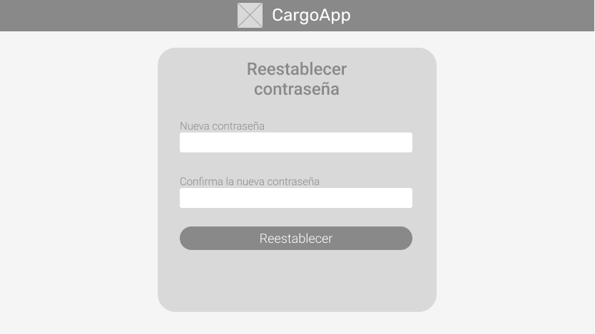
Registro de nueva cuenta:
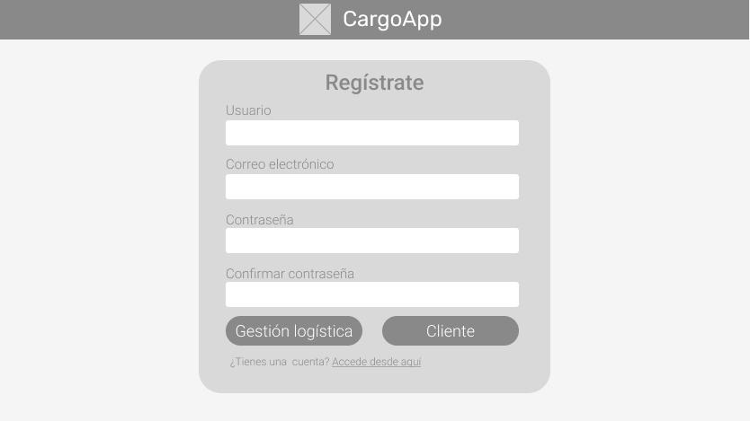

-Sección de Historial de envíos:

### 4.4.2. Web Applications Wireflow Diagrams
### 4.4.2. Web Applications Mock-ups
### 4.4.3. Web Applications User Flow Diagrams
## 4.5. Web Applications Prototyping
## 4.6. Domain-Driven Software Architecture
### 4.6.1. Software Architecture Context Diagram
### 4.6.2. Software Architecture Container Diagrams
### 4.6.3. Software Architecture Components Diagrams
## 4.7. Software Object-Oriented Design
### 4.7.1. Class Diagrams
### 4.7.2. Class Dictionary
## 4.8. Database Design
### 4.8.1. Database Diagram

# Capítulo V Product Implementation, Validation & Deployment

## 5.1. Software Configuration Management

### 5.1.1. Software Development Environment Configuration

**Project Management:**

En la gestión del proyecto, empleamos WhatsApp como el principal medio de comunicación, mediante un grupo donde intercambiamos ideas y opiniones sobre cada aspecto del trabajo. Además, hacemos uso de Google Meet para llevar a cabo videoconferencias y dialogar de manera sincrónica. Por otro lado, el proyecto también tiene que ser documentado con todos los puntos requeridos, por lo que utilizamos Google Drive para la creación de documentos compartidos y poder trabajar colaborativamente, permitiendo un mejor flujo de trabajo y tener un historial sobre lo que realizó cada uno. También, utilizamos GitHub para el manejo de repositorios a través de una comunidad conformada por todos los integrantes del equipo.

**Requirements Management:**

Para registrar los requisitos, o también llamadas historias de usuario, usamos la herramienta Pivotal Tracker, en la cual las colocamos en orden de prioridad según el Product Backlog. Esto se realizó de forma grupal, así que todos los integrantes aportamos en las historias de usuario y discutimos sobre las funcionalidades que consideramos que debe tener la aplicación web.

**Product UX/UI Design:**

Para los productos de UX trabajamos con la herramienta UXPressia, para realizar los artefactos como el User Persona, Empathy Mapping, Impact Mapping, etc. Gracias a esto logramos modelar los diseños de la experiencia de usuario, lo cual es útil para poder crear una mejor perspectiva para los segmentos objetivo. Por otro lado, hicimos los prototipos de la aplicación web con la herramienta Figma, con la que hicimos los Wireframes y Mock-ups para tener el diseño de la aplicación.

**Software Development:**

El IDE que utilizamos a lo largo del desarrollo del proyecto es Visual Studio Code, el cual es el entorno de desarrollo que todos los miembros del grupo sabemos utilizar, además que ofrece flexibilidad, facilidad de uso y una gran variedad de soporte de lenguajes de programación. Asimismo, es posible realizar la conexión con repositorios en línea creados en GitHub a través de este, lo cual nos permite tener una mejor gestión del proyecto. Para el desarrollo también utilizamos los lenguajes aprendidos previamente, como HTML, CSS y JavaScript.

**Software Testing:**

Una de las partes más importantes del desarrollo de software son las pruebas de aceptación, ya que nos permite comprobar que los criterios de aceptación están favoreciendo a las necesidades del negocio y cumplen con los requerimientos. Para ello, hemos hecho uso del lenguaje Gherkin. Este consiste en el escenario Given When Then, y analizar las variables de input y output. Es un lenguaje sencillo de entender para todos al utilizar lenguaje natural.

### 5.1.2. Source Code Management

Usuarios de GitHub:
<table>
  <thead>
    <tr>
        <th>Integrante</th>
        <th>Usuario de GitHub</th>
    </tr>
  </thead>
  <tbody>
  <tr>
      <td>Delgado Corrales, Piero Gonzalo</td>
      <td>PieroD04</td>
  </tr>
  <tr>
      <td>Matos Fernandez, Christian Andre</td>
      <td>FerKlox</td>
  </tr>
  <tr>
      <td>Paredes Puente, Sebastián Roberto</td>
      <td>sebastian123gonzalo</td>
  </tr>
  <tr>
      <td>Salinas Torres, Salvador Antonio</td>
      <td>salvadoorssalinas</td>
  </tr>
  <tr>
      <td>Valverde Mozo, Andre Gabriel</td>
      <td>AndreVMG</td>
  </tr>
  </tbody>
</table>

*URL de repositorio de Landing Page:* https://github.com/Grupo-2-Apps-Web/Landing-Page

*URL de repositorio de Web Services:* https://github.com/Grupo-2-Apps-Web/Web-Services

*URL de repositorio de Frontend Web Applications:* https://github.com/Grupo-2-Apps-Web/Frontend-Web-Applications

Para el desarrollo del trabajo se usará GitFlow. Este es un modelo de flujo de trabajo para la gestión de control de versiones Git. Está compuesta por ramas y cada una tiene un uso específico: Main, Feature, Develop. En la rama Main, se trabaja con las versiones finales del sprint y se hace un despliegue de la aplicación web, es por ello que todas las versiones almacenadas en esta rama deben ser funcionales y estables para el usuario. En las ramas Feature se trabaja con versiones sobre las que se desarrolla un feature específico, así como un feature para registro de un usuario. Las ramas Feature se trabajan y controlan por separado para tener un orden sobre el cual trabajar a partir del Product Backlog, y en caso ocurra algún problema al trabajar en un feature, no afecte sobre todo el programa. Finalmente, tenemos la rama Develop, sobre la cual se fusionan todos los features ya trabajados. De esta manera, se puede asegurar que todo esté funcionando como se espera antes de hacer el despliegue oficial para pasarlo a la rama Main.

### 5.1.3. Source Code Style Guide & Conventions

En el desarrollo de este trabajo, se utilizará una gran variedad de lenguajes para trabajar en el Landing Page, Web Services y Frontend Web Application. Para ello, se utilizará la siguiente guía de estilos y convenciones.

**HTML**

Es el lenguaje utilizado para estructurar el contenido de una página web, brindando una variedad de elementos posibles como texto, imágenes, formularios, etc.
https://www.w3schools.com/html/html5_syntax.asp
- Declarar el tipo de documento en la primera línea con \<!DOCTYPE html>.
Respetar la estructura básica del HTML: \<html>, \<head>, \<body>.
- Declarar el título de la página para dar a conocer al usuario en qué página se encuentra. (Usar el elemento \<title> en \<head>)
- Se usará la indentación coherente para lograr una lectura sencilla del código, por lo que es importante tener la tabulación correcta para cada nivel de anidamiento.
- Siempre cerrar los elementos que lo requieran, ya sea una división, párrafo, título. (Si se declara una \
, siempre cerrarlo con \
)
- Declarar el atributo “alt” para las imágenes.

**CSS**

Es el lenguaje utilizado para definir el diseño de la página web, así como los estilos, fuentes, colores, contenedores, etc.
https://google.github.io/styleguide/htmlcssguide.html
- Usar indentación de forma correcta.
- Los nombres para elementos deben ser cortos y en minúsculas.
- Declarar los colores en código hexadecimal. (Ejemplo: #024A86)
- Dejar comentarios para conocer el propósito del estilo y su uso.
- El diseño debe ser responsive para que los usuarios lo puedan visualizar cómodamente desde el dispositivo en qué se encuentren.

**JavaScript**

Es el lenguaje de programación más utilizado para la programación web, ya que permite desarrollar páginas interactivas con animaciones agradables para los usuarios.
https://www.w3schools.com/js/js_conventions.asp
- Declarar nombres coherentes y cortos para las variables y funciones.
- Dejar comentarios para dar a conocer que hace cada parte del código sobre la página web.
- Siempre colocar un punto y coma al final de cada línea de código.
- Declarar las constantes cuando sea necesario en lugar de variables que nunca cambiarán su valor.
- Usar los operadores de comparación estricta en lugar de comparación regular cuando sea posible. (Ejemplo: Utilizar === en lugar de ==)

**C#**

Es un lenguaje de programación comúnmente utilizado para programación web, programación móvil, entre otros.  https://learn.microsoft.com/en-us/dotnet/csharp/fundamentals/coding-style/coding-conventions
- Nombrar las variables, funciones y clases con CamelCase, además de ser significativos y cortos.
- Usar comillas dobles (“) para las cadenas de texto.
- Usar indentación correctamente para un código coherente y ordenado.
- Dejar comentarios en cada bloque de código para explicar su funcionalidad.
- Declarar constantes cuando sean variables que no cambiarán su valor a lo largo de todo el código.

**Gherkin**

Es el lenguaje para el diseño de casos de prueba en base a los requisitos establecidos por el negocio. Este se utiliza durante el proceso de testing.
https://specflow.org/gherkin/gherkin-conventions-for-readable-specifications/
- Separar en bloques cada parte de Given When Then, para una mejor lectura y subdividirse adecuadamente.
- Al mostrar las variables de input y output con sus ejemplos, se utilizan tablas para la representación de estos. Sin embargo, no es necesario utilizar tantas tablas para cada parte del código, sino una general al final del escenario.
- Si hay más de un escenario en un archivo, hacer la separación adecuada entre estas para diferenciarlas y dar a conocer que son más de uno. Para ello, se puede dejar dos líneas en blanco para saber dónde es que un escenario termina y el otro comienza.
- Agregar líneas en blanco dentro de cada Step para una mejor lectura y organización de la información.

### 5.1.4. Software Deployment Configuration

Para la configuración del despliegue de la aplicación, utilizaremos Git, un sistema de control de versiones distribuido que es bastante utilizado en proyectos de desarrollo de software. Es una herramienta esencial para trabajar colaborativamente y poder hacer el seguimiento de los cambios realizados por los miembros del grupo. Una de sus mejores ventajas es su capacidad para rastrear los cambios en los archivos de un proyecto a lo largo del tiempo. Con Git, es posible crear ramas, realizar cambios en ellas y fusionarlos eficientemente, permitiendo que varios desarrolladores trabajen en diferentes aspectos del proyecto simultáneamente sin interferencias.

Por otro lado, tenemos a GitHub, el cual es la plataforma para poder alojar repositorios de Git. Es uno de los servicios más utilizados por desarrolladores de forma mundial, ya que permite manejar repositorios públicos y privados para almacenar el código en la nube. A parte de ello, maneja el historial de los repositorios, permitiendo a los usuarios acceder a todas las versiones trabajadas, permitiendo que puedan retornar a una versión anterior en caso lo deseen. Ofrece otras herramientas que son muy útiles como los pull requests, los cuales son solicitudes de revisiones de una rama y luego poder fusionarla con otra rama.

Así es como con este, que cada miembro podrá trabajar de forma remota desde su IDE, teniendo una copia del repositorio Git a través del repositorio en línea almacenado en GitHub, así poder hacer commits para empujar los cambios que hayan realizado.
