

  

# **Universidad Peruana de Ciencias Aplicadas**
## Carrera de Ingeniería de Software

Ciclo: 2024 - 1

Curso: Aplicaciones Web

Sección: SW53

Profesor: Alex Humberto Sánchez Ponce

“Informe de Trabajo Final”

Startup: CargoWatch

Producto: CargoApp

|          Integrantes          |      Código      |
|:-----------------------------:|:-------------------:|
|   Delgado Corrales, Piero Gonzalo   |    U202210749    |
|  Matos Fernandez, Christian Andre   |    U202214162    |
|   Paredes Puente, Sebastián Roberto  |    U202217239    |
|  Salinas Torres, Salvador Antonio   |    U20221B127    |
|   Valverde Mozo, Andre Gabriel   |    U202218899    |

Junio 2024

# Registro de Versiones

<table>
  <thead>
    <tr>
        <th>Versión</th>
        <th>Fecha</th>
        <th>Autor</th>
        <th>Descripción de modificación</th>
    </tr>
  </thead>
  <tbody>
  <tr>
      <td><strong>TB1</strong></td>
      <td>Jueves 11 de Abril</td>
      <td>
        <ul>
          <li>Delgado Corrales, Piero Gonzalo</li>
          <li>Matos Fernandez, Christian Andre</li>
          <li>Paredes Puente, Sebastián Roberto</li>
          <li>Salinas Torres, Salvador Antonio</li>
          <li>Valverde Mozo, Andre Gabriel</li>
        </ul>
      </td>
      <td>
        Se han incluído los siguientes capítulos:
        <ul>
          <li>Capítulo I: Introducción</li>
          <li>Capítulo II: Requirements Elicitation & Analysis</li>
          <li>Capítulo III: Requirements Specification</li>
          <li>Capítulo IV: Product Design</li>
          <li>Avance del Capítulo V: Product Implementation, Validation & Deployment hasta el punto 5.2.1.8</li>
          <li>Avance de Conclusiones, Bibliografía y Anexos</li>
        </ul>
      </td>
  </tr>
  <tr>
  <td><strong>TP1</strong></td>
      <td>Viernes 3 de Mayo</td>
      <td>
        <ul>
          <li>Delgado Corrales, Piero Gonzalo</li>
          <li>Matos Fernandez, Christian Andre</li>
          <li>Paredes Puente, Sebastián Roberto</li>
          <li>Salinas Torres, Salvador Antonio</li>
          <li>Valverde Mozo, Andre Gabriel</li>
        </ul>
      </td>
      <td>
        Se han incluído los siguientes cambios:
        <ul>
          <li>Implementación de mejoras</li>
          <li>Avance hasta el punto 5.2.2.8</li>
        </ul>
      </td>
  </tr>
  <tr>
  <td><strong>TB2</strong></td>
      <td>Domingo 9 de junio</td>
      <td>
        <ul>
          <li>Delgado Corrales, Piero Gonzalo</li>
          <li>Matos Fernandez, Christian Andre</li>
          <li>Paredes Puente, Sebastián Roberto</li>
          <li>Salinas Torres, Salvador Antonio</li>
          <li>Valverde Mozo, Andre Gabriel</li>
        </ul>
      </td>
      <td>
        Se han incluído los siguientes cambios:
        <ul>
          <li>Implementación de mejoras</li>
          <li>5.2.3. Sprint 3</li>
          <li>5.3. Validation Interviews</li>
          <li>5.4. Video About the Product</li>
          <li>Video About the Team</li>
        </ul>
      </td>
  </tr>
  </tbody>
</table>

# **Project Report Collaboration Insights**
URL Project Report (Github): [https://github.com/Grupo-2-Apps-Web/Project-Report](https://github.com/Grupo-2-Apps-Web/Project-Report)

Commits en project report TB1:

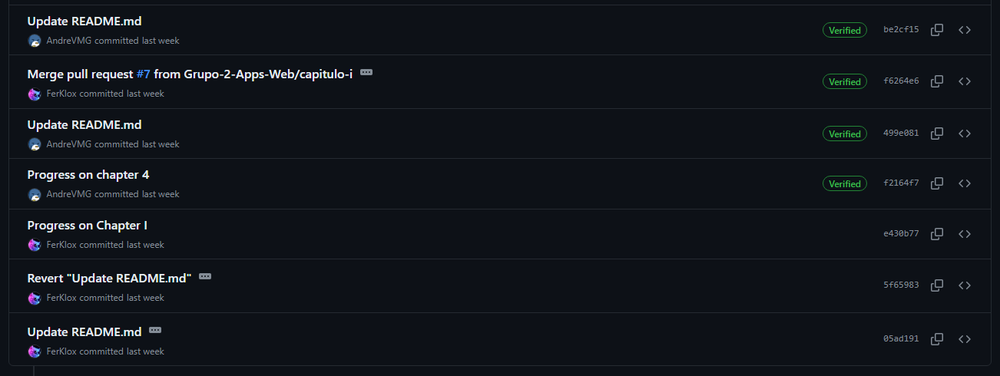

Commits en project report TP1:

Commits en project report TB2:

# **Tabla de Contenido**

[Registro de Versiones](#registro-de-versiones)

[Student Outcome](#student-outcome)

[Capítulo I: Introducción](#Capítulo-I-Introducción)
  - [1.1. Startup Profile](#11-startup-profile)
    - [1.1.1. Descripción de la Startup](#111-descripción-de-la-startup)
    - [1.1.2. Perfiles de integrantes del equipo](#112-perfiles-de-integrantes-del-equipo)
  - [1.2. Solution Profile](#12-solution-profile)
    - [1.2.1. Antecedentes y problemática](#121-antecedentes-y-problemática)
    - [1.2.2. Lean UX Process](#122-lean-ux-process)
      - [1.2.2.1. Lean UX Problem Statements](#1221-lean-ux-problem-statements)
      - [1.2.2.2. Lean UX Assumptions](#1222-lean-ux-assumptions)
      - [1.2.2.3. Lean UX Hypothesis Statements](#1223-lean-ux-hypothesis-statements)
      - [1.2.2.4. Lean UX Canvas](#1224-lean-ux-canvas)
  - [1.3. Segmentos objetivo](#13-segmentos-objetivo)

[Capítulo II: Requirements Elicitation & Analysis](#Capítulo-II-Requirements-Elicitation--Analysis)
  - [2.1. Competidores](#21-competidores)
    - [2.1.1. Análisis competitivo](#211-análisis-competitivo)
    - [2.1.2. Estrategias y tácticas frente a competidores](#212-estrategias-y-tácticas-frente-a-competidores)
  - [2.2. Entrevistas](#22-entrevistas)
    - [2.2.1. Diseño de entrevistas](#221-diseño-de-entrevistas)
    - [2.2.2. Registro de entrevistas](#222-registro-de-entrevistas)
    - [2.2.3. Análisis de entrevistas](#223-análisis-de-entrevistas)
  - [2.3. Needfinding](#23-needfinding)
    - [2.3.1. User Personas](#231-user-personas)
    - [2.3.2. User Task Matrix](#232-user-task-matrix)
    - [2.3.3. User Journey Mapping](#233-user-journey-mapping)
    - [2.3.4. Empathy Mapping](#234-empathy-mapping)
    - [2.3.5. As-is Scenario Mapping](#235-as-is-scenario-mapping)
  - [2.4. Ubiquitous Language](#24-ubiquitous-language)

[Capítulo III: Requirements Specification](#Capítulo-III-Requirements-Specification)
  - [3.1. To-Be Scenario Mapping](#31-to-be-scenario-mapping)
  - [3.2. User Stories](#32-user-stories)
  - [3.3. Impact Mapping](#33-impact-mapping)
  - [3.4. Product Backlog](#34-product-backlog)

[Capítulo IV: Product Design](#Capítulo-IV-Product-Design)
  - [4.1. Style Guidelines](#41-style-guidelines)
    - [4.1.1. General Style Guidelines](#411-general-style-guidelines)
    - [4.1.2. Web Style Guidelines](#412-web-style-guidelines)
  - [4.2. Information Architecture](#42-information-architecture)
    - [4.2.1. Organization Systems](#421-organization-systems)
    - [4.2.2. Labeling Systems](#422-labeling-systems)
    - [4.2.3. SEO Tags and Meta Tags](#423-seo-tags-and-meta-tags)
    - [4.2.4. Searching Systems](#424-searching-systems)
    - [4.2.5. Navigation Systems](#425-navigation-systems)
  - [4.3. Landing Page UI Design](#43-landing-page-ui-design)
    - [4.3.1. Landing Page Wireframe](#431-landing-page-wireframe)
    - [4.3.2. Landing Page Mock-up](#432-landing-page-mock-up)
  - [4.4. Web Applications UX/UI Design](#44-web-applications-uxui-design)
    - [4.4.1. Web Applications Wireframes](#441-web-applications-wireframes)
    - [4.4.2. Web Applications Wireflow Diagrams](#442-web-applications-wireflow-diagrams)
    - [4.4.3. Web Applications Mock-ups](#443-web-applications-mock-ups)
    - [4.4.4. Web Applications User Flow Diagrams](#444-web-applications-user-flow-diagrams)
  - [4.5. Web Applications Prototyping](#45-web-applications-prototyping)
  - [4.6. Domain-Driven Software Architecture](#46-domain-driven-software-architecture)
    - [4.6.1. Software Architecture Context Diagram](#461-software-architecture-context-diagram)
    - [4.6.2. Software Architecture Container Diagrams](#462-software-architecture-container-diagrams)
    - [4.6.3. Software Architecture Components Diagrams](#463-software-architecture-components-diagrams)
  - [4.7. Software Object-Oriented Design](#47-software-object-oriented-design)
    - [4.7.1. Class Diagrams](#471-class-diagrams)
    - [4.7.2. Class Dictionary](#472-class-dictionary)
  - [4.8. Database Design](#48-database-design)
    - [4.8.1. Database Diagram](#481-database-diagram)

[Capítulo V: Product Implementation, Validation & Deployment](#Capítulo-V-Product-Implementation-Validation--Deployment)
  - [5.1. Software Configuration Management](#51-software-configuration-management)
    - [5.1.1. Software Development Environment Configuration](#511-software-development-environment-configuration)
    - [5.1.2. Source Code Management](#512-source-code-management)
    - [5.1.3. Source Code Style Guide & Conventions](#513-source-code-style-guide--conventions)
    - [5.1.4. Software Deployment Configuration](#514-software-deployment-configuration)
  - [5.2. Landing Page, Services & Applications Implementation](#52-landing-page-services--applications-implementation)
    - [5.2.1. Sprint 1](#521-sprint-1)
      - [5.2.1.1. Sprint Planning 1](#5211-sprint-planning-1)
      - [5.2.1.2. Sprint Backlog 1](#5212-sprint-backlog-1)
      - [5.2.1.3. Development Evidence for Sprint Review](#5213-development-evidence-for-sprint-review)
      - [5.2.1.4. Testing Suite Evidence for Sprint Review](#5214-testing-suite-evidence-for-sprint-review)
      - [5.2.1.5. Execution Evidence for Sprint Review](#5215-execution-evidence-for-sprint-review)
      - [5.2.1.6. Services Documentation Evidence for Sprint Review](#5216-services-documentation-evidence-for-sprint-review)
      - [5.2.1.7. Software Deployment Evidence for Sprint Review](#5217-software-deployment-evidence-for-sprint-review)
      - [5.2.1.8. Team Collaboration Insights during Sprint](#5218-team-collaboration-insights-during-sprint)
    - [5.2.2. Sprint 2](#522-sprint-2)
      - [5.2.2.1. Sprint Planning 2](#5221-sprint-planning-2)
      - [5.2.2.2. Sprint Backlog 2](#5222-sprint-backlog-2)
      - [5.2.2.3. Development Evidence for Sprint Review](#5223-development-evidence-for-sprint-review)
      - [5.2.2.4. Testing Suite Evidence for Sprint Review](#5224-testing-suite-evidence-for-sprint-review)
      - [5.2.2.5. Execution Evidence for Sprint Review](#5225-execution-evidence-for-sprint-review)
      - [5.2.2.6. Services Documentation Evidence for Sprint Review](#5226-services-documentation-evidence-for-sprint-review)
      - [5.2.2.7. Software Deployment Evidence for Sprint Review](#5227-software-deployment-evidence-for-sprint-review)
      - [5.2.2.8. Team Collaboration Insights during Sprint](#5228-team-collaboration-insights-during-sprint)
    - [5.2.3. Sprint 3](#523-sprint-3)
      - [5.2.3.1. Sprint Planning 3](#5231-sprint-planning-3)
      - [5.2.3.2. Sprint Backlog 3](#5232-sprint-backlog-2)
      - [5.2.3.3. Development Evidence for Sprint Review](#5233-development-evidence-for-sprint-review)
      - [5.2.3.4. Testing Suite Evidence for Sprint Review](#5234-testing-suite-evidence-for-sprint-review)
      - [5.2.3.5. Execution Evidence for Sprint Review](#5235-execution-evidence-for-sprint-review)
      - [5.2.3.6. Services Documentation Evidence for Sprint Review](#5236-services-documentation-evidence-for-sprint-review)
      - [5.2.3.7. Software Deployment Evidence for Sprint Review](#5237-software-deployment-evidence-for-sprint-review)
      - [5.2.3.8. Team Collaboration Insights during Sprint](#5238-team-collaboration-insights-during-sprint)
    - [5.2.4. Sprint 4](#524-sprint-4)
      - [5.2.4.1. Sprint Planning 4](#5241-sprint-planning-4)
      - [5.2.4.2. Sprint Backlog 4](#5242-sprint-backlog-4)
      - [5.2.4.3. Development Evidence for Sprint Review](#5243-development-evidence-for-sprint-review)
      - [5.2.4.4. Testing Suite Evidence for Sprint Review](#5244-testing-suite-evidence-for-sprint-review)
      - [5.2.4.5. Execution Evidence for Sprint Review](#5245-execution-evidence-for-sprint-review)
      - [5.2.4.6. Services Documentation Evidence for Sprint Review](#5246-services-documentation-evidence-for-sprint-review)
      - [5.2.4.7. Software Deployment Evidence for Sprint Review](#5247-software-deployment-evidence-for-sprint-review)
      - [5.2.4.8. Team Collaboration Insights during Sprint](#5248-team-collaboration-insights-during-sprint)
  - [5.3. Validation Interviews](#53-validation-interviews)
    - [5.3.1. Diseño de Entrevistas](#531-diseño-de-entrevistas)
    - [5.3.2. Registro de Entrevistas](#532-registro-de-entrevistas)
    - [5.3.3. Evaluaciones según heurísticas](#533-evaluaciones-según-heurísticas)
  - [5.4. Video About-the-Product](#54-video-about-the-product)

[Conclusiones](#conclusiones)
  - [Conclusiones y recomendaciones](#conclusiones-y-recomendaciones)
  - [Video About-the-Team](#video-about-the-team)

[Bibliografía](#bibliografía)

[Anexos](#anexos)

# Student Outcome

ABET – EAC - Student Outcome 5
Criterio: La capacidad de funcionar efectivamente en un equipo cuyos miembros juntos proporcionan liderazgo, crean un entorno de colaboración e inclusivo, establecen objetivos, planifican tareas y cumplen objetivos.

|Criterio específico|Acciones realizadas|Conclusiones|
| :- | :- | :- |
|Participa en equipos multidisciplinarios con eficacia, eficiencia y objetividad, en el marco de un proyecto en soluciones de ingeniería de software.|
**Delgado Corrales, Piero Gonzalo**

**TB1:** He ayudado a organizar las actividades del equipo de tal modo que hemos podido trabajar de manera simultánea para entregar resultados rápidamente.  **TP1:** He organizado las actividades del equipo como la división de exposiciones y tareas del sprint 2 para alcanzar los objetivos de este entregable.  **TB2:** He organizado las actividades para el sprint 3 y alcanzar los objetivos en el plazo por distintos medios de comunicación.

**Matos Fernandez, Christian Andre**

**TB1:** He contribuido en la coordinación de las tareas del equipo de manera que hemos sido capaces de realizar múltiples actividades de forma concurrente, lo que nos ha permitido alcanzar resultados de manera ágil y eficiente.  **TP1:** He planificado las actividades del equipo, incluyendo la asignación de presentaciones y tareas para la segunda fase del proyecto, con el fin de lograr los objetivos establecidos para este entregable.   **TB2:** He completado todas las tareas del sprint 3, asegurándome de que todos los objetivos se cumplieran dentro del plazo establecido.

**Paredes Puente, Sebastián Roberto**

**TB1:** He coordinado en las reuniones para establecer los trabajos que le tocaba hacer a cada uno para el informe. Adicionalmente, apoyé activamente en las actividades del equipo, asegurando que trabajemos de forma simultánea y eficiente para lograr una entrega rápida y bien hecha.  **TP1:** Para esta entrega parcial, la comunicación en el equipo ha sido fundamental. Me comuniqué con mis compañeros para coordinar y asignar tareas de manera ordenada. Gracias a esto, logramos crear las funcionalidades esenciales del frontend de la aplicación web.  **TB2:** Logré completar todas mis tareas asignadas para este Sprint 3, asegurándome de cumplir todos los objetivos dentro del plazo establecido. Durante esta tercera entrega, organizamos adecuadamente las actividades a través de distintos medios de comunicación para desarrollar tanto el Frontend como el Backend de la aplicación.

**Salinas Torres, Salvador Antonio**

**TB1:** Contribuí ágilmente durante el desarrollo de esta entrega, siempre estando pendiente del tiempo para llegar a la fecha límite habiendo terminado todos los puntos requeridos. Asimismo, me aseguré de utilizar el flujo de trabajo GitFlow con el cual ya estaba familiarizado anteriormente y pude enseñar al resto de mi equipo para que lo apliquen correctamente.  **TP1:** Para esta entrega, apoyé en la distribución de tareas y poder lograr el objetivo de este segundo sprint satisfactoriamente. Y logre trabajar en la parte de Frontend de nuestra aplicación, usando el framework Vue y creando una fake api para simulación de datos.   **TB2:** En esta tercera entrega, se desarrolló el Sprint 3 del proyecto, el cual se basó en el desarrollo del Frontend y Backend de la aplicación. Para ello, nos organizamos adecuadamente con las tareas y llegar a cumplir con todo en la fecha límite.

**Valverde Mozo, Andre Gabriel**

**TB1:** Participé en las reuniones grupales para establecer las responsabilidades de cada miembro en el informe. Además, contribuí de manera activa en las labores del equipo, asegurando que trabajaramos de forma coordinada y eficiente para alcanzar una entrega rápida y de calidad.  **TP1:** Durante esta fase intermedia de desarrollo, la comunicación dentro del equipo ha demostrado ser un pilar fundamental. Me he mantenido en constante contacto con mis colegas, estableciendo un flujo de comunicación efectivo para coordinar nuestras acciones y asignar tareas de manera organizada y eficiente.   **TB2:** En esta entrega nos enfocamos en el Sprint 3, centrándonos en el desarrollo del backend y su integración con el frontend. Implementamos funcionalidades clave para el procesamiento de datos y la gestión de usuarios, y mejoramos la interfaz de usuario para una experiencia más intuitiva. Esta sincronización entre backend y frontend garantiza una aplicación más robusta y eficiente, acercándonos a nuestros objetivos del proyecto.
|**TB1:** Para esta primera entrega, la comunicación efectiva ha sido esencial ya que la cantidad de contenidos a presentar ha sido grande. Del mismo modo, realizar reuniones de grupo nos sirvió para ser más eficientes a la hora de gestionar los avances para llegar a entregar lo pedido.   **TP1:** Para esta entrega parcial, la comunicación en el equipo ha sido importante para alcanzar a crear todas las funcionalidades esenciales del apartado del frontend de la aplicación web.   **TB2:** Para esta entrega, se han recopilado las opiniones de los segmentos en las entrevistas de validación para realizar mejoras en el diseño y funcionalidades de nuestra aplicación. |
|Conoce al menos un sector empresarial o dominio de aplicación de soluciones de software.|
**Delgado Corrales, Piero Gonzalo**

**TB1:** Para esta primera entrega, he investigado sobre los principales competidores en el sector de aplicaciones para la gestión de transporte terrestre.  **TP1:** Para esta entrega del trabajo parcial, he utilizado los conocimientos que obtuve de la entrevista que realicé para crear la vista del frontend de forma más objetiva.   **TB2:** Para esta entrega, se ha aprendido más sobre la opinión de los dos segmentos objetivos mediante las entrevistas de validación. 

**Matos Fernandez, Christian Andre**

**TB1:** Para esta entrega, me he dedicado a investigar acerca de los competidores principales dentro del sector de aplicaciones destinadas a la gestión del transporte terrestre.  **TP1:** En este trabajo parcial, apliquen los aprendizajes obtenidos de la entrevista que llevé a cabo para desarrollar la interfaz del frontend de manera más imparcial y precisa.   **TB2:** Durante este tercer sprint, llevé a cabo entrevistas de validación en las que expliqué el desarrollo realizado en la aplicación. Esto nos permitió obtener valiosas opiniones de nuestros segmentos objetivo para seguir mejorando. 

**Paredes Puente, Sebastián Roberto**

**TB1:** Para este proyecto, realicé una investigación exhaustiva en el sector empresarial vinculado al transporte de carga. Durante este proceso, tuve la oportunidad de entrevistar a profesionales con amplia experiencia en el campo, lo que me permitió comprender mejor sus necesidades y obtener una perspectiva renovada para el desarrollo de nuestra aplicación.   **TP1:** Para esta entrega parcial del trabajo, he utilizado los conocimientos recopilados de artefactos como entrevistas para diseñar la solución de software del frontend.  **TB2:** Durante este tercer sprint, llevé a cabo entrevistas de validación en las que expliqué el desarrollo realizado en la aplicación. Esto nos permitió obtener valiosas opiniones de nuestros segmentos objetivo para seguir mejorando. En esta entrega, nos enfocamos en el desarrollo del backend y su integración con el frontend, implementando funcionalidades clave para el procesamiento de datos y la gestión de usuarios, y mejorando la interfaz de usuario para una experiencia más intuitiva. Esta sincronización entre backend y frontend garantiza una aplicación más eficiente, acercándonos a los objetivos del proyecto.

**Salinas Torres, Salvador Antonio**

**TB1:** Realicé una investigación sobre la necesidad para el seguimiento de transporte de forma segura y que tan importante puede llegar a ser para las empresas que requieren de un servicio de transporte para cargas grandes. De este modo, investigué en un área que yo no conocía muy bien, e igualmente logré obtener los datos necesarios para realizar un buen trabajo   **TP1:** Tomando en cuenta toda la investigación de mercado realizada en la entrega anterior, he apoyado en la realización de una interfaz en Frontend que sea de agrado para nuestros segmentos objetivo y lograr con los requisitos planteados.   **TB2:** En este tercer sprint, realicé entrevistas de validación, en el cual expliqué lo que se trabajó en la aplicación, y con esto pudimos obtener una buena retroalimentación de nuestros segmentos objetivo para seguir mejorando.

**Valverde Mozo, Andre Gabriel**

**TB1:** Para esta primera entrega, investigué el diseño de páginas de destino en aplicaciones de gestión de transporte terrestre. Analicé la presentación de productos, elementos visuales, y cómo se guía al usuario hacia la conversión, obteniendo una visión completa de las mejores prácticas en este ámbito.  **TP1:** Durante este proceso, he aplicado los conocimientos adquiridos de las entrevistas para desarrollar la interfaz del frontend con mayor imparcialidad y precisión. La información obtenida de las entrevistas ha sido fundamental para entender las necesidades y perspectivas de los usuarios, lo que ha influido directamente en el diseño de la interfaz.   **TB2:** En este avance, me comuniqué con mi grupo de trabajo para coordinar los cambios e implementaciones relacionados con el backend. Implemente los endpoints necesarios y realice la documentación correspondiente, mostrando evidencia de su funcionamiento. Además, integramos el frontend y el backend para proporcionar el máximo valor a nuestros usuarios.
|
 **TB1:** Para esta entrega, se realizó una investigación a los principales competidores en el sector de aplicaciones para la gestión de transporte terrestre; y, a su vez, a personas que se encuentran involucradas en el rubro, obteniendo una perspectiva valiosa para el desarrollo del proyecto.   **TP1:** Para esta entrega del trabajo parcial, se han tenido que usar los conocimientos recopilados de los artefactos como entrevistas para diseñar la solución de software del apartado frontend.   **TB2:** Para esta entrega, se han recopilado las opiniones de los segmentos en las entrevistas de validación para realizar mejoras en el diseño y funcionalidades de nuestra aplicación. 
|

# Capítulo I Introducción
## 1.1 Startup Profile
### 1.1.1 Descripción de la Startup

CargoWatch es una startup dedicada a abordar los desafíos de transparencia y eficiencia en el transporte de carga para empresas. Nuestro producto CargoApp resuelve la falta de visibilidad y transparencia en el proceso logístico al proporcionar seguimiento en tiempo real de la ubicación y estado de la carga durante el transporte.

**Misión:**

En CargoWatch, nuestra misión es brindar transparencia y confianza a través de nuestra plataforma. Buscamos simplificar y optimizar las operaciones logísticas para nuestros clientes, permitiéndoles gestionar sus envíos de manera eficiente y segura.

**Visión:**

Nuestra visión es liderar la innovación tecnológica en seguimiento de transporte de carga, siendo reconocidos por nuestra innovación, confiabilidad y compromiso con la excelencia en el servicio.

  

### 1.1.2 Perfiles de integrantes del equipo

<table>
  <tr>
    <td valign="top" width="450px">
      
<strong>Delgado Corrales, Piero Gonzalo (U202210749)</strong> Estoy cursando el quinto ciclo de la carrera de Ingeniería de Software. Entre mis habilidades técnicas está la programación en lenguaje C++, un conocimiento variado de estructuras de datos y sus aplicaciones. Del mismo modo, el último ciclo he aprendido sobre diseño de páginas web mediante el uso de HTML y CSS, y herramientas como Figma. Soy una persona responsable e intento mantener una buena organización para gestionar las entregas de trabajos eficientemente.

    </td>
    <td height="200px" align="center">
      
    </td>
  </tr>
  <tr>
    <td>
      
<strong>Salinas Torres, Salvador Antonio (U20221B127)</strong> Soy estudiante de quinto ciclo de la carrera de Ingeniería de Software. Poseo conocimientos en programación orientada a objetos en C++ y Python, desarrollo web usando HTML, CSS y JavaScript, y gestión de base de datos en SQL Server. Considero que soy una persona responsable y siempre organizo el tiempo para hacerlos tranquilamente antes de la fecha de entrega.

    </td>
    <td height="200px" align="center">
      
    </td>
  </tr>
  <tr>
    <td>
      
<strong>Paredes Puente, Sebastián Roberto (U202217239)</strong> Mi nombre es Sebastian Roberto Paredes Puente, soy estudiante de ingeniería de software en la UPC. Dentro de mis habilidades se encuentran el analizar información, programar en lenguaje C++, además, he cursado cursos de programación con el lenguaje de Python, SQL server y HTML. Con respecto a mis habilidades blandas, poseo adaptabilidad, pensamiento creativo, trabajo en equipo, gestión del tiempo y capacidad analítica para la resolución de problemas. Me considero una persona responsable con respecto a diversos trabajos grupales; además, tengo puntualidad a la hora de entregar trabajos y/o proyectos.

    </td>
    <td height="200px" align="center">
      
    </td>
  </tr>
  <tr>
    <td>
      
<strong>Matos Fernandez, Christian Matos (U202217239)</strong> Me llamo Christian Matos, y estoy en mi quinto ciclo de Ingeniería de Software. Poseo experiencia en programación en lenguajes como Python, C++, y JavaScript. Disfruto contribuir con mis habilidades y trabajar en equipo para alcanzar nuestros objetivos comunes.

    </td>
    <td height="200px" align="center">
      
    </td>
  </tr>
  <tr>
    <td>
      
<strong>Valverde Mozo, Andre Gabriel (U202218899)</strong> Mi perfil se basa en ser alguien que busca soluciones creativas a todo problema, todo es posible al fin y al cabo. Considero que tengo una buena capacidad de análisis de problemas y un pensamiento rápido en dichos casos. Me encanta todo lo que es la programación ya que es una forma de arte para mi, solo que lo puedo hacer realidad frente a mis ojos.

    </td>
    <td height="200px" align="center">
      
    </td>
  </tr>
</table>

## 1.2. Solution Profile

### 1.2.1 Antecedentes y problemática

En el ámbito del transporte de carga para empresas, se observa una creciente demanda de incrementar la transparencia y eficiencia en las operaciones logísticas. Sin embargo, los proveedores de servicios de transporte se enfrentan a desafíos considerables al intentar ofrecer evidencia de carga y seguimiento en tiempo real de las unidades de transporte, lo que puede resultar en inquietudes y desconfianza por parte de los clientes.

5 “W”s + 2 "H"'s

**WHAT (QUÉ)**
- **¿Cual es el problema?**  
  El problema radica en la falta de transparencia y visibilidad en el proceso de transporte de carga, lo que conduce a malentendidos, desconfianza y preocupaciones por parte de los clientes. Los proveedores de servicios de transporte y sus clientes enfrentan dificultades para obtener información actualizada y precisa sobre la ubicación y el estado de la carga durante el transporte. Esto puede generar una gestión ineficiente de la cadena de suministro, afectar la satisfacción del cliente y obstaculizar la comunicación efectiva entre ambas partes.
  
- **¿Cuál es la relación con la persona en cuestión?**  
  La relación con la persona en cuestión está determinada por su papel en el proceso de transporte de carga. Si actúa como proveedor de servicios de transporte, su relación es directa con la eficiencia y transparencia en la entrega de mercancías. Si es cliente, depende de esa transparencia para asegurar la entrega oportuna y en buenas condiciones de sus productos. La falta de transparencia afecta directamente la relación entre proveedores y clientes, pudiendo generar gestión deficiente de la cadena de suministro e insatisfacción del cliente.

**WHEN (CUÁNDO)**
- **¿Cuándo sucede el problema?**  
  El problema de falta de transparencia y visibilidad en el proceso de transporte de carga puede surgir en cualquier momento durante el transporte, desde la carga inicial de la mercancía hasta su entrega final. Este problema puede manifestarse en diferentes etapas del proceso de transporte, lo que incluye la falta de información sobre la ubicación y el estado de la carga en tiempo real, así como la incapacidad para acceder a datos precisos sobre los gastos asociados y los tiempos de entrega estimados.
  
- **¿Cuando utiliza el cliente el producto?**  
  El cliente utiliza el producto, la aplicación de seguimiento de transporte de carga, para monitorear en tiempo real la ubicación y el estado de su carga durante el transporte, así como para revisar los registros de gastos asociados y comunicarse con el proveedor de servicios de transporte.

**WHERE (DÓNDE)**
- **¿Dónde está el cliente cuando usa el producto?**  
  El cliente puede usar el producto, la aplicación de seguimiento de transporte de carga, desde cualquier lugar donde tenga acceso a un dispositivo móvil o una computadora con conexión a internet. Esto puede ser en su oficina, en su hogar, o incluso mientras está en movimiento, permitiéndole monitorear el transporte de su carga desde cualquier ubicación conveniente para él.
  
- **¿A dónde se dirige?**  
  El cliente se dirige a la aplicación de seguimiento de transporte de carga para obtener información en tiempo real sobre el progreso y la ubicación de su carga durante el transporte. La aplicación le proporciona la visibilidad necesaria para monitorear el estado de su mercancía y tomar decisiones informadas sobre la gestión de la cadena de suministro, asegurando una entrega oportuna y eficiente.
  
- **¿Dónde surge el problema?**  
  El problema surge en el proceso de interacción entre proveedores de transporte y clientes, donde la comunicación y la visibilidad son clave.

**WHO (QUIÉN)**
- **¿Quienes están involucrados?**  
  Los involucrados incluyen a los proveedores de servicios de transporte de carga, que son responsables de la entrega de la mercancía, y a los clientes que envían o reciben las mercancías a través de estos servicios.
  
- **¿A quienes les sucede el problema?**  
  El problema de falta de transparencia y visibilidad en el proceso de transporte de carga afecta tanto a los proveedores de servicios de transporte como a sus clientes.
  
- **¿Quién lo utilizará?**  
  El producto, la aplicación de seguimiento de transporte de carga, será utilizado tanto por proveedores de servicios de transporte como por sus clientes.

**WHY (PORQUÉ)**
- **¿Cuál es la causa del problema?**  
  La causa del problema radica en la falta de herramientas efectivas para proporcionar transparencia y visibilidad en el proceso de transporte de carga, lo que dificulta la comunicación y la toma de decisiones informadas tanto para los proveedores de servicios de transporte como para sus clientes.
**HOW (CÓMO)**
- **¿Cómo nos conocieron los compradores?**  
  Los compradores pueden conocer el producto a través de diversos canales, como recomendaciones de otros clientes, publicidad en línea, marketing en redes sociales, búsquedas en internet, participación en eventos de la industria o mediante asociaciones con empresas de transporte de carga.
  
- **¿Cómo prefieren los clientes acceder a nuestro contenido?**  
  Los clientes prefieren acceder al contenido a través de una aplicación móvil intuitiva y fácil de usar, que les permita monitorear en tiempo real el progreso del transporte de carga, revisar los registros de gastos y comunicarse con los proveedores de servicios de transporte de manera conveniente desde sus dispositivos móviles.
  
- **¿Que llevó a la persona a llegar a esta situación?**  
  La falta de transparencia y visibilidad en el transporte de carga puede ser el resultado de herramientas de comunicación y seguimiento inadecuadas entre proveedores y clientes.

**HOW MUCH (CUÁNTO)**
- **¿Cuánto presupuesto se necesita para realizar el proyecto?**  
  Determinar el presupuesto exacto requerido para el proyecto de seguimiento de transporte de carga dependerá de varios factores, como el alcance del desarrollo de la aplicación, la complejidad de las características requeridas, los costos de desarrollo de software, integración de tecnologías de seguimiento, mantenimiento continuo y otros gastos asociados. Sería necesario realizar un análisis detallado del proyecto para estimar con precisión el presupuesto necesario.

### 1.2.2 Lean UX Process.

#### 1.2.2.1. Lean UX Problem Statements.

En el sector de transporte de carga para empresas, existe una necesidad creciente de mejorar la transparencia y eficiencia en las operaciones logísticas. Actualmente, los proveedores de servicios de transporte enfrentan desafíos significativos para proporcionar evidencia de carga y seguimiento en tiempo real de las unidades de transporte, lo que puede generar preocupaciones y desconfianza por parte de los clientes.

Los clientes de los proveedores de servicios de transporte carecen de visibilidad sobre el estado y la ubicación de sus envíos durante el proceso de transporte de carga. La falta de información en tiempo real sobre el recorrido de las unidades de transporte y los gastos asociados puede resultar en preocupaciones, incertidumbre y falta de confianza en el servicio proporcionado. Esta falta de transparencia y visibilidad puede conducir a una experiencia del cliente insatisfactoria, aumentar el riesgo de disputas y reclamaciones, y afectar negativamente la reputación de los proveedores de servicios de transporte. Además, la incapacidad para registrar y documentar adecuadamente los gastos asociados con el transporte de carga puede resultar en una gestión ineficiente de costos y una rentabilidad reducida para los proveedores de servicios de transporte.

¿Cómo podemos garantizar la entrega de evidencia fotográfica al momento de cargar la mercancía de manera confiable? ¿Cuáles son los principales puntos de dolor para los clientes al no poder rastrear el estado y la ubicación de sus envíos durante el transporte de carga? ¿Qué sistemas o herramientas se utilizan actualmente para mostrar el recorrido de las unidades de transporte a los clientes? ¿Cómo podemos mejorar la eficiencia en la captura y registro de los gastos asociados con el transporte de carga, como gasolina diesel, peajes y viáticos del conductor? ¿Qué información específica esperan los clientes recibir sobre el recorrido de sus envíos para sentirse seguros y confiados con el servicio?

#### 1.2.2.2. Lean UX Assumptions

**Business Outcomes:**

- **Creemos que nuestros clientes necesitan:**

  Nuestros clientes necesitan una aplicación que les proporcione seguimiento en tiempo real de su carga, evidencia fotográfica al cargar mercancía, registro automático de gastos, visualización detallada del recorrido, comunicación directa y la integración de documentos importantes.

- **Estas necesidades se pueden resolver con:**

  Estas necesidades se pueden resolver con una aplicación de seguimiento de carga que incluya tecnología GPS, funciones de carga de imágenes, registro automático de gastos, mapeo del recorrido, comunicación integrada y almacenamiento de documentos.

- **Nuestros clientes iniciales son (o serán):**
  
  Nuestros clientes iniciales son empresas de transporte de carga, empresas de logística y cualquier entidad que requiera supervisar y gestionar el transporte de mercancías de manera eficiente y transparente.

- **El valor #1 que un cliente quiere de nuestro servicio es:**

  El valor número uno que un cliente desea de nuestro servicio es la transparencia en el transporte de su carga, incluyendo la capacidad de rastreo en tiempo real, evidencia fotográfica de la carga, y acceso fácil a información detallada sobre el progreso y el estado de su envío.

- **El cliente también puede obtener estos beneficios adicionales:**

  Además de la transparencia en el transporte de carga, el cliente puede obtener beneficios adicionales como mayor eficiencia operativa, reducción de costos, satisfacción del cliente, toma de decisiones estratégicas basadas en datos y cumplimiento normativo.

- **Vamos a adquirir la mayoría de nuestros clientes a través de:**

  Vamos a adquirir la mayoría de nuestros clientes a través de estrategias de marketing digital, asociaciones con empresas de logística y transporte, y mediante la participación en ferias y eventos de la industria logística y de transporte de carga.

- **Haremos dinero a través de:**

  A través de tarifas por transacción, donde cobramos una pequeña comisión por cada carga transportada utilizando nuestra plataforma. Esto incentivaría a nuestros clientes a utilizar activamente nuestra aplicación para gestionar sus envíos, y a medida que su volumen de negocios aumenta, también aumentan nuestros ingresos.

- **Nuestra competencia principal en el mercado será:**

  Nuestra competencia principal en el mercado será otras plataformas de seguimiento de transporte de carga que ofrecen funcionalidades similares, así como empresas de logística establecidas que puedan proporcionar soluciones internas de seguimiento de carga a sus clientes.

- **Los venceremos debido a:**

  Los venceremos debido a nuestra solución integral, personalizable y fácil de usar, junto con un servicio al cliente excepcional y capacidad de adaptación a las necesidades del mercado.

- **Nuestro mayor riesgo de producto es:**

  Nuestro mayor riesgo de producto es la falta de adopción por parte de los clientes debido a la competencia en el mercado y la percepción de falta de valor distintivo en nuestras características.

- **Resolveremos esto a través de:**

  Resolveremos esto a través de mejoras constantes en nuestra oferta, una campaña de marketing sólida y un compromiso firme con la satisfacción del cliente.

**User Outcomes:**

- **¿Quién será nuestro usuario?**

  Nuestro usuario será cualquier entidad involucrada en el transporte de carga, como empresas de logística y transporte, así como gestores de flotas y operadores logísticos.

- **¿Dónde encaja nuestro producto en su vida?**

  Nuestro producto encaja en la vida de los usuarios al ofrecer una solución integral y eficiente para supervisar y gestionar el transporte de carga, desde la planificación hasta el seguimiento en tiempo real y la gestión de documentos.

- **¿Qué problemas tiene nuestro producto y cómo se pueden resolver?**

  Algunos problemas potenciales de nuestro producto podrían incluir dificultades técnicas y desafíos en la adopción por parte de los usuarios. Estos pueden abordarse mediante pruebas exhaustivas, mejoras continuas y una estrategia de marketing efectiva.

- **¿Cómo y cuándo es usado nuestro producto?**

  Nuestro producto es utilizado por nuestros clientes durante todo el proceso de transporte de carga, desde la planificación y coordinación inicial hasta el seguimiento en tiempo real durante el viaje y la gestión de documentos una vez que se completa la entrega. Se utiliza en momentos clave como la programación de envíos, la supervisión del progreso del transporte y la resolución de problemas o incidencias que puedan surgir en cualquier etapa del proceso logístico.

- **¿Qué problemas tiene nuestro producto?**

  Algunos problemas potenciales de nuestro producto pueden incluir dificultades técnicas, resistencia a la adopción por parte de los usuarios y competencia en el mercado.

- **¿Qué características son importantes?**

  Algunas características importantes pueden incluir seguimiento en tiempo real, evidencia fotográfica, registro de gastos, comunicación integrada, integración de documentos y análisis de datos.

#### 1.2.2.3. Lean UX Hypothesis Statements.

Creemos que la implementación de sistemas de seguimiento en tiempo real en nuestra cadena de suministro mejorará la visibilidad de la carga. 

Sabremos que esto es cierto cuando veamos una reducción significativa en los tiempos de respuesta a consultas de ubicación de la carga por parte de los clientes.

Creemos que la capacitación del personal en protocolos de comunicación estandarizados aumentará la transparencia en nuestras operaciones logísticas. 

Sabremos que esto es cierto cuando veamos una disminución en los malentendidos y una mejora en la precisión de la información proporcionada a los clientes sobre el estado de sus envíos.

Creemos que la adopción de una plataforma de gestión de la cadena de suministro centralizada aumentará la eficiencia operativa y la colaboración entre los diferentes actores.
 
Sabremos que esto es cierto cuando veamos una mejora en la coordinación entre los proveedores de servicios de transporte, almacenes y clientes, reflejada en una reducción en los retrasos y errores en la entrega de la carga.

Creemos que la retroalimentación regular de los clientes sobre la visibilidad de la carga nos proporcionará información valiosa para mejorar nuestros procesos. 

Sabremos que esto es cierto cuando veamos un aumento en la satisfacción del cliente y una mayor confianza en nuestra capacidad para proporcionar información precisa y oportuna sobre sus envíos.

Creemos que la colaboración estrecha con nuestros proveedores de servicios de transporte para implementar tecnologías de seguimiento avanzadas mejorará la trazabilidad de la carga. 

Sabremos que esto es cierto cuando veamos una disminución en los casos de pérdida o daño de la carga durante el transporte, así como una mayor precisión en los plazos de entrega estimados proporcionados a los clientes.

#### 1.2.2.4. Lean UX Canvas.

  

## 1.3. Segmentos objetivo.

| Segmento objetivo                        | Empresas de gestión de logística de transporte |
|-----------------------------------------|-------------------------------------------------|
| Edad                                    | Entre 25 y 50 años                              |
| Ubicación                               | Lima, Perú                                      |
| Sexo                                    | Masculino o Femenino                            |
| Formación educativa                     | Matriculados en instituciones de educación superior |
| Poder adquisitivo                       | Moderado y Alto                                 |
| Clase social                            | Media y Alta                                    |

| Segmento objetivo                        | Clientes que requieren servicios de transporte |
|-----------------------------------------|-------------------------------------------------|
| Edad                                    | Entre 25 y 50 años                              |
| Ubicación                               | Lima, Perú                                      |
| Sexo                                    | Masculino o Femenino                            |
| Formación educativa                     | Matriculados en instituciones de educación superior |
| Poder adquisitivo                       | Medio y Alto                                    |
| Clase social                            | Media y Alta                                    |

# Capítulo II Requirements Elicitation & Analysis

## 2.1 Competidores

Para realizar el análisis competitivo hemos tomado en consideración competidores directos e indirectos:

* LogiNext Mile: empresa que ofrece un software de optimización de rutas y planificación de entregas que automatiza y mejora la eficiencia de las operaciones de entrega, garantizando entregas más rápidas y una experiencia superior para el cliente mediante la integración de preferencias del cliente. 

  

* Drivin: empresa que busca incrementar la eficiencia de operaciones logísticas como planificación de rutas, sistema de notificaciones y monitoreo a tiempo real.

  

* SimpliRoute: aplicación que utiliza tecnología IA para optimizar rutas de entrega incorporando variables como límite de carga por vehículo, horarios y restricciones territoriales.

  

### 2.1.1 Análisis competitivo

<table>
  <tr>
    <th colspan="6" valign="top">Competitive Analysis Landscape</th>
  </tr>
  <tr>
    <td colspan="2" valign="top">¿Por qué llevar a cabo este análisis?</td>
    <td colspan="4" valign="top">El objetivo de este análisis es identificar las características de los competidores y encontrar maneras de diferenciarnos.</td>
  </tr>
  <tr>
    <td colspan="2" rowspan="2" valign="top">Startup y Competidores</td>
    <td valign="top">CargoWatch</td>
    <td valign="top">LogiNext Mile</td>
    <td valign="top">Drivin</td>
    <td valign="top">SimpliRoute</td>
  </tr>
  <tr>
    <td valign="top"></td>
    <td valign="top"></td>
    <td valign="top"></td>
    <td valign="top"></td>
  </tr>
  <tr>
    <td rowspan="2" valign="top">Perfil</td>
    <td valign="top">Overview</td>
    <td valign="top">Plataforma innovadora que ofrece seguimiento en tiempo real y transparencia en el transporte de carga para empresas</td>
    <td valign="top">Software integral para optimizar y automatizar operaciones de entrega, incluyendo planificación de rutas y seguimiento en tiempo real</td>
    <td valign="top">Plataforma para mejorar la eficiencia logística interconectando módulos como planificación de rutas y monitoreo en tiempo real</td>
    <td valign="top">Aplicación de optimización de rutas de entrega con enfoque en variables como límites de carga y horarios, utilizando tecnología IA</td>
  </tr>
  <tr>
    <td valign="top">Ventaja competitiva ¿Qué valor ofrece a los clientes?</td>
    <td valign="top">Seguimiento en tiempo real y reportes detallados de gastos como el cálculo de los costos de combustible durante el transporte de carga</td>
    <td valign="top">Entregas más rápidas, menores costos y una experiencia superior para el cliente</td>
    <td valign="top">Optimización operativa para entregas rápidas y precisas</td>
    <td valign="top">Optimización avanzada de rutas mediante IA para reducir costos y tiempos de entrega</td>
  </tr>
  <tr>
    <td rowspan="2" valign="top">Perfil de Marketing</td>
    <td valign="top">Mercado objetivo</td>
    <td valign="top">Empresas logísticas de transporte terrestre</td>
    <td valign="top">Empresas logísticas de transporte terrestre</td>
    <td valign="top">Empresas logísticas de transporte terrestre</td>
    <td valign="top">Empresas logísticas de transporte terrestre</td>
  </tr>
  <tr>
    <td valign="top">Estrategias de marketing</td>
    <td valign="top">Transparencia, seguridad e innovación</td>
    <td valign="top">Digitalización, optimización y automatización</td>
    <td valign="top">Empresa joven, dinámica y flexible</td>
    <td valign="top">Confianza, innovación y simple</td>
  </tr>
  <tr>
    <td rowspan="3" valign="top">Perfil de Producto</td>
    <td valign="top">Productos & Servicios</td>
    <td valign="top">Plataforma de seguimiento a tiempo real Reporte detallado de gastos Análisis de datos Comunicación integrada</td>
    <td valign="top">Automatización de operaciones de entrega Integraciones con terceros</td>
    <td valign="top">Distintos módulos interconectados como optimizador de ruta, gestión de documentos, disponibilidad de vehículos, etc.</td>
    <td valign="top">Algoritmo de optimización de rutas Servicio de integración de herramientas de logística</td>
  </tr>
  <tr>
    <td valign="top">Precios & Costos</td>
    <td valign="top">20$ / mes</td>
    <td valign="top">50$ / mes</td>
    <td valign="top">35$ / mes</td>
    <td valign="top">Lite (40$ / mes) Pro  (Personalizado) Corporate (Personalizado)</td>
  </tr>
  <tr>
    <td valign="top">Canales de distribución (Web y/o Móvil)</td>
    <td valign="top">Web y/o móvil</td>
    <td valign="top">Web y/o móvil</td>
    <td valign="top">Web y/o móvil</td>
    <td valign="top">Web y/o móvil</td>
  </tr>
  <tr>
    <td rowspan="4" valign="top">Análisis SWOT</td>
    <td valign="top">Fortalezas</td>
    <td valign="top">Reportes detallados de gastos, lo que permite a los usuarios analizar y controlar sus costos operativos de manera efectiva</td>
    <td valign="top">Enfoque en entregas más rápidas, menores costos y una experiencia superior para el cliente</td>
    <td valign="top">Amplia gama de servicios para mejorar la eficiencia logística</td>
    <td valign="top">Utilización de tecnología IA para optimizar rutas de entrega</td>
  </tr>
  <tr>
    <td valign="top">Debilidades</td>
    <td valign="top">Funcionalidades similares a la competencia en el mercado de otras plataformas de seguimiento de carga</td>
    <td valign="top">Riesgo de dependencia tecnológica y vulnerabilidades a posibles fallas del sistema</td>
    <td valign="top">Dependencia de la tecnología para la entrega de sus servicios, lo que podría resultar en vulnerabilidades si hay fallas técnicas</td>
    <td valign="top">Dependencia de la tecnología IA, lo que puede generar preocupaciones sobre la confiabilidad y la precisión de las soluciones</td>
  </tr>
  <tr>
    <td valign="top">Oportunidades</td>
    <td valign="top">Creciente demanda de transparencia en la cadena de suministro al aumentar la preocupación por la seguridad</td>
    <td valign="top">Expansión internacional para atender a mercados globales en crecimiento</td>
    <td valign="top">Posibilidad de expandir sus servicios hacia nuevos segmentos del mercado logístico</td>
    <td valign="top">Desarrollo de alianzas estratégicas con otras empresas para ofrecer soluciones integradas de logística</td>
  </tr>
  <tr>
    <td valign="top">Amenazas</td>
    <td valign="top">Creciente amenaza de ataques cibernéticos podría comprometer la seguridad de los datos almacenados en la plataforma</td>
    <td valign="top">Rápida evolución de la tecnología que requiere una continua inversión en investigación y desarrollo para mantenerse competitivo</td>
    <td valign="top">Cambios en las regulaciones gubernamentales que podrían afectar la operación de sus servicios de logística</td>
    <td valign="top">Competidores que desarrollan tecnologías similares de optimización de rutas utilizando IA</td>
  </tr>
</table>

### 2.1.2 Estrategias y tácticas frente a competidores
**Estrategias**

<u>Diferenciación del producto</u>: desarrollaremos características únicas y valor agregado para destacarnos de la competencia en el mercado de seguimiento de carga. Por ejemplo, el reporte de gastos a partir del seguimiento a tiempo real.

<u>Diversificación de servicios</u>: ampliaremos la gama de servicios ofrecidos además del seguimiento a tiempo real como el reporte de gastos y comunicación con los proveedores de servicio.

<u>Personalización de servicios</u>: ofreceremos opciones personalizadas para satisfacer necesidades específicas de los clientes dentro de los planes de pago.

**Tácticas**

<u>Implementación de retroalimentación de usuarios</u>: Analizaremos los comentarios de los usuarios para identificar áreas de mejora y priorizar el desarrollo de características que satisfagan las necesidades del mercado.

<u>Monitoreo de la competencia</u>: Realizaremos un seguimiento de las estrategias y tácticas tomadas por los competidores para evaluar oportunidades y estándares en la industria.

<u>Optimización de los motores de búsqueda</u>: Usaremos palabras clave relevantes, metatags adecuadas y contenido de calidad además de campañas de marketing en los motores de búsqueda para posicionarnos mejor y aumentar la visibilidad.

## 2.2 Entrevistas

### 2.2.1 Diseño de entrevistas

__Clientes que requieren servicios de transporte__:
  * ¿Qué tan importante es el servicio de transporte para la empresa donde trabaja?

  * ¿Qué tipos de transporte son necesarios para su empresa?

  * ¿Cuál cree que son los desafíos más grandes para encontrar un buen servicio de transporte para su empresa?

  * ¿Cree que una aplicación de seguimiento en tiempo real sería útil para usted en el proceso de transporte de carga?

  * ¿Considera que esta aplicación agregaría valor a su experiencia con el servicio de transporte de carga?

  * ¿Cómo cree que esta aplicación podría mejorar la transparencia y la confianza en el proceso de transporte de carga?

  * ¿Estaría dispuesto a probar una aplicación de seguimiento en tiempo real si se ofreciera como parte del servicio de transporte?

  * ¿Qué características adicionales le animaría a utilizar una aplicación de seguimiento en tiempo real para gestionar sus envíos de carga?

  * ¿Cómo cree que esta aplicación podría simplificar o mejorar sus operaciones logísticas?

  * ¿Qué expectativas tendría respecto al diseño y la usabilidad de la aplicación?

__Empresas de gestión de logística de transporte__:

  * ¿Hace cuánto tiempo que ofrece servicios de transporte?

  * ¿Cuáles son los principales desafíos que enfrentan al proporcionar servicios de transporte de carga?

  * ¿Qué tecnologías o herramientas utilizan actualmente para gestionar y rastrear envíos de carga?

  * ¿Cómo garantizan la transparencia y visibilidad en el proceso de transporte de carga para sus clientes?

  * ¿Qué medidas toman para optimizar la eficiencia operativa y reducir los costos en el transporte de carga?

  * ¿Cuál es su enfoque en términos de sostenibilidad y reducción de emisiones en el transporte de carga?

  * ¿Qué tipo de clientes suelen atender y cuáles son sus requisitos específicos?
  
  * ¿Cómo manejan las situaciones de emergencia o imprevistos durante el transporte de carga?
  
  * ¿Cuáles son los criterios que utilizan para evaluar y seleccionar socios o proveedores en su cadena de suministro?

### 2.2.2 Registro de entrevistas

**Entrevista 1 - Cliente que requiere transporte**

**Entrevistador:** Salvador Salinas

**Entrevistado:** Anderson Gonza

**Link de la entrevista:** <https://youtu.be/bfqZ8sSGn7I>

  

**Resumen de la entrevista:** 

Anderson Gonza es trabajador de una empresa que maneja grandes cargas para transportar, por lo que conoce lo difícil que puede llegar a ser encontrar a otra empresa que sea capaz de ofrecer un buen servicio de transporte para sus cargas. Se le comentó sobre la idea de una aplicación para hacer seguimiento a la carga de transporte y le pareció interesante. Comentó que sería muy útil para tener transparencia y confiabilidad al momento de realizar envíos. Además, mencionó que las notificaciones serían de mucha utilidad para conocer sobre los eventos importantes que sucedan en el proceso de transporte de un envío.

**Entrevista 2 - Cliente que requiere transporte**

**Entrevistador:** Piero Delgado

**Entrevistado:** Joaquin Rivadeneyra

**Link de la entrevista: <https://youtu.be/UriDWwVIwxw>**

  

**Resumen de la entrevista:** 

La entrevista fue realizada a Joaquín, un emprendedor que utiliza servicios de transporte de mercancías. Destacó la importancia del transporte terrestre para satisfacer la demanda de los clientes y la necesidad de movilizar la mercancía de manera rápida y segura. Mencionó los desafíos que afronta en el proceso como la confiabilidad en la entrega, la disponibilidad de vehículos adecuados y los costos competitivos. Joaquín consideraría útil una aplicación de seguimiento en tiempo real para mejorar la confiabilidad y el control sobre las entregas. También expresó interés en características como notificaciones de entrega, alertas de retrasos y comunicación directa con el transportista. Él espera que la aplicación simplifique las operaciones logísticas al proporcionar una herramienta centralizada para gestionar todos los envíos, optimizando procesos y reduciendo errores. Además, se destacó la importancia de un diseño intuitivo y fácil de usar para la aplicación.

**Entrevista 3 - Cliente que requiere transporte**

**Entrevistador:** Andre Valverde

**Entrevistado:** Rodrigo Guerra

**Link de la entrevista: <https://youtu.be/CFWmt8VZmZs>** 

  

**Resumen de la entrevista:** 

La entrevista fue con Rodrigo Guerra, un emprendedor que depende de servicios de transporte de mercancías. Destacó la importancia crítica del transporte para su negocio, enfatizando la necesidad de opciones variadas y confiables. Identificó desafíos como la falta de visibilidad y control de costos. Mostró interés en una aplicación de seguimiento en tiempo real para mejorar la transparencia y eficiencia. Expresó disposición a probarla si ayuda a mejorar la logística y destacó la importancia de una interfaz intuitiva y un diseño moderno.

**Entrevista 4 - Empresa de gestión logística de transporte**

**Entrevistador:** Christian Matos

**Entrevistado:** Valeria Cardenas

**Link de la entrevista: <https://youtu.be/g3N4MNTBP0A>**

  

**Resumen de la entrevista:** 

Valeria Cardenas, con dos años de experiencia como administradora en el sector de transporte de carga, afronta los retos geográficos e infraestructurales del país. Su enfoque se centra en la transparencia y la sostenibilidad, mediante el uso de GPS para el seguimiento de envíos, la selección de socios de alta calidad y la renovación de flotas a través de programas de capacitación para el transporte de materiales peligrosos. Asimismo, enfrenta estos desafíos gestionando envíos con herramientas como Excel y rastreo satelital, priorizando la eficiencia y la puntualidad. Además, promueve la sostenibilidad mediante la restricción de unidades antiguas y la formación del personal. 

**Entrevista 5 - Empresa de gestión logística de transporte**

**Entrevistador: Sebastian Paredes**

**Entrevistado: Miriam Puente**

**Link de la entrevista: <https://youtu.be/mCPfsJyBJNM>**

  

**Resumen de la entrevista:** 

Miriam Puente, administradora con 6 años de experiencia en transporte de carga, destaca los desafíos geográficos y de infraestructura en el país. Utilizan GPS para rastrear envíos debido a costos. Garantizan transparencia al escoger socios de calidad. Optimizan eficiencia con pruebas mecánicas y documentación en regla. Enfoque en sostenibilidad con renovación de flotas y capacitación para transporte de materiales peligrosos. Atienden clientes mineros e infraestructura con requisitos específicos. Manejan emergencias con unidades de reemplazo y conductores en reserva. Evalúan proveedores en calidad, referencias y tiempo de servicio.

**Entrevista 6 - Empresa de gestión logística de transporte**

**Entrevistador: Sebastian Paredes**

**Entrevistado: Roberto Paredes**

**Link de la entrevista: <https://youtu.be/6dreqpKNg7U>**

  

**Resumen de la entrevista:** 

Roberto Paredes, empresario con 16 años de experiencia en transporte de carga, destaca los desafíos de infraestructura y regulación. Utilizan Excel y rastreo satelital para gestionar envíos. Garantizan transparencia con eficiencia y puntualidad. Optimizan la eficiencia con capacitación y ahorro en costos. Enfoque en sostenibilidad mediante restricción de unidades antiguas. Atienden clientes de construcción con cargas especiales. Manejan emergencias con unidades de respaldo. Seleccionan proveedores serios y formales.

### 2.2.3 Análisis de entrevistas

**Cliente que requiere transporte**

**Segmento demográfico:**

Edad: personas de 25 a 50 años de edad

Sexo: Masculino y Femenino

Ocupación: Administrativo en área de logística

**Segmento Geográfico:**

País: Perú

Idioma: Español

**Segmento Psicográfico:**

Clase social: NSE A, NSE B.

**Segmento Conductual:**

Conocimientos: Conocimiento básico del manejo de una aplicación web.

Actitudes: Personas con interés en tener buen contacto con empresas de gestión logística para hacer seguimiento a los envíos que manejan.

Gracias a las entrevistas realizadas, comprendimos que para los clientes suele ser difícil encontrar una empresa de gestión logística en la cual poder confiar para hacer los envíos que son importantes para ellos. Así, al comentarle sobre nuestra idea de aplicación web para poder hacer seguimiento a los envíos de forma segura, indicaron que les pareció muy buena idea ya que brinda mejor transparencia y confiabilidad.

**Empresa de gestión logística**

**Segmento demográfico:**

Edad: personas de 25 a 50 años de edad

Sexo: Masculino y Femenino

Ocupación: Trabajador en gestión logística

**Segmento Geográfico:**

País: Perú

Idioma: Español

**Segmento Psicográfico:**

Clase social: NSE A, NSE B.

**Segmento Conductual:**

Conocimientos: Conocimiento básico del manejo de una aplicación web.

Actitudes: Personas con interés en tener buen contacto con empresas a las cuales ofrecer el servicio de transporte para sus cargas y brindar seguimiento de los envíos.

Gracias a las entrevistas realizadas, comprendimos que para las empresas suele ser difícil llevar un registro eficiente y detallado. Así, al comentarle sobre nuestra idea de aplicación web para poder hacer seguimiento a los envíos de forma segura, indicaron que les pareció muy buena idea ya que les permite registrar un informe completo y detallado que será útil para ellos y para sus clientes.

## 2.3. Needfinding

### 2.3.1. User Personas

__Segmento: Empresas de gestión logística de transporte__

  

__Segmento: Clientes que requieren servicios de transporte__

  

### 2.3.2. User Task Matrix

<table>
<tr><th rowspan="2" valign="top"><b>User Task</b></th><th colspan="2" valign="top">Empresas de gestión logística de transporte</th></tr>
<tr><td valign="top"><b>Frecuencia</b></td><td valign="top"><b>Importancia</b></td></tr>
<tr><td valign="top">Registrar una nueva carga en el sistema</td><td valign="top">Siempre</td><td valign="top">Medio</td></tr>
<tr><td valign="top">Asignar un proveedor de transporte a una carga</td><td valign="top">Siempre</td><td valign="top">Medio</td></tr>
<tr><td valign="top">Seguir el estado y la ubicación de una carga en tiempo real</td><td valign="top">A veces</td><td valign="top">Alta</td></tr>
<tr><td valign="top">Verificar la evidencia fotográfica de la carga al ser cargada</td><td valign="top">Siempre</td><td valign="top">Alta</td></tr>
<tr><td valign="top">Revisar los registros de gastos asociados al transporte de una carga</td><td valign="top">A veces</td><td valign="top">Alta</td></tr>
<tr><td valign="top">Facilitar la comunicación con los clientes</td><td valign="top">Siempre</td><td valign="top">Medio</td></tr>
<tr><td valign="top">Planificar rutas de transporte más eficientes</td><td valign="top">A veces</td><td valign="top">Medio</td></tr>
</table>

<table>
<tr><th rowspan="2" valign="top"><b>User Task</b></th><th colspan="2" valign="top">Clientes que requieren servicios de transporte</th></tr>
<tr><td valign="top"><b>Frecuencia</b></td><td valign="top"><b>Importancia</b></td></tr>
<tr><td valign="top">Solicitar un servicio de transporte para una carga</td><td valign="top">Siempre</td><td valign="top">Medio</td></tr>
<tr><td valign="top">Verificar el estado y la ubicación de una carga en tiempo real</td><td valign="top">A veces</td><td valign="top">Alta</td></tr>
<tr><td valign="top">Recibir notificaciones sobre el progreso de una entrega</td><td valign="top">Siempre</td><td valign="top">Alta</td></tr>
<tr><td valign="top">Comunicarse con el proveedor de transporte para resolver problemas</td><td valign="top">A veces</td><td valign="top">Medio</td></tr>
<tr><td valign="top">Verificar la evidencia fotográfica de la carga al ser cargada</td><td valign="top">Siempre</td><td valign="top">Alta</td></tr>
<tr><td valign="top">Solicitar cotizaciones para servicios de transporte</td><td valign="top">Siempre</td><td valign="top">Medio</td></tr>
<tr><td valign="top">Revisar los registros de gastos asociados a una entrega</td><td valign="top">A veces</td><td valign="top">Alta</td></tr>
</table>

### 2.3.3. User Journey Mapping

Usuario **Empresas de gestión logística de transporte**

  

Usuario **Clientes que requieren servicios de transporte**

  

### 2.3.4. Empathy Mapping

Usuario **Empresas de gestión logística de transporte**

  

Usuario **Clientes que requieren servicios de transporte**

  

### 2.3.5. As-is Scenario Mapping

__Segmento Empresas de gestión logística de transporte__

__Segmento Clientes que requieren servicios de transporte__

## 2.4. Ubiquitous Language

En esta sección, se definirán términos utilizados a lo largo del proyecto para que se pueda comprender para todos los miembros del equipo y agentes interesado:

- **Transport Provider (Proveedor de transporte):** Empresa o entidad encargada de transportar la carga.
- **Photographic Evidence (Evidencia fotográfica):** Imágenes que muestran la carga al ser cargada, utilizadas para verificar su estado.
- **Expense Record (Registro de gastos):** Documentación que detalla los costos asociados al transporte de una carga.
- **Transport Routes (Rutas de transporte):** Caminos o trayectos planificados para el transporte de la carga, con el objetivo de ser eficientes.
- **Customer Communication (Comunicación con los clientes):** Interacción con los clientes para proporcionar información sobre el estado de la carga y resolver cualquier problema.
- **Route Planning (Planificación de rutas):** Proceso de establecer las mejores rutas de transporte para optimizar el proceso.
- **Real-time Tracking (Seguimiento en tiempo real):** Monitorización constante de la ubicación y el estado de la carga durante su transporte.
- **Transport Coordinator (Coordinador de transporte):** Persona encargada de gestionar y coordinar el transporte de la carga.
- **Fleet Operator (Operador de flota):** Persona encargada de manejar y supervisar la flota de vehículos utilizados para el transporte de la carga.
- **Freight Transport (Transporte de carga):** El transporte de bienes o mercancías de un lugar a otro, generalmente a gran escala y a largas distancias.

# Capítulo III Requirements Specification

## 3.1. To-Be Scenario Mapping

__Segmento Empresas de gestión logística de transporte__

__Segmento Clientes que requieren servicios de transporte__

## 3.2. User Stories

**ÉPICAS**

<table><tr><th valign="top"><b>Epic ID</b></th><th valign="top"><b>Epic</b></th><th valign="top"><b>User story ID</b></th><th valign="top"><b>User stories</b></th></tr>
<tr><td rowspan="4" valign="top">E01</td><td rowspan="4" valign="top">Como cliente de empresa logística quiero tener información detallada de mis envíos en tiempo real para tener una visibilidad completa del proceso.</td><td valign="top">US01</td><td valign="top">Alertas de eventos importantes durante la entrega</td></tr>
<tr><td valign="top">US02</td><td valign="top">Seguimiento en tiempo real para cliente</td></tr>
<tr><td valign="top">US03</td><td valign="top">Notificaciones de eventos relevantes</td></tr>
<tr><td valign="top">US04</td><td valign="top">Acceso a detalles de entrega</td></tr>
<tr><td rowspan="5" valign="top">E02</td><td rowspan="5" valign="top">Como cliente de empresa logística quiero acceder a un historial completo de mis envíos anteriores para gestionar mis actividades pasadas</td><td valign="top">US05</td><td valign="top">Historial de envíos ordenados</td></tr>
<tr><td valign="top">US06</td><td valign="top">Búsqueda de envíos ordenados</td></tr>
<tr><td valign="top">US07</td><td valign="top">Visualización de gastos realizados en el viaje</td></tr>
<tr><td valign="top">US08</td><td valign="top">Estadísticas de envíos</td></tr>
<tr><td valign="top">US09</td><td valign="top">Exportación del historial de envíos</td></tr>
<tr><td rowspan="3" valign="top">E03</td><td rowspan="3" valign="top">Como cliente quiero una interfaz de usuario intuitiva y fácil de usar para tener una experiencia agradable</td><td valign="top">US10</td><td valign="top">Interfaz intuitiva y fácil de usar</td></tr>
<tr><td valign="top">US11</td><td valign="top">Soporte multidispositivo y multiplataforma</td></tr>
<tr><td valign="top">US12</td><td valign="top">Personalización de visualización</td></tr>
<tr><td rowspan="6" valign="top">E04</td><td rowspan="6" valign="top">Como cliente quiero tener acceso seguro a la aplicación para poder utilizar las funcionalidades acorde a mis necesidades</td><td valign="top">US13</td><td valign="top">Registro de usuario</td></tr>
<tr><td valign="top">US14</td><td valign="top">Inicio de sesión</td></tr>
<tr><td valign="top">US15</td><td valign="top">Cierre de sesión</td></tr>
<tr><td valign="top">US16</td><td valign="top">Elegir plan de suscripción</td></tr>
<tr><td valign="top">US17</td><td valign="top">Recuperación de cuenta</td></tr>
<tr><td valign="top">US18</td><td valign="top">Gestión de método de pago</td></tr>
<tr><td rowspan="6" valign="top">E05</td><td rowspan="6" valign="top">Como potencial usuario quiero poder acceder a una Landing Page estática para conocer tanto sobre la aplicación y sus funcionalidades como la startup.</td><td valign="top">US19</td><td valign="top">NavBar y Footer</td></tr>
<tr><td valign="top">US20</td><td valign="top">
Página de inicio

</td></tr>
<tr><td valign="top">US21</td><td valign="top">Sección “Acerca De”</td></tr>
<tr><td valign="top">US22</td><td valign="top">Sección “Sobre Nosotros”</td></tr>
<tr><td valign="top">US23</td><td valign="top">Sección “Características”</td></tr>
<tr><td valign="top">US24</td><td valign="top">Sección “Contacto”</td></tr>
<tr><td rowspan="13" valign="top">E06</td><td rowspan="13" valign="top">
Como empresario de gestión logística quiero que la aplicación me brinde diferentes funcionalidades como seguimiento real, registrar gastos y ver el historial de envíos para poder llevar un registro eficiente

</td><td valign="top">US25</td><td valign="top">Registro de un nuevo viaje</td></tr>
<tr><td valign="top">US26</td><td valign="top">Modificación de datos de un viaje</td></tr>
<tr><td valign="top">US27</td><td valign="top">Registro de gastos de viaje</td></tr>
<tr><td valign="top">US28</td><td valign="top">Modificación de gastos de un viaje</td></tr>
<tr><td valign="top">US29</td><td valign="top">Registro de datos de conductor</td></tr>
<tr><td valign="top">US30</td><td valign="top">Modificación de datos de conductor</td></tr>
<tr><td valign="top">US31</td><td valign="top">Registro de datos de vehículo</td></tr>
<tr><td valign="top">US32</td><td valign="top">Modificación de datos de vehículo</td></tr>
<tr><td valign="top">US33</td><td valign="top">Seguimiento en tiempo real para empresa</td></tr>
<tr><td valign="top">US34</td><td valign="top">Historial de envíos realizados</td></tr>
<tr><td valign="top">US35</td><td valign="top">Visualización de datos de conductor</td></tr>
<tr><td valign="top">US36</td><td valign="top">Visualización de datos de vehículo</td></tr>
<tr><td valign="top">US37</td><td valign="top">Visualización de datos de cliente</td></tr>
<tr><td rowspan="3" valign="top">E07</td><td rowspan="4" valign="top">Como desarrollador quiero desarrollar mi propia API para gestionar la base de datos de forma adecuada</td><td valign="top">US38</td><td valign="top">Uso de nuestra API para gestionar usuarios</td></tr>
<tr><td valign="top">US39</td><td valign="top">Uso de nuestra API para gestionar los datos de viajes</td></tr>
<tr><td valign="top">US40</td><td valign="top">Seguridad y autenticación en nuestra API</td></tr>
</table>

**HISTORIAS DE USUARIO**

|User Story ID|Título|Descripción|Criterios de Aceptación |Relacionado con (Epic ID)|
| :- | :- | :- | :- | :- |
|US01|Alertas de eventos importantes durante la entrega|Como cliente de empresa logística quiero recibir una alerta sobre cualquier evento importante que pueda afectar la entrega para minimizar cualquier impacto en mi operación|
**Escenario 01: Alerta de Retraso**

**Dado** **que** el sistema detecta un retraso en la entrega de la mercancía

**Cuando** se activa la alerta de retraso

**Entonces** el cliente recibirá una notificación inmediata

**Escenario 02: Entrega Anticipada**

**Dado que** la entrega se realiza antes de la fecha prevista

**Cuando** el sistema detecta que la mercancía llegará antes de lo esperado.

**Entonces** el cliente recibirá una alerta

**Escenario 03: Alerta de Cambio de Ruta**

**Dado que** la unidad de transporte cambia su ruta planificada de manera inesperada

**Cuando** se detecta el cambio no autorizado en la ruta

**Entonces** el cliente recibirá una alerta sobre el cambio

**Escenario 04: Cambio de Ruta Autorizado**

**Dado que** la unidad de transporte necesita ajustar su ruta debido a un cierre de carretera planificado

**Cuando** se detecta el cambio en la ruta

**Y** se confirma que es necesario y autorizado

**Entonces** el cliente recibirá una alerta sobre el cambio de ruta junto con una explicación sobre la razón del cambio

**Escenario 05: Alerta de Parada No Programada**

**Dado que** la unidad de transporte realiza una parada no programada durante el viaje

**Cuando** se detecta una parada adicional fuera de las programadas

**Entonces** el cliente recibirá una alerta sobre la parada no programada

**Escenario 06: Parada No Programada Justificada**

**Dado que** la unidad de transporte realiza una parada no programada debido a una emergencia médica del conductor.

**Cuando** se detecta la parada adicional 

**Y** se verifica que es justificada

**Entonces** el cliente recibirá una alerta sobre la parada no programada.
|E01|
|US02|Seguimiento en tiempo real de envíos para cliente|Como cliente de empresa logística quiero hacer seguimiento de mi envío , para poder obtener actualizaciones en tiempo real sobre la ubicación y el estado de mi mercancía durante el transporte.|
**Escenario 1: Visualización de envíos en seguimiento**

**Dado** **que** el cliente tiene acceso a la plataforma en línea

**Cuando** ingresa a la sección GPS

**Y** se muestra el listado los envíos que se encuentran en progreso

**Y** selecciona uno de los viajes

**Entonces** la plataforma procesará la información 

**Y** muestra actualizaciones en tiempo real sobre la ubicación y estado de la mercancía durante el transporte.

**Escenario 2: Acceso a Actualizaciones Continuas**

**Dado** **que** el cliente ha registrado el número de seguimiento,

**Cuando** revisa la sección de GPS en la plataforma

**Y** se muestra el listado los envíos que se encuentran en progreso

**Y** selecciona uno de los viajes

**Entonces** la plataforma procesará la información 

**Y** se mostrarán actualizaciones continuas sobre la ubicación y estado de su mercancía, incluyendo hitos y estimaciones de entrega.
|E01|
|US03|Notificaciones de eventos relevantes|Como cliente de empresa logística quiero recibir notificaciones automáticas sobre eventos relevantes relacionados con mi envío, para estar informado sobre el progreso de mi mercancía sin tener que realizar un seguimiento constante.|
**Escenario 1: Recepción de Notificación al Inicio del Transporte**

**Dado** **que** el cliente registró el envío en la plataforma,

**Cuando** comienza el transporte,

**Entonces** recibe automáticamente una notificación con detalles relevantes sobre el envío.

**Escenario 2: Notificación de Llegada a Punto de Control Importante**

**Dado que** el envío está en tránsito,  **Y** se habilitó las notificaciones automáticas,

**Cuando** la mercancía llega a un punto de control importante,

**Entonces** se enviará una notificación instantánea que informará sobre este evento relevante
|E01|
|US04|Acceso a detalles de entrega|Como cliente de empresa logística quiero poder acceder a detalles específicos sobre la entrega de mi envío, para tener una comprensión completa del proceso de entrega.|
**Escenario 1: Visualización de Fecha y Hora de Entrega Programada**

**Dado** **que** el cliente sigue su envío en línea

**Cuando** ve los detalles de su envío específico en la sección GPS

**Entonces** encuentra fácilmente la fecha y hora programadas de entrega.

**Escenario 2: Acceso a Comentarios del Transportista**

**Dado** **que** el cliente espera un envío

**Cuando** revisa los detalles de su envío específico en la sección GPS

**Entonces** podrá ver comentarios del transportista.
|E01|
|US05|
Historial de envíos ordenados

|Como cliente de empresa logística quiero tener acceso a un historial completo de mis envíos anteriores, para poder realizar un seguimiento de las actividades de envío pasadas y planificar futuros envíos de manera más eficiente.|
**Escenario 1: Acceso al Historial de Envíos Anteriores**

**Dado** **que** el cliente está registrado en la plataforma,

**Cuando** accede a su cuenta,

**Entonces** ve su historial de envíos con todos los detalles.
|E02|
|US06|Búsqueda de envíos ordenados|Como cliente de empresa logística quiero poder filtrar mis envíos anteriores mediante criterios de búsqueda para encontrar la información que necesito|
**Escenario 1: Búsqueda por nombre**

**Dado que** un cliente está en el historial de envíos

**Y** le da a ‘Filtrar por nombre’

**Cuando** ingrese texto en la barra de búsqueda

**Entonces** la plataforma muestra una lista de todos los envíos realizados con la coincidencia de nombre

**Escenario 2: Búsqueda por fecha**

**Dado que** un cliente está en el historial de envíos

**Y** le da a ‘Filtrar por fecha’

**Cuando** ingrese la fecha en la barra de búsqueda

**Entonces** la plataforma muestra una lista de todos los envíos realizados en esa fecha

**Escenario 3: Búsqueda por lugar**

**Dado que** un cliente está en el historial de envíos

**Y** le da a ‘Filtrar por lugar’

**Cuando** ingrese el lugar en la barra de búsqueda

**Entonces** la plataforma muestra una lista de todos los envíos realizados con ese lugar
|E02|
|US07|Visualización de gastos realizados en el viaje|Como cliente de empresa logística quiero visualizar los gastos realizados en cada viaje para conocer los motivos del monto total por el servicio.|
**Escenario 1: Visualización de gastos en un viaje**

**Dado que** el cliente desea conocer los gastos realizados por la empresa logísticas en un viaje

**Cuando** accede a la plataforma para revisar los servicios previamente realizados

**Y** selecciona la sección Gastos

**Entonces** se mostrará el listado de los envíos realizados

**Y** podrá ver los detalles de los gastos realizados en cada uno
|E02|
|US08|Estadísticas de envíos|Como cliente de empresa logística quiero tener acceso a estadísticas sobre mis envíos previos para comprender patrones y tomar decisiones informadas|
**Escenario 1: Visualización de envíos por mes**

**Dado que** un cliente está en el historial de envíos

**Cuando** seleccione ‘Visualización por mes’

**Entonces** la plataforma muestra un gráfico con el número de envíos por mes

**Escenario 2: Visualización de envíos por destino**

**Dado que** un cliente está en el historial de envíos 

**Cuando** seleccione ‘Visualización por destino’

**Entonces** la plataforma muestra un gráfico con el número de envíos por destino
|E02|
|US09|Exportación del historial de envíos|Como cliente de empresa logística quiero poder exportar mi historial de envíos para realizar un análisis fuera de la plataforma|
**Escenario 1: Exportación en formato JSON**

**Dado que** un cliente está en el historial de envíos 

**Cuando** seleccione ‘Exportar historial’

**Y** elija formato JSON

**Entonces** la plataforma generará un archivo JSON con los detalles de los envíos

**Escenario 2: Exportación en formato XML**

**Dado que** un cliente está en el historial de envíos 

**Cuando** seleccione ‘Exportar historial’

**Y** elija formato XML

**Entonces** la plataforma generará un archivo XML con los detalles de los envíos
|E02|
|US10|Interfaz intuitiva y fácil de usar|Como cliente quiero una plataforma de seguimiento fácil e intuitiva, para acceder rápidamente a la información sin complicaciones.|
**Escenario 1: Navegación Intuitiva en la Plataforma de Seguimiento**

**Dado** **que** el usuario accede a la plataforma de seguimiento, 

**Cuando** inicia sesión, **Entonces** podrá ver una interfaz clara con navegación fácil y etiquetas claras.

**Escenario 2: Acceso Rápido a la Información de Envíos**

**Dado** **que** el usuario necesita detalles de un envío,

**Cuando** accede al panel de seguimiento,

**Entonces** ve de inmediato la ubicación actual del envío y eventos importantes, sin clics o búsquedas adicionales.
|E04|
|US11|Soporte multidispositivo y multiplataforma|Como cliente quiero acceder a la plataforma desde cualquier dispositivo o sistema operativo para una experiencia consistente|
**Escenario 1: Acceso en dispositivo móvil**

**Dado que** un cliente está en dispositivo móvil 

**Cuando** acceda a la plataforma

**Entonces** la plataforma se adaptará al tamaño del dispositivo

**Escenario 2: Acceso desde distintos navegador web**

**Dado que** un cliente usa distintos navegadores web 

**Cuando** acceda a la plataforma

**Entonces** la plataforma cargará con normalidad y con todas las funcionalidades
|E03|
|US12|Personalización de visualización|Como cliente, quiero personalizar la presentación de la información para que se adapte a mis preferencias|
**Escenario 1: Personalización de la vista**

**Dado que** un cliente accede a la plataforma

**Y** este en la configuración 

**Cuando** seleccione un tipo de vista específico

**Entonces** la plataforma cambiará la disposición de los elementos para adaptarse al tipo de vista

**Escenario 2: Personalización del tema**

**Dado que** un cliente accede a la plataforma

**Y** este en la configuración 

**Cuando** seleccione un tema específico

**Entonces** la plataforma cambiará los colores para adaptarse al tema
|E03|
|US13|Registro de usuario|Como cliente quiero poder registrarme en la aplicación para tener acceso autorizado y personalizado|
**Escenario 1: Registro de usuario exitoso**

**Dado que** el cliente se encuentra en apartado de “Registrarse”

**Cuando** llene todo el formulario de registro con su información personal

**Y** los datos sean validados

**Entonces** la cuenta se creará correctamente

**Y** recibirá una confirmación en su correo con un enlace para verificar su cuenta.

**Escenario 2: Registro de usuario fallido**

**Dado que** el cliente se encuentra en apartado de “Registrarse”

**Cuando** llene todo el formulario de registro con información incorrecta

**Entonces** la cuenta no se creará.

**Y** se mostrará el mensaje indicando el error.
|E04|
|US14|Inicio de sesión|Como cliente quiero acceder a mi cuenta registrada para acceder a las funciones de la aplicación|
**Escenario 1: Inicio de sesión exitoso**

**Dado que** el cliente se encuentra en el apartado de “Iniciar sesión”

**Cuando** introduzca sus credenciales

**Y** los datos sean validados

**Entonces** recibirá un mensaje de bienvenida

**Y** tendrá acceso a la vista del usuario

**Escenario 2: Inicio de sesión fallido**

**Dado que** el cliente se encuentra en el apartado de “Iniciar sesión”

**Cuando** introduzca sus credenciales

**Y** los datos sean invalidados

**Entonces** no se le permitirá acceso a su cuenta.

**Y** se mostrará el mensaje indicando el error.
|E04|
|US15|Cierre de sesión|Como cliente quiero cerrar sesión de forma segura en cualquier momento para garantizar la seguridad y privacidad de mis datos|
**Escenario 1: Cierre de sesión exitoso**

**Dado que** el cliente ha iniciado sesión en la aplicación

**Cuando** se dirija al apartado de configuración

**Y** seleccione la opción “Cerrar sesión”

**Entonces** se cerrará el acceso a la cuenta

**Y** se mostrará nuevamente el apartado “Iniciar sesión”
|E04|
|US16|Elegir plan de suscripción|Como cliente quiero elegir un plan de suscripción que se acomode a mis necesidades para acceder a las funcionalidades necesarias para mí.|
**Escenario 1: Elección de plan de suscripción exitosa**

**Dado que** el cliente se ha registrado en la aplicación

**Y** se le muestre los planes de suscripción disponibles

**Cuando** elija el plan de suscripción que desea

**Entonces** se asignará el tipo de suscripción a la cuenta

**Y** se le permitirá el acceso a las funcionalidades disponibles

**Escenario 2: Elección de plan de suscripción fallida**

**Dado que** el cliente se ha registrado en la aplicación

**Y** se le muestre los planes de suscripción disponibles

**Cuando** elija el plan de suscripción que desea

**Entonces** no se asignará el plan de suscripción elegido

**Y** se mostrará el mensaje de error.
|E04|
|US17|Recuperación de cuenta|Como cliente quiero poder recuperar mi cuenta en caso haya tenido algún inconveniente con las credenciales para recuperar el acceso de forma segura.|
**Escenario 1: Recuperación de cuenta exitosa**

**Dado que** el cliente se encuentra en el apartado “Iniciar sesión”

**Cuando** seleccione la opción “¿Olvidó su contraseña?”

**Y** realice correctamente los pasos indicados para recuperar la cuenta.

**Entonces** recibirá una confirmación por correo

**Y** recuperará el acceso a la cuenta

**Escenario 2: Recuperación de cuenta fallida**

**Dado que** el cliente se encuentra en el apartado “Iniciar sesión”

**Cuando** seleccione la opción “¿Olvidó su contraseña?”

**Y** realice incorrectamente los pasos indicados para recuperar la cuenta.

**Entonces** recibirá un mensaje indicando el error por correo
|E04|
|US18|Gestión de método de pago|Como cliente quiero gestionar mi método de pago para asegurarme de que la facturación se realice de manera correcta y segura en mi cuenta.|
**Escenario 1: Gestión de método de pago exitoso**

**Dado que** el cliente desea ingresar un método de pago

**Y** se dirige a la Configuración

**Y** selecciona la opción Gestionar método de pago

**Cuando** el cliente llena los campos con los datos de facturación y de la tarjeta a utilizar

**Entonces** se validará la información ingresada

**Y** se registrará la información para hacer el pago de suscripción

**Escenario 2:** **Gestión de método de pago erróneo**

**Dado que** el cliente desea ingresar un método de pago

**Y** se dirige a la Configuración

**Y** selecciona la opción Gestionar método de pago

**Cuando** el cliente llena los campos erróneamente con los datos de facturación y de la tarjeta a utilizar

**Entonces** se validará la información ingresada

**Y** se mostrará un mensaje de error indicando que los campos no se llenaron correctamente
|E04|
|US19|NavBar y Footer|Como usuario quiero usar visualizar una barra de navegación y pie de página para navegar fácilmente a través de la página.|
**Escenario 1: Visualización de Navbar y Footer**

**Dado que** el usuario desea conocer sobre la aplicación

**Cuando** ingresa al Landing Page

**Entonces** se mostrará el Navbar y el Footer que permitirán al usuario navegar de forma sencilla
|E05|
|US20|Página de inicio|Como usuario quiero ver una página de inicio para conocer la idea principal de la aplicación.|
**Escenario 1: Visualización de página de inicio**

**Dado que** el usuario desea conocer sobre la aplicación

**Cuando** ingresa al Landing Page

**Entonces** se mostrará la página de inicio sencilla que comprende la idea principal.
|E05|
|US21|Sección “Acerca De”|Como usuario quiero ver una página “Acerca De” para conocer la problemática principal y el propósito de la aplicación.|
**Escenario 1: Visualización de página Acerca De**

**Dado que** el usuario desea conocer sobre el problema que resuelve la aplicación

**Cuando** ingresa al Landing Page

**Y** ingresa a la sección “Acerca De”

**Entonces** se mostrará la página Acerca De, donde se muestra la problemática que resolverá la aplicación.
|E05|
|US22|Sección “Sobre Nosotros”|Como usuario quiero ver una página sobre la startup para conocer el propósito de la startup que está desarrollando la aplicación.|
**Escenario 1: Visualización de página Sobre Nosotros**

**Dado que** el usuario desea conocer sobre la empresa

**Cuando** ingresa al Landing Page

**Y** ingresa a la sección Sobre Nosotros

**Entonces** se mostrará la página Sobre Nosotros, donde se muestra información sobre la startup, su misión y visión.
|E05|
|US23|Sección “Características”|Como usuario quiero ver una página “Características” para conocer las funcionalidades que brinda la aplicación.|
**Escenario 1: Visualización de página Características**

**Dado que** el usuario desea conocer sobre las características de la aplicación

**Cuando** ingresa al Landing Page

**Y** ingresa a la sección “Características”

**Entonces** se mostrará la página Características, donde se muestra información sobre las principales funcionalidades que brinda la aplicación.
|E05|
|US24|Sección “Contacto”|Como usuario quiero acceder a una página “Contacto” para conocer los medios de contacto con la empresa para realizar preguntas sobre dudas, problemas o sugerencias.|
**Escenario 1: Visualización de página Contacto**

**Dado que** el usuario desea contactar con el área de soporte de la startup

**Cuando** ingresa al Landing Page

**Y** ingresa a la sección “Contacto”

**Entonces** se mostrará la página Contacto, donde se muestra los medios de contacto que puede usar el usuario para realizar consultas.
|E05|
|US25|Registro de nuevo viaje|Como empresario de gestión logística, quiero registrar los datos de un nuevo viaje para tener un registro guardado y mostrar transparencia a mis clientes.|
**Escenario 1: Registrar nuevo viaje**

**Dado que** el empresario desea registrar un nuevo viaje en la aplicación

**Cuando** accede a la plataforma y selecciona la sección Registro

**Y** selecciona la opción para registrar un nuevo viaje

**Y** llena los campos requeridos de conductor, unidad, carga, entre otros

**Y** da click en “Registrar”

**Entonces** se verificarán los datos ingresados

**Y** se registrará información acerca del nuevo viaje
|E06|
|US26|Modificación de datos de un viaje|Como empresario de gestión logística, quiero modificar los datos de un viaje para corregir  datos erróneos que fueron registrados.|
**Escenario 1: Modificar datos de viaje**

**Dado que** el empresario desea modificar los datos de un viaje en la aplicación

**Cuando** accede a la plataforma y selecciona la sección Registro

**Y** selecciona la opción para modificar un viaje

**Y** ingresa el ID del viaje a modificar

**Y** llena los campos requeridos de conductor, unidad, carga, entre otros

**Y** da click en “Guardar”

**Entonces** se verificarán los datos ingresados

**Y** registrarán las modificaciones sobre el viaje
|E06|
|US27|Registro de gastos de viaje|Como empresario de gestión logística, quiero poder registrar los gastos realizados durante los viajes para mantener un registro preciso y mantener informados a mis clientes sobre los costos asociados a sus servicios.|
**Escenario 1: Registrar gastos de un viaje**

**Dado que** el empresario desea registrar los gastos de un viaje en la aplicación

**Cuando** accede a la plataforma y selecciona la sección Registro

**Y** selecciona la opción para registrar un nuevo gasto

**Y** ingresa el ID del viaje

**Y** llena los campos requeridos de gasolina, peajes y viáticos

**Y** da click en “Registrar”

**Entonces** se verificarán los datos ingresados

**Y** se registrará los gastos del viaje
|E06|
|US28|Modificación de gastos de un viaje|Como empresario de gestión logística, quiero modificar los gastos realizados durante un viaje para corregir datos erróneos ingresados al hacer el registro del gasto.|
**Escenario 1: Modificar gastos de un viaje**

**Dado que** el empresario desea modificar los gastos de un viaje en la aplicación

**Cuando** accede a la plataforma y selecciona la sección Registro

**Y** selecciona la opción para modificar gastos de un viaje

**Y** ingresa el ID del viaje

**Y** llena los campos requeridos de gasolina, peajes y viáticos

**Y** da click en “Guardar”

**Entonces** se verificarán los datos ingresados

**Y** se registrará las modificaciones en los gastos del viaje
|E06|
|US29|Registro de datos de conductor|Como empresario de gestión logística, quiero poder registrar los datos de mis conductores para asignarlos adecuadamente a cada envío.|
**Escenario 1: Registrar datos de conductor**

**Dado que** el empresario desea registrar los gastos de un viaje en la aplicación

**Cuando** accede a la plataforma y selecciona la sección Registro

**Y** selecciona la opción para registrar un nuevo conductor

**Y** llena los campos requeridos de nombre, dni, licencia y teléfono

**Y** da click en “Registrar”

**Entonces** se verificarán los datos ingresados

**Y** se registrará los datos del conductor
|E06|
|US30|Modificación de datos de conductor|Como empresario de gestión logística, quiero modificar los datos de un conductor para corregir datos erróneos ingresados al hacer el registro del conductor.|
**Escenario 1: Modificar datos de conductor**

**Dado que** el empresario desea modificar los datos de un conductor

**Cuando** accede a la plataforma y selecciona la sección Registro

**Y** selecciona la opción para modificar datos de un conductor

**Y** ingresa el dni del conductor

**Y** llena los campos requeridos de nombre, dni, licencia y teléfono

**Y** da click en “Guardar”

**Entonces** se verificarán los datos ingresados

**Y** se registrará las modificaciones en los datos del conductor
|E06|
|US31|Registro de datos de vehículo|Como empresario de gestión logística, quiero poder registrar los datos de mis vehículos para tener registro de los envíos que realizan.|
**Escenario 1: Registrar datos de conductor**

**Dado que** el empresario desea registrar los gastos de un viaje en la aplicación

**Cuando** accede a la plataforma y selecciona la sección Registro

**Y** selecciona la opción para registrar un nuevo conductor

**Y** llena los campos requeridos de modelo, placa, placa de tracto, carga máxima y volumen

**Y** da click en “Registrar”

**Entonces** se verificarán los datos ingresados

**Y** se registrará los datos del vehículo
|E06|
|US32|Modificación de datos de vehículo|Como empresario de gestión logística, quiero modificar los datos de un conductor para corregir datos erróneos ingresados al hacer el registro del vehículo.|
**Escenario 1: Modificar datos de vehículo**

**Dado que** el empresario desea modificar los datos de un conductor

**Cuando** accede a la plataforma y selecciona la sección Registro

**Y** selecciona la opción para modificar datos de un conductor

**Y** ingresa el dni del conductor

**Y** llena los campos requeridos de modelo, placa, placa de tracto, carga máxima y volumen

**Y** da click en “Guardar”

**Entonces** se verificarán los datos ingresados

**Y** se registrará las modificaciones en los datos del vehículo
|E06|
|US33|Seguimiento en tiempo real para empresa|Como empresario de gestión logística, quiero poder visualizar el seguimiento en tiempo real de los servicios mediante la plataforma para identificar posibles imprevistos y tomar acciones correctivas de manera oportuna.|
**Escenario 1: Visualización de seguimiento en tiempo real**

**Dado que** el empresario necesita supervisar el progreso de los servicios en tiempo real

**Cuando** accede a la plataforma para verificar el estado de un servicio en curso

**Y** selecciona la sección GPS para el "Seguimiento en Tiempo Real"

**Entonces** se mostrará la ubicación y ruta trazada en un mapa
|E06|
|US34|Historial de envíos realizados|Como empresario de gestión logística, quiero tener un historial de envíos para llevar un registro detallado de todos los servicios que he realizado y poder acceder a esta información en cualquier momento.|
**Escenario 1: Visualización de historial de envíos**

**Dado que** el empresario necesita mantener un registro de todos los servicios realizados

**Cuando** accede a la plataforma para revisar los servicios previamente realizados

**Y** selecciona la sección Historial para visualizar el "Historial de Envíos"

**Entonces** se mostrará el listado de los envíos realizados

**Y** podrá ver los detalles de cada uno
|E06|
|US35|Visualización de datos de conductor|Como empresario de gestión logística, quiero ver los datos de los conductores para visualizar la información de cada uno de ellos de forma ordenada.|
**Escenario 1: Visualización de un conductor**

**Dado que** el empresario desea ver la información de los conductores que ha registrado

**Cuando** accede a la plataforma para revisar los servicios previamente realizados

**Y** selecciona la sección Conductores

**Entonces** se mostrará el listado de los conductores registrados

**Y** podrá ver los detalles de cada uno
|E06|
|US36|Visualización de datos de vehículo|Como empresario de gestión logística, quiero ver los datos de los vehículos para visualizar la información de cada uno de ellos de forma ordenada.|
**Escenario 1: Visualización de un vehículo**

**Dado que** el empresario desea ver la información de los vehículos que ha registrado

**Cuando** accede a la plataforma para revisar los servicios previamente realizados

**Y** selecciona la sección Vehículos

**Entonces** se mostrará el listado de los vehículos registrados

**Y** podrá ver los detalles de cada uno
|E06|
|US37|Visualización de datos de cliente|Como empresario de gestión logística, quiero ver los datos de mis clientes para visualizar la información de cada uno de ellos de forma ordenada.|
**Escenario 1: Visualización de clientes**

**Dado que** el empresario desea ver la información de los clientes con los que ha registrado viajes

**Cuando** accede a la plataforma

**Y** selecciona la sección Clientes

**Entonces** se mostrará el listado de sus clientes registrados
|E06|
|US38|Uso de nuestra API para gestionar usuarios|Como desarrollador quiero integrar un API para gestionar la información de los usuarios en la base de datos.|
**Escenario 1: Agregar datos del usuario en la base de datos**

**Dado que** el desarrollador tiene acceso a la documentación de la API y las credenciales necesarias para realizar la integración

**Cuando** el desarrollador envía una solicitud POST con los datos del usuario a la API

**Entonces** la API responde con un código de estado 200 y el usuario se agrega correctamente a la base de datos

**Escenario 2: Obtener la información de un usuario**

**Dado** que el desarrollador tiene acceso a la documentación de la API y las credenciales necesarias para realizar la integración

**Cuando** el desarrollador envía una solicitud GET a la API para obtener la información de un usuario específico

**Entonces** la API responde con un código de estado 200 y devuelve los datos del usuario solicitado
|E07|
|US39|Uso de nuestra API para gestionar los datos de viajes|Como desarrollador quiero integrar un API para gestionar la información de los viajes, gastos, conductores y vehículos en la base de datos|
**Escenario 1: Agregar datos referente a un viaje en la base de datos**

**Dado que** el desarrollador tiene acceso a la documentación de la API y las credenciales necesarias para realizar la integración

**Cuando** el desarrollador envía una solicitud POST con los datos de un viaje, gasto, conductor o vehículo de una empresa a la API

**Entonces** la API responde con un código de estado 200 y el elemento se agrega correctamente a la base de datos

**Escenario 2: Obtener la información de elementos referente a un viaje**

**Dado que** el desarrollador tiene acceso a la documentación de la API y las credenciales necesarias para realizar la integración

**Cuando** el desarrollador envía una solicitud GET a la API para obtener la información de los viajes, gastos, conductores o vehículos de un usuario específico

**Entonces** la API responde con un código de estado 200 y devuelve todos los elementos del usuario solicitado
|E07|
|US40|Seguridad y autenticación en nuestra API|Como usuario quiero que la aplicación cumpla con los estándares de seguridad para proteger mi información registrada.|
**Escenario 1: Seguridad en la conexión web**

**Dado que** el usuario desea que sus datos sean protegidos

**Cuando** el sistema realice alguna petición a nuestra API

**Entonces** se verificará el Token de autenticidad

**Y** una vez verificado brindará respuesta a la petición realizada
|E07|

## 3.3. Impact Mapping

## 3.4. Product Backlog

El Product Backlog se gestiona a través de la herramienta Pivotal Tracker, el cual se puede visualizar en el enlace URL Project Report (Github): [https://www.pivotaltracker.com/n/projects/2699736](https://www.pivotaltracker.com/n/projects/2699736)

 

|**# Orden**|**User Story Id**|**Título**|**Descripción**|**Story Points (1/2/3/5/8)**|
| :- | :- | :- | :- | :- |
|1|US19|NavBar y Footer|Como usuario quiero usar visualizar una barra de navegación y pie de página para navegar fácilmente a través de la página.|3|
|2|US20|Página de inicio|Como usuario quiero ver una página de inicio para conocer la idea principal de la aplicación.|3|
|3|US21|Sección “Acerca De”|Como usuario quiero ver una página “Acerca De” para conocer la problemática principal y el propósito de la aplicación.|3|
|4|US22|Sección “Sobre Nosotros”|Como usuario quiero ver una página sobre la startup para conocer el propósito de la startup que está desarrollando la aplicación.|3|
|5|US23|Sección “Características”|Como usuario quiero ver una página “Características” para conocer las funcionalidades que brinda la aplicación.|3|
|6|US24|Sección “Contacto”|Como usuario quiero acceder a una página “Contacto” para conocer los medios de contacto con la empresa para realizar preguntas sobre dudas, problemas o sugerencias.|3|
|7|US05|Historial de envíos ordenados|Como cliente de empresa logística quiero tener acceso a un historial completo de mis envíos anteriores, para poder realizar un seguimiento de las actividades de envío pasadas y planificar futuros envíos de manera más eficiente.|5|
|8|US06|Búsqueda de envíos ordenados|Como cliente de empresa logística quiero poder filtrar mis envíos anteriores mediante criterios de búsqueda para encontrar la información que necesito|5|
|9|US07|Visualización de gastos realizados en el viaje|Como cliente de empresa logística quiero visualizar los gastos realizados en cada viaje para conocer los motivos del monto total por el servicio.|5|
|10|US02|Seguimiento en tiempo real de envíos para cliente|Como cliente de empresa logística, quiero poder ingresar el número de seguimiento de mi envío en una plataforma en línea, para poder obtener actualizaciones en tiempo real sobre la ubicación y el estado de mi mercancía durante el transporte.|5|
|11|US04|Acceso a detalles de entrega|Como cliente de empresa logística, quiero poder acceder a detalles específicos sobre la entrega de mi envío, para tener una comprensión completa del proceso de entrega.|5|
|12|US08|Estadísticas de envíos|Como cliente de empresa logística quiero tener acceso a estadísticas sobre mis envíos previos para comprender patrones y tomar decisiones informadas|5|
|13|US25|Registro de nuevo viaje|Como empresario de gestión logística, quiero registrar los datos de un nuevo viaje para tener un registro guardado y mostrar transparencia a mis clientes.|5|
|14|US26|Modificación de datos de un viaje|Como empresario de gestión logística, quiero modificar los datos de un viaje para corregir datos erróneos que fueron registrados.|3|
|15|US27|Registro de gastos de viaje|Como empresario de gestión logística, quiero poder registrar los gastos realizados durante los viajes para mantener un registro preciso y mantener informados a mis clientes sobre los costos asociados a sus servicios.|5|
|16|US28|Modificación de gastos de un viaje|Como empresario de gestión logística, quiero modificar los gastos realizados durante un viaje para corregir datos erróneos ingresados al hacer el registro del gasto.|3|
|17|US33|Seguimiento en tiempo real para empresa|Como empresario de gestión logística, quiero poder visualizar el seguimiento en tiempo real de los servicios mediante la plataforma para identificar posibles imprevistos y tomar acciones correctivas de manera oportuna.|5|
|18|US34|Historial de envíos realizados|Como empresario de gestión logística, quiero tener un historial de envíos para llevar un registro detallado de todos los servicios que he realizado y poder acceder a esta información en cualquier momento.|3|
|19|US01|Alertas de eventos importantes durante la entrega|Como cliente de empresa logística quiero recibir una alerta sobre cualquier evento importante que pueda afectar la entrega para minimizar cualquier impacto en mi operación|5|
|20|US37|Visualización de datos de cliente|Como empresario de gestión logística, quiero ver los datos de mis clientes para visualizar la información de cada uno de ellos de forma ordenada.|3|
|21|US29|Registro de datos de conductor|Como empresario de gestión logística, quiero poder registrar los datos de mis conductores para asignarlos adecuadamente a cada envío.|3|
|22|US30|Modificación de datos de conductor|Como empresario de gestión logística, quiero modificar los datos de un conductor para corregir datos erróneos ingresados al hacer el registro del conductor.|3|
|23|US31|Registro de datos de vehículo|Como empresario de gestión logística, quiero poder registrar los datos de mis vehículos para tener registro de los envíos que realizan.|3|
|24|US32|Modificación de datos de vehículo|Como empresario de gestión logística, quiero modificar los datos de un conductor para corregir datos erróneos ingresados al hacer el registro del vehículo.|3|
|25|US35|Visualización de datos de conductor|Como empresario de gestión logística, quiero ver los datos de los conductores para visualizar la información de cada uno de ellos de forma ordenada.|2|
|26|US36|Visualización de datos de vehículo|Como empresario de gestión logística, quiero ver los datos de los vehículos para visualizar la información de cada uno de ellos de forma ordenada.|2|
|27|US03|Notificaciones de eventos relevantes|Como cliente de empresa logística quiero recibir notificaciones automáticas sobre eventos relevantes relacionados con mi envío, para estar informado sobre el progreso de mi mercancía sin tener que realizar un seguimiento constante.|5|
|28|US09|Exportación del historial de envíos|Como cliente de empresa logística quiero poder exportar mi historial de envíos para realizar un análisis fuera de la plataforma|5|
|29|US10|Interfaz intuitiva y fácil de usar|Como cliente, quiero una plataforma de seguimiento fácil e intuitiva, para acceder rápidamente a la información sin complicaciones.|3|
|30|US11|Soporte multidispositivo y multiplataforma|Como cliente quiero acceder a la plataforma desde cualquier dispositivo o sistema operativo para una experiencia consistente|5|
|31|US12|Personalización de visualización|Como cliente, quiero personalizar la presentación de la información para que se adapte a mis preferencias|5|
|32|US13|Registro de usuario|Como cliente quiero poder registrarme en la aplicación para tener acceso autorizado y personalizado|5|
|33|US14|Inicio de sesión|Como cliente quiero acceder a mi cuenta registrada para acceder a las funciones de la aplicación|5|
|34|US15|Cierre de sesión|Como cliente quiero cerrar sesión de forma segura en cualquier momento para garantizar la seguridad y privacidad de mis datos|5|
|35|US16|Elegir plan de suscripción|Como cliente quiero elegir un plan de suscripción que se acomode a mis necesidades para acceder a las funcionalidades necesarias para mí.|5|
|36|US17|Recuperación de cuenta|Como cliente quiero poder recuperar mi cuenta en caso haya tenido algún inconveniente con las credenciales para recuperar el acceso de forma segura.|5|
|37|US18|Gestión de método de pago|Como cliente quiero gestionar mi método de pago para asegurarme de que la facturación se realice de manera correcta y segura en mi cuenta.|5|
|38|US38|Uso de nuestra API para gestionar usuarios|Como desarrollador quiero integrar un API para gestionar la información de los usuarios en la base de datos.|5|
|39|US39|Uso de nuestra API para gestionar los datos de viajes|Como desarrollador quiero integrar un API para gestionar la información de los viajes, gastos, conductores y vehículos en la base de datos.|5|
|40|US40|Seguridad y autenticación en nuestra API|Como usuario quiero que la aplicación cumpla con los estándares de seguridad para proteger mi información registrada.|5|

# Capítulo IV Product Design
## 4.1. Style Guidelines
### 4.1.1 General Style Guidelines

Color: 
Una paleta de colores que inspire confianza, profesionalismo y dinamismo, como tonos de azul oscuro para la confianza y la seguridad, combinados con tonos de verde o naranja para representar la eficiencia y la innovación en el transporte.

Typography: 
Utilizamos diversas tipografías para lograr un diseño cohesivo y legible. Roboto regular y Roboto light se usan para los titulares, proporcionando una lectura clara y directa. Para párrafos, se ha seleccionado Rubik regular, aportando comodidad en la lectura extendida, mientras que los links llevan Rubik light italic, añadiendo un toque distintivo. Para los campos de entrada, usamos Open Sans regular, que proporciona claridad y profesionalismo, y para botones, Rubik medium, garantizando una llamada a la acción clara y destacada.

Branding: 
El logotipo de CargoApp es una representación simbólica y poderosa de la marca, que comunica eficazmente su compromiso con la excelencia en el transporte de carga y su enfoque integral en satisfacer las necesidades de los clientes en cada etapa del proceso logístico.

Spacing:
El spacing mantiene: 
* Botones: padding de 16px vertical y 32px horizontal 
* Margin entre texto 16px 
* Margin entre elementos 24px 
* Margin entre secciones 72px

### 4.1.2. Web Style Guidelines
<u>Paleta de colores:</u>

<u>Tipografía:</u>

<u>Grid System:</u>
Ofrece un esquema visual que garantiza la coherencia y la armonización en la disposición y alineación de los elementos de la página en distintos tamaños de pantalla.

<u>Buttons:</u>
Los botones representan un componente fundamental en la interfaz de usuario de CargoApp, ya que ofrecen una forma clara y visualmente destacada para que los usuarios realicen acciones importantes. Hemos establecido un estilo de botón coherente que refleja la identidad visual de la plataforma y promueve una experiencia de usuario intuitiva y uniforme.

<u>Input System:</u>
Hemos desarrollado un sistema de ingreso uniforme que asegura una experiencia de usuario intuitiva y uniforme en todos los aspectos de la interfaz.

## 4.2. Information Architecture
### 4.2.1. Organization Systems
En CargoApp, hemos tomado decisiones específicas sobre cómo organizar la información para garantizar una experiencia de usuario fluida y efectiva. Para lograr esto, hemos optado por una combinación de sistemas de organización y esquemas de categorización de contenido.

En cuanto a la organización de la información, hemos decidido utilizar la jerarquía visual para destacar la importancia relativa de diferentes elementos en la interfaz de usuario. Esto nos permite guiar a los usuarios hacia la información más relevante y acciones clave de manera intuitiva.

Además, vamos a implementar la organización secuencial en aquellas áreas de la aplicación donde los usuarios realizan tareas específicas en un orden predefinido. Esto les permite avanzar paso a paso de manera clara y sin confusiones.

Por otro lado, hemos adoptado un enfoque matricial en secciones donde se presentan datos estructurados y comparativos. Esto facilita a los usuarios la visualización y comprensión de información compleja de manera más eficiente.

En cuanto a los esquemas de categorización de contenido, hemos elegido organizar la información de forma alfabética en áreas donde la búsqueda y la referencia rápida son prioritarias. Para la organización cronológica, la empleamos en casos donde la secuencia temporal es fundamental para comprender la información, como registros de eventos o seguimiento de actividades.

La organización por tópicos se utiliza para agrupar información relacionada por temas específicos, facilitando a los usuarios encontrar contenido relevante de manera contextualizada. Además, hemos segmentado el contenido según la audiencia, adaptándolo a las necesidades y roles específicos de diferentes grupos de usuarios dentro de la plataforma.

### 4.2.2. Labeling Systems

**Vista Cliente**

<table>
  <tr>
    <th>Titulo</th>
    <th>Descripción</th>
  </tr>
  <tr>
    <td>Record / Historial</td>
    <td>Este botón te permite acceder al listado de todos los envíos del usuario.</td>
  </tr>
  <tr>
    <td>Expenses / Gastos</td>
    <td>Este botón permite acceder al listado de gastos registrados de los envíos.</td>
  </tr>
  <tr>
    <td>GPS</td>
    <td>Este botón permite acceder a la vista de ubicación en tiempo real de los envíos actuales.</td>
  </tr>
  <tr>
    <td>Statistics / Estadísticas</td>
    <td>Este botón permite acceder a las estadísticas obtenidas de los envíos considerando la fecha y destino de cada envío.</td>
  </tr>
  <tr>
    <td>Settings / Configuración</td>
    <td>Al seleccionar este botón, puedes acceder a la configuración de tu cuenta para gestionar tus preferencias de visualización, suscripción y otros ajustes relacionados con tu cuenta de CargoApp.</td>
  </tr>
</table>

**Vista Empresario**

<table>
  <tr>
    <th>Titulo</th>
    <th>Descripción</th>
  </tr>
  <tr>
    <td>Registry / Registro</td>
    <td>Este botón permite registrar y modificar datos como envíos, gastos, conductores y vehículos.</td>
  </tr>
    <tr>
    <td>Clients / Clientes</td>
    <td>Este botón te permite acceder al listado de los clientes con los que se haya registrado al menos un envío.</td>
  </tr>
  <tr>
    <td>Drivers / Conductores</td>
    <td>Este botón te permite acceder al listado de los conductores registrados.</td>
  </tr>
  <tr>
    <td>Vehicles / Vehículos</td>
    <td>Este botón te permite acceder al listado de los vehículos registrados.</td>
  </tr>
  <tr>
    <td>Record / Historial</td>
    <td>Este botón te permite acceder al listado de todos los envíos del usuario.</td>
  </tr>
  <tr>
    <td>GPS</td>
    <td>Este botón permite acceder a la vista de ubicación en tiempo real de los envíos actuales.</td>
  </tr>
  <tr>
    <td>Settings / Configuración</td>
    <td>Al seleccionar este botón, puedes acceder a la configuración de tu cuenta para gestionar tus preferencias de visualización, suscripción y otros ajustes relacionados con tu cuenta de CargoApp.</td>
  </tr>
</table>

### 4.2.3. SEO Tags and Meta Tags
Aquí detallamos los SEO Tags y Meta Tags que utilizaremos en las principales páginas de nuestra experiencia, tanto en el sitio web estático (Landing Page) como en la Aplicación Web. Los valores asignados incluirán al menos el Title, los Meta Tags Description, Keywords y Author:

<u>Landing Page:</u>
* Title: [Nombre de la Empresa] - Transporte de Carga Eficiente y Transparente
* Description: Descubra cómo nuestro servicio de transporte de carga mejora la transparencia y eficiencia en sus operaciones logísticas. Ofrecemos seguimiento en tiempo real, evidencia fotográfica y más.
* Keywords: transporte de carga, logística, transparencia, eficiencia, seguimiento en tiempo real, evidencia fotográfica, servicios de transporte.
* Author: [Nombre de la Empresa]

<u>Aplicación Web:</u>
* Title: [Nombre de la Empresa] - Inicio
* Description: Bienvenido a nuestra Aplicación Web para transporte de carga. Gestione sus envíos, acceda al seguimiento en tiempo real, y optimice sus operaciones logísticas con nuestras herramientas integradas.
* Keywords: aplicación web, transporte de carga, seguimiento en tiempo real, gestión de envíos, operaciones logísticas.
* Author: [Nombre de la Empresa]

### 4.2.4. Searching Systems
En esta sección, detallamos los sistemas de búsqueda que implementaremos en nuestro producto digital para ayudar a los usuarios a encontrar rápidamente la información que necesitan sin sentirse abrumados por el volumen de datos disponible.

<u>Opciones de Búsqueda:</u>

* Barra de Búsqueda: Implementaremos una barra de búsqueda visible y accesible en todas las páginas del producto digital. Esto permitirá a los usuarios buscar información específica ingresando palabras clave o frases relevantes.
* Filtros Avanzados: Proporcionaremos filtros avanzados que permitirán a los usuarios refinar sus búsquedas según diferentes criterios, como fecha, categoría, ubicación, etc. Estos filtros ayudarán a los usuarios a encontrar información más relevante y específica.
* Búsqueda por Categorías: Organizaremos la información en categorías claras y definidas para que los usuarios puedan explorar y buscar información dentro de áreas específicas de interés.
* Búsqueda por Etiquetas: Utilizaremos etiquetas o palabras clave para etiquetar y organizar el contenido, lo que facilitará a los usuarios encontrar información relacionada con temas específicos.

<u>Visualización de Resultados:</u>
Después de realizar una búsqueda, los resultados se presentarán de manera clara y ordenada, mostrando los elementos más relevantes en la parte superior. Cada resultado incluirá un título, una descripción breve y enlaces directos a la página o sección relevante dentro del producto digital. Además, los resultados podrán ser ordenados según relevancia, fecha u otros criterios, según las preferencias del usuario.

### 4.2.5 Navigation Systems
Para ofrecer a nuestros usuarios una experiencia fluida y completa al explorar nuestra landing page, hemos diseñado un sistema de navegación estratégico que garantiza accesibilidad y claridad en todo momento.

<u>Barra de Navegación:</u>
Implementaremos una barra de opciones ubicada estratégicamente en la parte superior de la página. Esta barra servirá como un índice que acompañará al usuario durante todo su recorrido por la landing page. Permitirá a los usuarios navegar fácilmente entre las diferentes secciones, facilitando el retorno a secciones anteriores sin perderse en la navegación.

<u>Descripciones Concisas:</u>
Cada sección de la landing page estará acompañada de descripciones breves y concisas. Evitaremos abrumar al usuario con información excesiva, asegurando que cada mensaje sea claro y fácil de entender. Esto permitirá una experiencia de navegación más ágil y agradable para nuestros usuarios.

<u>Punto de Acceso Clave:</u>
Al finalizar el recorrido en nuestra landing page, hemos establecido el inicio de sesión o registro como puntos de acceso clave a las funcionalidades principales de nuestro servicio. Al iniciar sesión o registrarse, los usuarios desbloquearán características y funcionalidades adicionales, como recomendaciones personalizadas y asistencia especializada. Esta decisión tiene como objetivo proporcionar una experiencia personalizada y efectiva desde el momento en que los usuarios se unen a nuestro servicio.

## 4.3. Landing Page UI Design
### 4.3.1. Landing Page Wireframe
El Landing Page consiste en cinco secciones: Inicio, Acerca de, Sobre Nosotros, Características y Contacto. Con relación al diseño inclusivo, las imágenes contienen textos alternativos y los colores tienen un contraste específico que permite destacar los textos e imágenes. El tamaño de los títulos y la corta cantidad de texto permite un mejor enfoque y menor aburrimiento. Además, se muestra la barra de navegación para ayudar al usuario a navegar fácilmente por la página web y también el pie de página en la parte inferior.

Página de inicio: Muestra la frase que representa el propósito de nuestra startup y de la aplicación.

Página Acerca de: Contiene información sobre la problemática que abordamos.

Página Sobre Nosotros: Contiene información sobre la startup, nuestra misión y visión.

Página Características: Contiene información sobre las principales características que ofrecemos a los segmentos objetivo a través de la aplicación web.

Página Contacto: Contiene el formulario a través del cual los usuarios pueden realizar consultas, quejas o recomendaciones para mejorar nuestra aplicación web.

### 4.3.2. Landing Page Mock-up
A partir de lo trabajado en los Wireframes, utilizamos la misma estructura para cada una de las páginas, pero ahora se trabajó con la paleta de colores establecida, tipografía y los demás recursos a utilizar como imágenes de fondo.

Página de inicio:

Página Acerca de:

Página Sobre Nosotros:

Página Características:

Página Contacto:

## 4.4. Web Applications UX/UI Design
### 4.4.1. Web Applications Wireframes
El Web Application consiste en cinco secciones para el cliente: Historial, Gastos, GPS, Estadísticas y Configuración. Asimismo, consta de tres secciones para los empresarios de las empresas de gestión logística. Finalmente, ambos segmentos constan del mismo menú de inicio de sesión y registro.

**Para cliente**

-Sección de Inicio de sesión:
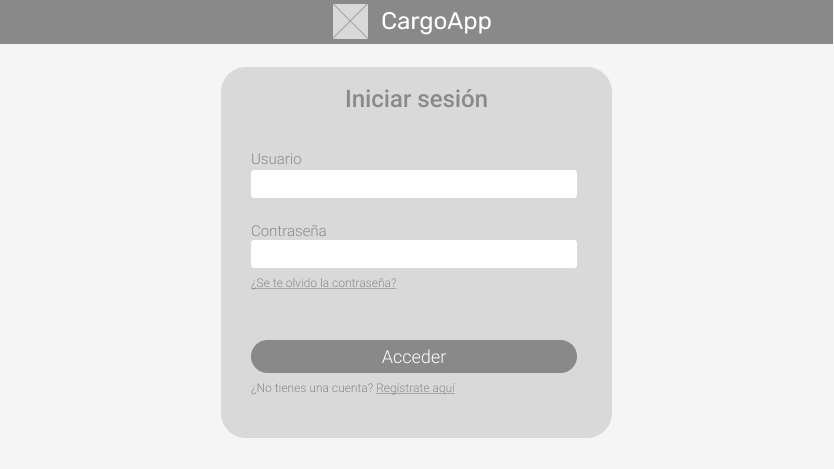
Fallo en las credenciales:

Fallo repetido:

Recuperación de contraseña:

Registro de nueva cuenta:

-Sección de Historial de envíos:

-Sección de Gastos:

-Sección GPS:

En la sección GPS, también hay alertas:

-Sección Estadísticas:

-Sección Configuración:

**Para empresa**

-Sección Registro:

-Sección Historial:

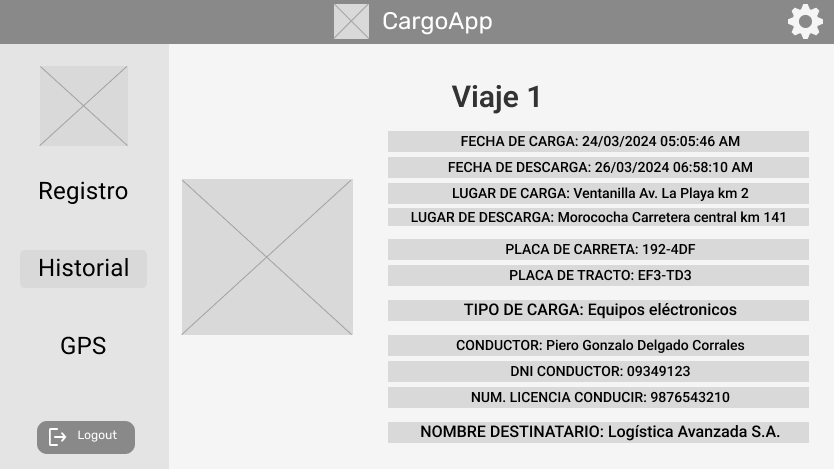

-Sección GPS:

### 4.4.2. Web Applications Wireflow Diagrams

**Para cliente**

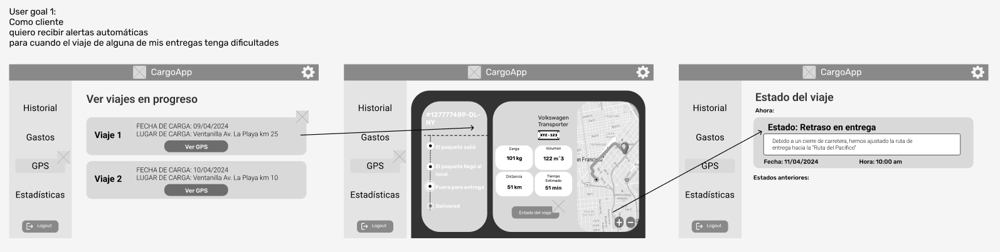

**Para empresarios**

### 4.4.3. Web Applications Mock-ups
A partir de lo trabajado en los Wireframes, se utilizó dicha estructura para cada una de las vistas, pero con el estilo establecido en el Style Guidelines.

**Para cliente**

-Sección de Inicio de sesión:

Fallo en las credenciales:

Fallo repetido:

Recuperación de contraseña:

Registro de nueva cuenta:

-Sección de Historial de envíos:

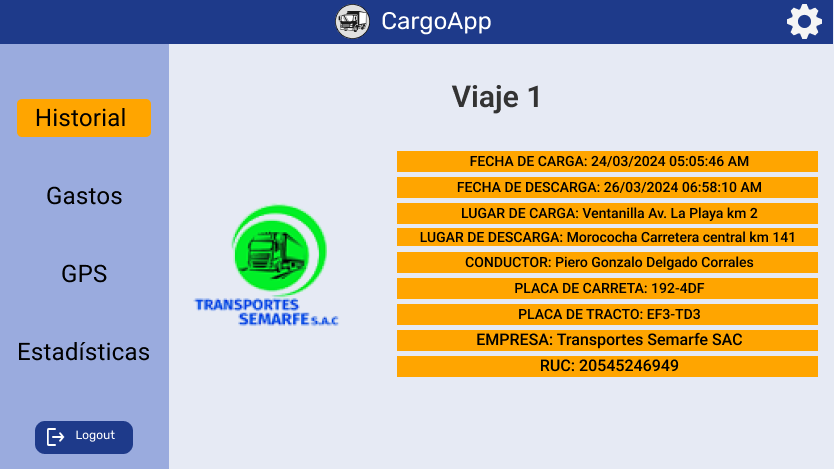

-Sección de Gastos:

-Sección GPS:

En la sección GPS, también hay alertas:

-Sección Estadísticas:

-Sección Configuración:

**Para empresa**

-Sección Registro:

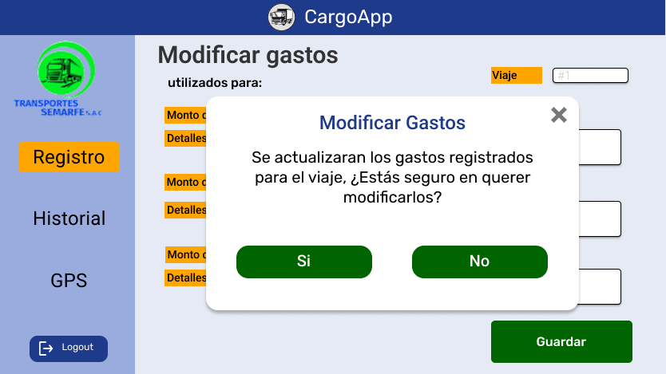

-Sección Historial:

-Sección GPS:

### 4.4.4. Web Applications User Flow Diagrams

**Para cliente**

**Para empresario**

## 4.5. Web Applications Prototyping
A partir de los User Flows definidos en el punto anterior, se trabajó el prototipo funcional en Figma, el cual se explica en el siguiente video.
URL del prototipo en Figma: [Prototipo en Figma](https://www.figma.com/proto/7GsEd72HENCshG6MZEvT6j/App-Web-Figma?type=design&node-id=112-67&t=qvGSt8aScsQekITy-0&scaling=contain&page-id=112%3A67&starting-point-node-id=2152%3A42&show-proto-sidebar=1)

Captura del video:
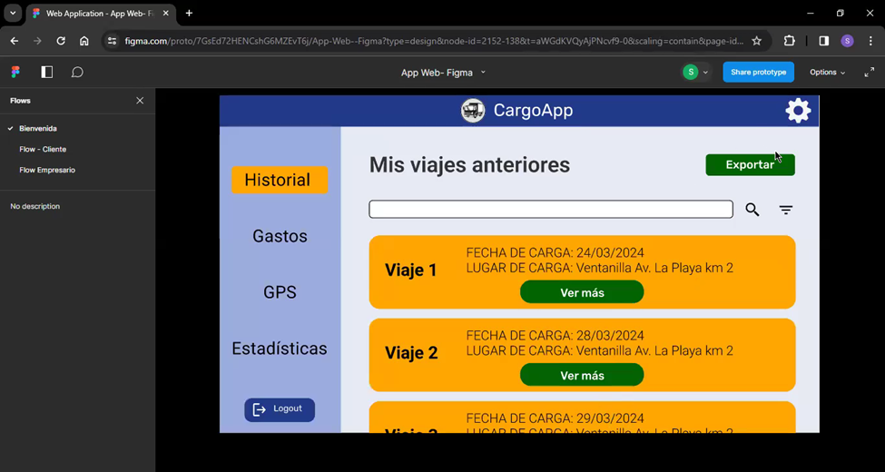
URL del video:
[Microsoft Stream Video](https://upcedupe-my.sharepoint.com/:v:/g/personal/u20221b127_upc_edu_pe/EY3jRbbgXclDn6lwH8nDOgEBryone7KkB99JDILQEF-krQ?nav=eyJyZWZlcnJhbEluZm8iOnsicmVmZXJyYWxBcHAiOiJPbmVEcml2ZUZvckJ1c2luZXNzIiwicmVmZXJyYWxBcHBQbGF0Zm9ybSI6IldlYiIsInJlZmVycmFsTW9kZSI6InZpZXciLCJyZWZlcnJhbFZpZXciOiJNeUZpbGVzTGlua0NvcHkifX0&e=Ra0jLc)

## 4.6. Domain-Driven Software Architecture
### 4.6.1. Software Architecture Context Diagram

El diagrama de contexto describe la estructura y las interacciones principales de nuestro sistema de gestión de transporte de carga a través de una plataforma digital. Este sistema involucra a proveedores de servicios de transporte que utilizan la plataforma para registrar y gestionar envíos, así como a clientes de empresas logísticas que acceden a la plataforma para rastrear y gestionar eventos relacionados con los envíos. La plataforma central, denominada CargoApp (TransportationSystem), permite registrar el proceso de envío y almacenar información relevante. Además, el sistema se integra con un servicio externo de pagos (PaymentSystem) para gestionar transacciones asociadas con los envíos y utiliza Google Maps para obtener información de ubicación en tiempo real. Este diagrama proporciona una visión general de cómo interactúan las entidades dentro del sistema y cómo se conectan con sistemas externos críticos para sus operaciones.

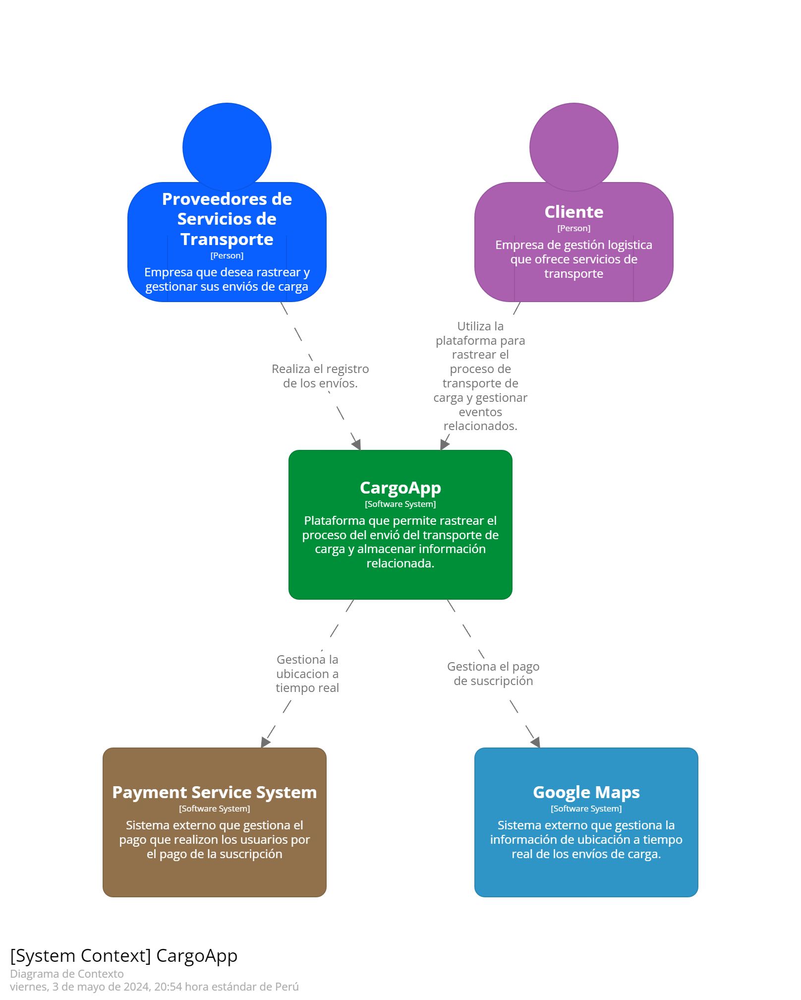

### 4.6.2. Software Architecture Container Diagrams

El diagrama de contenedores detalla los componentes principales de nuestro sistema de gestión de transporte de carga a través de una plataforma digital. La aplicación web permite a los usuarios ver la ubicación en tiempo real de sus envíos y gestionar datos relacionados, mientras que la página de inicio ofrece funcionalidades de consulta. La API REST actúa como el intermediario entre el frontend y el backend del sistema, facilitando la comunicación a través de solicitudes web. Además, una base de datos almacena los datos del sistema. Las interacciones incluyen consultas de usuarios hacia la aplicación web y la página de inicio, y comunicación entre la API REST, la base de datos y otros sistemas externos como el sistema de pagos y Google Maps. Este diagrama proporciona una visión clara de cómo se estructuran y comunican los diferentes elementos dentro del sistema de transporte de carga digital.

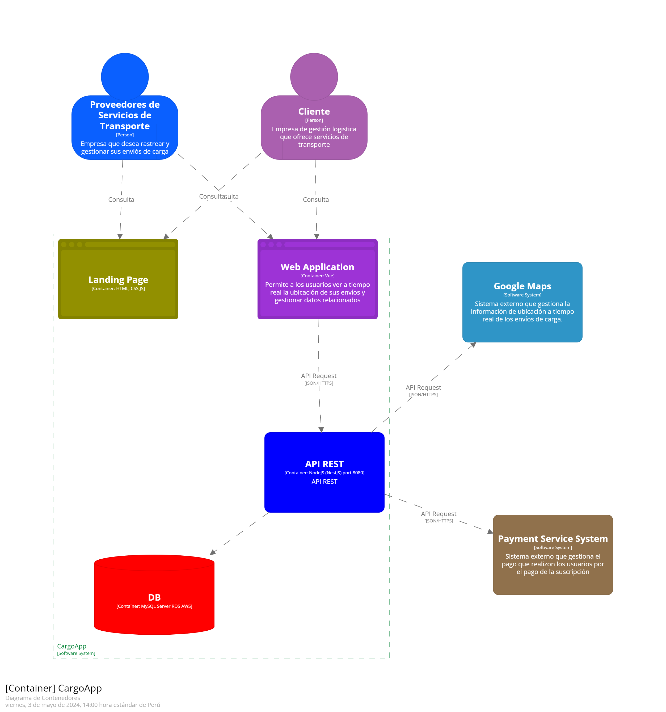

### 4.6.3. Software Architecture Components Diagrams

El diagrama de componentes de la API REST muestra las partes esenciales de nuestro sistema diseñado para gestionar funcionalidades relacionadas con usuarios, visualización de viajes y gastos, registro de datos y funcionalidades compartidas. Estos componentes, implementados con Vue.js para la interfaz de usuario y Node.js (NestJS) para el kernel compartido, interactúan entre sí y con sistemas externos como una base de datos JDBC, el sistema de pagos y Google Maps. El componente "User" maneja las operaciones de usuario y se conecta al sistema de pagos; "Visualization" se encarga de mostrar viajes y gastos con datos de la base de datos y Google Maps; "Registration" registra datos de viajes y gastos en la base de datos; y "Shared Kernel" proporciona funcionalidades compartidas. Este diagrama ilustra cómo se integran y colaboran estos componentes en la arquitectura de la API REST del sistema.

*User Bounded Context Component Diagram*

*Registration Bounded Context Component Diagram*

*Visualization Bounded Context Component Diagram*

## 4.7. Software Object-Oriented Design
### 4.7.1. Class Diagrams

Se realizaron los diagramas de clase, en los cuales se especifica las clases a manejar en cada Bounded Context, así como sus atributos y métodos.

#### User Bounded Context

#### Registration Bounded Context

### 4.7.2. Class Dictionary

A continuación, se especificara más a detalle sobre cada una de las clases.

#### User Bounded Context

**User (Aggregate)**
La clase User contiene toda la información de un usuario registrado dentro de la aplicación, así como su información empresarial, información de autenticación y plan de suscripción.

**Atributos:**
- id: int - Identificador único del usuario
- userData: UserData - Información sobre datos del usuario
- userAuthentication: UserAuthentication - Información sobre autenticación del usuario
- subscriptionPlan: SubscriptionPlan - Información sobre el plan de suscripción

**Métodos:**
- getUser(): Devuelve los detalles del usuario.
- updateUser(): Actualiza los detalles del usuario.

-----

**UserData (Value Object)**
La clase UserData contiene información de los datos empresariales del usuario.

**Atributos:**
- name: string - Nombre del usuario
- phone: string - Teléfono del usuario
- ruc: string - Identificador RUC del usuario
- address: string - Dirección del usuario

**Métodos:**
- getName(): Devuelve el nombre del usuario
- setName(): Establece el nombre del usuario
- getPhone(): Devuelve el teléfono del usuario
- setPhone(): Establece el teléfono del usuario
- getRuc(): Devuelve el RUC del usuario
- setRuc(): Establece el RUC del usuario
- getAddress(): Devuelve la dirección del usuario
- setAddress(): Establece la dirección del usuario

-----

**UserAuthentication (Value Object)**
La clase UserAuthentication contiene información de los datos de autenticación del usuario

**Atributos:**
- email: string - Correo electrónico del usuario
- password: string - Contraseña del usuario

**Métodos:**
- getEmail(): Devuelve el correo electrónico del usuario
- setEmail(): Establece el correo electrónico del usuario
- getPassword(): Devuelve la contraseña del usuario
- setPassword(): Establece la contraseña del usuario

-----

**SubscriptionPlan (Value Object)**
La clase SubscriptionPlan contiene información del plan de suscripción del usuario.

**Atributos:**
- subscription: string - Suscripción elegida por el usuario

**Métodos:**
- getSubscription(): Devuelve la suscripción del usuario
- setSubscription(): Establece la suscripción del usuario

-----

**Client (Entity)**
La clase Client representa a un usuario que es de tipo cliente.

**Atributos:**
- id: int - Identificador único del cliente
- userId: int - Identificador del usuario con el que se relaciona

**Métodos:**
- getClient(): Devuelve los detalles del cliente

-----

**Entrepreneur (Entity)**
La clase Entrepreneur representa a un usuario que es de tipo empresario.

**Atributos:**
- id: int - Identificador único del empresario
- logoImage: string - Imagen del logo de la empresa
- userId: int - Identificador del usuario con el que se relaciona

**Métodos:**
- getEntrepreneur(): Devuelve los detalles del empresario

-----

**Configuration (Entity)**
La clase Configuration representa la configuración de tema, vista y compartir información determinada por el usuario dentro de la aplicación.

**Atributos:**
- id: int - Identificador único de la configuración
- theme: string - Tema elegido por el usuario
- view: string - Vista elegida por el usuario
- allowDataCollection: bool - Opción elegida por el usuario para colección de datos
- updateDataSharing: bool - Opción elegida por el usuario para compartir datos
- userId: int - Identificador del usuario con el que se relaciona

**Métodos:**
- getConfiguration(): Devuelve los detalles de la configuración
- updateConfiguration(): Actualiza los detalles de la configuración

-----

#### Registration Bounded Context

**Trip (Aggregate)**
La clase Trip contiene información central sobre el viaje, como el nombre, datos de la carga, detalles del viaje, y referencias a entidades como el vehículo y el conductor.

**Atributos:**
- id: int — Identificador único del viaje.
- name: Name — Nombre del viaje, representado como un Value Object.
- cargoData: CargoData — Información sobre la carga del viaje.
- tripData: TripData — Detalles específicos del viaje.
- vehicleId: int — Identificador del vehículo asignado.
- driverId: int — Identificador del conductor asignado.
- clientId: int — Identificador del cliente.
- entrepreneurId: int — Identificador del emprendedor.

**Métodos:**
- getTrip(): Devuelve los detalles del viaje.
- updateTrip(): Actualiza los detalles del viaje.

-----

**Name (Value Object)**
La clase Name representa el nombre del viaje como un Value Object.

**Atributos:**
- tripName: string — Nombre del viaje.

**Métodos:**
- getName(): Devuelve el nombre del viaje.
- setName(): Establece el nombre del viaje.

-----

**CargoData (Value Object)**
La clase CargoData contiene información sobre la carga del viaje.

**Atributos:**
- type: string — Tipo de carga.
- weight: float — Peso de la carga.

**Métodos:**
- getType(): Devuelve el tipo de carga.
- setType(): Establece el tipo de carga.
- getWeight(): Devuelve el peso de la carga.
- setWeight(): Establece el peso de la carga.

-----

**TripData (Value Object)**
La clase TripData incluye detalles específicos del viaje, como ubicaciones y fechas de carga y descarga.

**Atributos:**
- loadLocation: string — Ubicación de carga.
- loadDate: DateTime — Fecha de carga.
- unloadLocation: string — Ubicación de descarga.
- unloadDate: DateTime — Fecha de descarga.

**Métodos:**
- getLoadLocation(): Devuelve la ubicación de carga.
- setLoadLocation(): Establece la ubicación de carga.
- getLoadDate(): Devuelve la fecha de carga.
- setLoadDate(): Establece la fecha de carga.
- getUnloadLocation(): Devuelve la ubicación de descarga.
- setUnloadLocation(): Establece la ubicación de descarga.
- getUnloadDate(): Devuelve la fecha de descarga.
- setUnloadDate(): Establece la fecha de descarga.

-----

**Vehicle (Entity)**
La clase Vehicle representa un vehículo asociado a un viaje.

**Atributos:**
- id: int — Identificador único del vehículo.
- model: string — Modelo del vehículo.
- plate: string — Placa del vehículo.
- tractorPlate: string — Placa del tractor.
- maxLoad: float — Carga máxima del vehículo.
- volume: float — Volumen del vehículo.

**Métodos:**
- getVehicle(): Devuelve los detalles del vehículo.
- updateVehicle(): Actualiza los detalles del vehículo.

-----

**Driver (Entity)**
La clase Driver representa un conductor asociado a un viaje.

**Atributos:**
- id: int — Identificador único del conductor.
- name: string — Nombre del conductor.
- dni: string — Documento Nacional de Identidad del conductor.
- license: string — Licencia del conductor.
- contactNumber: string — Número de contacto del conductor.

**Métodos:**
- getDriver(): Devuelve los detalles del conductor.
- updateDriver(): Actualiza los detalles del conductor.

-----

**Alert (Entity)**
La clase Alert representa una alerta asociada a un viaje.

**Atributos:**
- id: int — Identificador único de la alerta.
- tripId: int — Identificador del viaje asociado.
- title: string — Título de la alerta.
- description: string — Descripción de la alerta.
- date: DateTime — Fecha de la alerta.

**Métodos:**
- getAlert(): Devuelve los detalles de la alerta.

-----

**Expense (Entity)**
La clase Expense representa un gasto asociado a un viaje.

**Atributos:**
- id: int — Identificador único del gasto.
- tripId: int — Identificador del viaje asociado.
- fuelAmount: int — Monto de combustible.
- fuelDescription: int — Descripción del combustible.
- viaticsAmount: int — Monto de viáticos.
- viaticsDescription: int — Descripción de los viáticos.
- tollsAmount: int — Monto de peajes.
- tollsDescription: int — Descripción de los peajes.

**Métodos:**
- getExpense(): Devuelve los detalles del gasto.
- updateExpense(): Actualiza los detalles del gasto.

-----

**OnGoingTrip (Entity)**
La clase OnGoingTrip representa un viaje en curso con información sobre la ubicación y estado actual.

**Atributos:**
- id: int — Identificador único del viaje en curso.
- tripId: int — Identificador del viaje asociado.
- latitude: float — Latitud de la ubicación actual.
- longitude: float — Longitud de la ubicación actual.
- speed: int — Velocidad actual.
- distance: int — Distancia recorrida.

**Métodos:**
- getOnGoingTrip(): Devuelve los detalles del viaje en curso.

-----

**Evidence (Entity)**
La clase Evidence representa evidencia asociada a un viaje.

**Atributos:**
- id: int — Identificador único de la evidencia.
- tripId: int — Identificador del viaje asociado.
- link: string — Enlace a la evidencia.

**Métodos:**
- getEvidence(): Devuelve los detalles de la evidencia.

## 4.8. Database Design
### 4.8.1. Database Diagram

A continuación, se muestra el diagrama de la base de datos relacional.
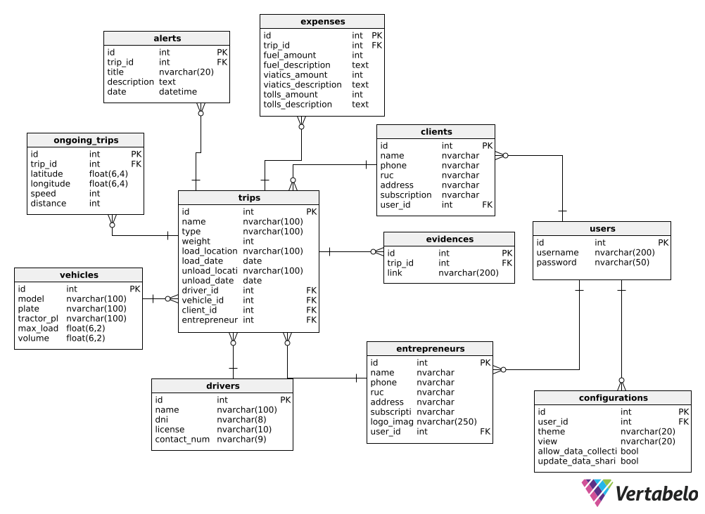

# Capítulo V Product Implementation, Validation & Deployment

## 5.1. Software Configuration Management

### 5.1.1. Software Development Environment Configuration

**Project Management:**

En la gestión del proyecto, empleamos WhatsApp como el principal medio de comunicación, mediante un grupo donde intercambiamos ideas y opiniones sobre cada aspecto del trabajo. Además, hacemos uso de Google Meet para llevar a cabo videoconferencias y dialogar de manera sincrónica. Por otro lado, el proyecto también tiene que ser documentado con todos los puntos requeridos, por lo que utilizamos Google Drive para la creación de documentos compartidos y poder trabajar colaborativamente, permitiendo un mejor flujo de trabajo y tener un historial sobre lo que realizó cada uno. También, utilizamos GitHub para el manejo de repositorios a través de una comunidad conformada por todos los integrantes del equipo.

**Requirements Management:**

Para registrar los requisitos, o también llamadas historias de usuario, usamos la herramienta Pivotal Tracker, en la cual las colocamos en orden de prioridad según el Product Backlog. Esto se realizó de forma grupal, así que todos los integrantes aportamos en las historias de usuario y discutimos sobre las funcionalidades que consideramos que debe tener la aplicación web.

**Product UX/UI Design:**

Para los productos de UX trabajamos con la herramienta UXPressia, para realizar los artefactos como el User Persona, Empathy Mapping, Impact Mapping, etc. Gracias a esto logramos modelar los diseños de la experiencia de usuario, lo cual es útil para poder crear una mejor perspectiva para los segmentos objetivo. Por otro lado, hicimos los prototipos de la aplicación web con la herramienta Figma, con la que hicimos los Wireframes y Mock-ups para tener el diseño de la aplicación.

**Software Development:**

El IDE que utilizamos a lo largo del desarrollo del proyecto es Visual Studio Code, el cual es el entorno de desarrollo que todos los miembros del grupo sabemos utilizar, además que ofrece flexibilidad, facilidad de uso y una gran variedad de soporte de lenguajes de programación. Asimismo, es posible realizar la conexión con repositorios en línea creados en GitHub a través de este, lo cual nos permite tener una mejor gestión del proyecto. Para el desarrollo también utilizamos los lenguajes aprendidos previamente, como HTML, CSS y JavaScript.

**Software Testing:**

Una de las partes más importantes del desarrollo de software son las pruebas de aceptación, ya que nos permite comprobar que los criterios de aceptación están favoreciendo a las necesidades del negocio y cumplen con los requerimientos. Para ello, hemos hecho uso del lenguaje Gherkin. Este consiste en el escenario Given When Then, y analizar las variables de input y output. Es un lenguaje sencillo de entender para todos al utilizar lenguaje natural.

### 5.1.2. Source Code Management

Usuarios de GitHub:
<table>
  <thead>
    <tr>
        <th>Integrante</th>
        <th>Usuario de GitHub</th>
    </tr>
  </thead>
  <tbody>
  <tr>
      <td>Delgado Corrales, Piero Gonzalo</td>
      <td>PieroD04</td>
  </tr>
  <tr>
      <td>Matos Fernandez, Christian Andre</td>
      <td>FerKlox</td>
  </tr>
  <tr>
      <td>Paredes Puente, Sebastián Roberto</td>
      <td>sebastian123gonzalo</td>
  </tr>
  <tr>
      <td>Salinas Torres, Salvador Antonio</td>
      <td>salvadoorssalinas</td>
  </tr>
  <tr>
      <td>Valverde Mozo, Andre Gabriel</td>
      <td>AndreVMG</td>
  </tr>
  </tbody>
</table>

*URL de repositorio de Landing Page:* https://github.com/Grupo-2-Apps-Web/Landing-Page

*URL de repositorio de Acceptance Tests:* https://github.com/Grupo-2-Apps-Web/Acceptance-Tests

*URL de repositorio de Frontend Web Applications:*
http://github.com/Grupo-2-Apps-Web/Frontend-Web-Applications

*URL de repositorio de Web Services:*
http://github.com/Grupo-2-Apps-Web/Web-Services

Para el desarrollo del trabajo se hará uso de GitFlow, el cual es un modelo de flujo de trabajo para la gestión de control de versiones Git. Está compuesta por ramas y cada una cumple un propósito distinto. Las ramas que utilizamos son: Feature, Develop, Release y Main. 

**Rama Feature**: En esta rama se desarrolla un feature específico, por ejemplo la implementación del registro de un usuario o del inicio de sesión. Las ramas Feature se trabajan y controlan por separado para tener un orden sobre el cual trabajar a partir del Product Backlog. Esto asegura que cualquier problema que surja durante el desarrollo de una característica no afecte al programa en su totalidad.

**Rama Develop**: En esta rama se fusionan las ramas feature desarrolladas. Esto permite verificar que todo funcione correctamente antes de integrarlo en la rama Release para su despliegue.

**Rama Release**: En esta rama se prepara la versión final del sprint. Se realiza una revisión final de la versión para poder hacer el despliegue. Se asegura que todo esté correcto y funcional antes de hacer el despliegue. Al hacer el merge a la rama main, se especifica la versión que se está desplegando, para tener un control sobre las versiones desplegadas.

**Rama Main**: En esta rama se encuentra la versión desplegada más reciente del proyecto. Es la rama principal que cuenta con cada versión desplegada oficialmente.

### 5.1.3. Source Code Style Guide & Conventions

En el desarrollo de este trabajo, se utilizará una gran variedad de lenguajes para trabajar en el Landing Page, Web Services y Frontend Web Application. Para ello, se utilizará la siguiente guía de estilos y convenciones.

**HTML**

Es el lenguaje utilizado para estructurar el contenido de una página web, brindando una variedad de elementos posibles como texto, imágenes, formularios, etc.
https://www.w3schools.com/html/html5_syntax.asp
- Declarar el tipo de documento en la primera línea con \<!DOCTYPE html>.
Respetar la estructura básica del HTML: \<html>, \<head>, \<body>.
- Declarar el título de la página para dar a conocer al usuario en qué página se encuentra. (Usar el elemento \<title> en \<head>)
- Se usará la indentación coherente para lograr una lectura sencilla del código, por lo que es importante tener la tabulación correcta para cada nivel de anidamiento.
- Siempre cerrar los elementos que lo requieran, ya sea una división, párrafo, título. (Si se declara una \
, siempre cerrarlo con \
)
- Declarar el atributo “alt” para las imágenes.

**CSS**

Es el lenguaje utilizado para definir el diseño de la página web, así como los estilos, fuentes, colores, contenedores, etc.
https://google.github.io/styleguide/htmlcssguide.html
- Usar indentación de forma correcta.
- Los nombres para elementos deben ser cortos y en minúsculas.
- Declarar los colores en código hexadecimal. (Ejemplo: #024A86)
- Dejar comentarios para conocer el propósito del estilo y su uso.
- El diseño debe ser responsive para que los usuarios lo puedan visualizar cómodamente desde el dispositivo en qué se encuentren.

**JavaScript**

Es el lenguaje de programación más utilizado para la programación web, ya que permite desarrollar páginas interactivas con animaciones agradables para los usuarios.
https://www.w3schools.com/js/js_conventions.asp
- Declarar nombres coherentes y cortos para las variables y funciones.
- Dejar comentarios para dar a conocer que hace cada parte del código sobre la página web.
- Siempre colocar un punto y coma al final de cada línea de código.
- Declarar las constantes cuando sea necesario en lugar de variables que nunca cambiarán su valor.
- Usar los operadores de comparación estricta en lugar de comparación regular cuando sea posible. (Ejemplo: Utilizar === en lugar de ==)

**C#**

Es un lenguaje de programación comúnmente utilizado para programación web, programación móvil, entre otros.  https://learn.microsoft.com/en-us/dotnet/csharp/fundamentals/coding-style/coding-conventions
- Nombrar las variables, funciones y clases con CamelCase, además de ser significativos y cortos.
- Usar comillas dobles (“) para las cadenas de texto.
- Usar indentación correctamente para un código coherente y ordenado.
- Dejar comentarios en cada bloque de código para explicar su funcionalidad.
- Declarar constantes cuando sean variables que no cambiarán su valor a lo largo de todo el código.

**Gherkin**

Es el lenguaje para el diseño de casos de prueba en base a los requisitos establecidos por el negocio. Este se utiliza durante el proceso de testing.
https://specflow.org/gherkin/gherkin-conventions-for-readable-specifications/
- Separar en bloques cada parte de Given When Then, para una mejor lectura y subdividirse adecuadamente.
- Al mostrar las variables de input y output con sus ejemplos, se utilizan tablas para la representación de estos. Sin embargo, no es necesario utilizar tantas tablas para cada parte del código, sino una general al final del escenario.
- Si hay más de un escenario en un archivo, hacer la separación adecuada entre estas para diferenciarlas y dar a conocer que son más de uno. Para ello, se puede dejar dos líneas en blanco para saber dónde es que un escenario termina y el otro comienza.
- Agregar líneas en blanco dentro de cada Step para una mejor lectura y organización de la información.

### 5.1.4. Software Deployment Configuration

Para la configuración del despliegue de la aplicación, utilizaremos Git, un sistema de control de versiones distribuido que es bastante utilizado en proyectos de desarrollo de software. Es una herramienta esencial para trabajar colaborativamente y poder hacer el seguimiento de los cambios realizados por los miembros del grupo. Una de sus mejores ventajas es su capacidad para rastrear los cambios en los archivos de un proyecto a lo largo del tiempo. Con Git, es posible crear ramas, realizar cambios en ellas y fusionarlos eficientemente, permitiendo que varios desarrolladores trabajen en diferentes aspectos del proyecto simultáneamente sin interferencias.

Por otro lado, tenemos a GitHub, el cual es la plataforma para poder alojar repositorios de Git. Es uno de los servicios más utilizados por desarrolladores de forma mundial, ya que permite manejar repositorios públicos y privados para almacenar el código en la nube. A parte de ello, maneja el historial de los repositorios, permitiendo a los usuarios acceder a todas las versiones trabajadas, permitiendo que puedan retornar a una versión anterior en caso lo deseen. Ofrece otras herramientas que son muy útiles como los pull requests, los cuales son solicitudes de revisiones de una rama y luego poder fusionarla con otra rama.

Así es como con este, que cada miembro podrá trabajar de forma remota desde su IDE, teniendo una copia del repositorio Git a través del repositorio en línea almacenado en GitHub, así poder hacer commits para empujar los cambios que hayan realizado.

## 5.2. Landing Page, Services & Applications Implementation.

### 5.2.1. Sprint 1

#### 5.2.1.1. Sprint Planning 1.

Se planeó el primer sprint a través de una reunión en Meet. Para ello, se hizo la siguiente tabla para registrar la información que se discutió.

|**Sprint #**|Sprint 1|
| :- | :- |
|**Sprint Planning Background**||
|Date|2024-04-01|
|Time|07:00 PM|
|Location|Presencial (En la universidad, luego de la clase)|
|Prepared by|Delgado Corrales, Piero Gonzalo|
|Attendees (to planning meeting)|
Delgado Corrales, Piero Gonzalo

Matos Fernandez, Christian Andre

Paredes Puente, Sebastián Roberto

Salinas Torres, Salvador Antonio

Valverde Mozo, Andre Gabriel
|
|Sprint n - 1 Review Summary|No hubo sprint anterior|
|Sprint n - 1 Retrospective Summary|No hubo sprint anterior|
|**Sprint Goal & User Stories**||
|Sprint 1 Goal|Realizar el Landing Page|
|Sprint 1 Velocity|20|
|Sum of Story Points|20|

#### 5.2.1.2. Sprint Backlog 1.

El objetivo de este primer sprint es la realización del Landing Page estático. Asimismo, trabajamos en una tabla en Trello: https://trello.com/b/rsvyHlub/sprint-backlog-1

<table><tr><th valign="top">Sprint #</th><th colspan="7" valign="top">Sprint 1</th></tr>
<tr><td colspan="2" valign="top">User Story</td><td colspan="6" valign="top">Work-Item / Task</td></tr>
<tr><td valign="top">Id</td><td valign="top">Title</td><td valign="top">Id</td><td valign="top">Title</td><td valign="top">Description</td><td valign="top">Estimation (Hours)</td><td valign="top">Assigned To</td><td valign="top">Status (To-Do / In-Process / Review / Done)</td></tr>
<tr><td rowspan="2" valign="top">US19</td><td rowspan="2" valign="top">NavBar y Footer</td><td valign="top">TS01</td><td valign="top">Implementación de Navbar</td><td valign="top">Se implementa el navbar de forma responsive.</td><td valign="top">2</td><td valign="top">Andre Valverde</td><td valign="top">Done</td></tr>
<tr><td valign="top">TS02</td><td valign="top">Implementación de Footer</td><td valign="top">Se implementa el footer de forma responsive.</td><td valign="top">2</td><td valign="top">Andre Valverde</td><td valign="top">Done</td></tr>
<tr><td valign="top">US20</td><td valign="top">Página de inicio</td><td valign="top">TS03</td><td valign="top">Implementación de página de inicio</td><td valign="top">Se implementa la página de inicio de forma responsive y con su archivo css correspondiente.</td><td valign="top">1</td><td valign="top">Andre Valverde</td><td valign="top">Done</td></tr>
<tr><td valign="top">US21</td><td valign="top">Sección “Acerca De”</td><td valign="top">TS04</td><td valign="top">Implementación de sección Acerca De</td><td valign="top">Se implementa la página Acerca De, de forma responsive y con su archivo css correspondiente.</td><td valign="top">1</td><td valign="top">Sebastián Paredes</td><td valign="top">Done</td></tr>
<tr><td valign="top">US22</td><td valign="top">Sección “Sobre Nosotros”</td><td valign="top">TS05</td><td valign="top">Implementación de sección Sobre Nosotros</td><td valign="top">Se implementa la página Sobre Nosotros, de forma responsive y con su archivo css correspondiente.</td><td valign="top">1</td><td valign="top">Salvador Salinas</td><td valign="top">Done</td></tr>
<tr><td valign="top">US23</td><td valign="top">Sección “Características”</td><td valign="top">TS06</td><td valign="top">Implementación de sección Características</td><td valign="top">Se implementa la página Características, de forma responsive y con su archivo css correspondiente.</td><td valign="top">2</td><td valign="top">Piero Delgado</td><td valign="top">Done</td></tr>
<tr><td valign="top">US24</td><td valign="top">Sección “Contacto”</td><td valign="top">TS07</td><td valign="top">Implementación de sección Contacto</td><td valign="top">Se implementa la página Contacto, de forma responsive y con su archivo css correspondiente.</td><td valign="top">2</td><td valign="top">Christian Matos</td><td valign="top">Done</td></tr>
</table>

#### 5.2.1.3. Development Evidence for Sprint Review.

Se realizaron los avances con los commits correspondientes en el repositorio de la siguiente forma.

Repositorio Landing Page: https://github.com/Grupo-2-Apps-Web/Landing-Page

|**Repository**|**Branch**|**Commit Id**|**Commit Message**|**Commited on (Date)**|
| :- | :- | :- | :- | :- |
|Grupo-2-Apps-Web/Landing-Page|feature/index|eb0fb57|feat: Navbar, footer, Index section added|10/04/2024|
|Grupo-2-Apps-Web/Landing-Page|develop|edd5a18|Merge pull request #1 from Grupo-2-Apps-Web/feature/index|10/04/2024|
|Grupo-2-Apps-Web/Landing-Page|feature/about-us|72874d3|feat: about us section added|10/04/2024|
|Grupo-2-Apps-Web/Landing-Page|develop|b86e73b|Merge pull request #2 from Grupo-2-Apps-Web/feature/about-us|10/04/2024|
|Grupo-2-Apps-Web/Landing-Page|feature/about-app|af49a19|feat: about app section added|10/04/2024|
|Grupo-2-Apps-Web/Landing-Page|develop|8737969|
Merge pull request #3 from Grupo-2-Apps-Web/feature/about-app

|10/04/2024|
|Grupo-2-Apps-Web/Landing-Page|feature/about-app|a5dc8e1|fix: solved issue with about app section|10/04/2024|
|Grupo-2-Apps-Web/Landing-Page|develop|946a945|
Merge pull request #4 from Grupo-2-Apps-Web/feature/about-app

|10/04/2024|
|Grupo-2-Apps-Web/Landing-Page|feature/features|30bab11|feat: features section added|10/04/2024|
|Grupo-2-Apps-Web/Landing-Page|develop|b290bd0|Merge pull request #6 from Grupo-2-Apps-Web/feature/features|10/04/2024|
|Grupo-2-Apps-Web/Landing-Page|feature/contact|ff30b46|feat: contact section added|10/04/2024|
|Grupo-2-Apps-Web/Landing-Page|develop|136a264|Merge pull request #7 from Grupo-2-Apps-Web/feature/contact|10/04/2024|
|Grupo-2-Apps-Web/Landing-Page|main|f436041|Merge pull request #8 from Grupo-2-Apps-Web/develop|10/04/2024|

#### 5.2.1.4. Testing Suite Evidence for Sprint Review.

Se realizaron los acceptance tests para las historias de usuario trabajadas y se registraron en el repositorio de la siguiente forma.

Repositorio Acceptance Tests: https://github.com/Grupo-2-Apps-Web/Acceptance-Tests

|**Repository**|**Branch**|**Commit Id**|**Commit Message**|**Commited on (Date)**|
| :- | :- | :- | :- | :- |
|Grupo-2-Apps-Web/Acceptance-Tests|main|e2424c7|feat: added feature file for US24|10/04/2024|
|Grupo-2-Apps-Web/Acceptance-Tests|main|bd2fd88|feat: added feature file for US21 and US22|10/04/2024|
|Grupo-2-Apps-Web/Acceptance-Tests|main|12bfcdb|feat: added feature file for US23|10/04/2024|
|Grupo-2-Apps-Web/Acceptance-Tests|main|c40bf47|feat: added feature file for us26|10/04/2024|
|Grupo-2-Apps-Web/Acceptance-Tests|main|9dd74de|feat: added feature file us25 and modify other features|10/04/2024|

#### 5.2.1.5. Execution Evidence for Sprint Review.

Para esta sección se evidenciará lo avanzado en el primer sprint, el cual se basa en la implementación del Landing Page estático. Para ello, se realizó el siguiente video con la explicación y las capturas que evidencia la página web.

URL de video: https://youtu.be/3-oeSZ3IzYo

Navbar, Footer, página de inicio: se implementaron al inicio ya que son la parte esencial para la navegación de la página. Además, son responsive y se logran adaptar a todos los tamaños.

Sección About App:

Sección About Us:

Sección Features:

Sección Contact:

#### 5.2.1.6. Services Documentation Evidence for Sprint Review.

En este primer sprint, no hemos trabajado con servicios web, ya que nos hemos concentrado exclusivamente en la creación del Landing Page estático. Es por ello que en esta ocasión, no se trabajó la documentación relacionada con el uso de servicios web.

#### 5.2.1.7. Software Deployment Evidence for Sprint Review.

Ya habiendo terminado de hacer los commits y hacer el release de este sprint, pasamos a hacer el deployment. En el primer sprint, hicimos el deployment del Landing Page estático, utilizando GitHub Pages. Para ello, entramos a la configuración del repositorio, en la sección Pages.

En Branch, escogemos la rama, la cual sería la rama main donde hemos hecho el release del sprint. Y le damos a Save.

Ahora solo quedaría esperar a que GitHub cree la página web y nos brinde el enlace para visualizar el Landing Page estático.

*URL deployment Landing Page:* https://grupo-2-apps-web.github.io/Landing-Page/

#### 5.2.1.8. Team Collaboration Insights during Sprint.

En la implementación del Landing Page, todos los integrantes realizaron commits referentes al branch feature en el cual trabajaron.

Nos dividimos de la siguiente forma para trabajar en el Landing Page:

- Andre Valverde: Navbar-Footer, Home
- Sebastián Paredes: About App
- Salvador Salinas: About Us
- Piero Delgado: Features
- Christian Matos: Contact

Siguiendo el flujo de trabajo de Gitflow, usamos las ramas main, develop y feature respectivamente.

### 5.2.2. Sprint 2

#### 5.2.2.1. Sprint Planning 2.

El segundo sprint se planeó a través de una reunión presencial en la universidad. Para ello, se hizo la siguiente tabla para registrar la información que se discutió.

|**Sprint #**|Sprint 2|
| :- | :- |
|**Sprint Planning Background**||
|Date|2024-04-22|
|Time|07:00 PM|
|Location|Presencial (En cubículo de la universidad)|
|Prepared by|Delgado Corrales, Piero Gonzalo|
|Attendees (to planning meeting)|
Delgado Corrales, Piero Gonzalo

Matos Fernandez, Christian Andre

Paredes Puente, Sebastián Roberto

Salinas Torres, Salvador Antonio

Valverde Mozo, Andre Gabriel
|
|Sprint 1 Review Summary|En el sprint 1, se realizó la implementación y deployment de la landing page estática.|
|Sprint 1 Retrospective Summary|Para la anterior entrega hubo unos cuantos percances y atrasos en las fechas determinadas para terminar las tareas asignadas a cada miembro. Por ello, hemos conversado para evitar que suceda nuevamente y cumplir con las fechas determinadas en un inicio.|
|**Sprint Goal & User Stories**||
|Sprint 2 Goal|Desarrollar la parte inicial en Frontend de la aplicación web.|
|Sprint 2 Velocity|65|
|Sum of Story Points|65|

#### 5.2.2.2. Sprint Backlog 2.

El objetivo de este segundo sprint es la realización del Frontend de la aplicación web. Asimismo, trabajamos en una tabla en Trello: https://trello.com/b/Mz2gCQVf/cargowatch-sprint-backlog-2

<table><tr><th valign="top">Sprint #</th><th colspan="7" valign="top">Sprint 2</th></tr>
<tr><td colspan="2" valign="top">User Story</td><td colspan="6" valign="top">Work-Item / Task</td></tr>
<tr><td valign="top">Id</td><td valign="top">Title</td><td valign="top">Id</td><td valign="top">Title</td><td valign="top">Description</td><td valign="top">Estimation (Hours)</td><td valign="top">Assigned To</td><td valign="top">Status (To-Do / In-Process / Review / Done)</td></tr>
<tr><td rowspan="3" valign="top">US05</td><td rowspan="3" valign="top">Historial de envíos ordenados</td><td valign="top">TS01</td><td valign="top">Implementación de header y navbar</td><td valign="top">Se implementa el header y navbar para poder navegar dentro de la aplicación web.</td><td valign="top">2</td><td valign="top">Piero Delgado</td><td valign="top">Done</td></tr>
<tr><td valign="top">TS02</td><td valign="top">Implementación de página de historial</td><td valign="top">Se implementa la página principal del historial que muestra el listado de los viajes anteriores.</td><td valign="top">1</td><td valign="top">Salvador Salinas</td><td valign="top">Done</td></tr>
<tr><td valign="top">TS03</td><td valign="top">Implementación de página de detalles de viaje</td><td valign="top">Se implementa la página de detalles de un viaje anterior elegido.</td><td valign="top">2</td><td valign="top">Salvador Salinas</td><td valign="top">Done</td></tr>
<tr><td rowspan="2" valign="top">US06</td><td rowspan="2" valign="top">Búsqueda de envíos ordenados</td><td valign="top">TS04</td><td valign="top">Implementación de barra de búsqueda</td><td valign="top">Se implementa la barra de búsqueda para buscar un viaje en específico dentro del historial de viajes anteriores.</td><td valign="top">2</td><td valign="top">Sebastián Paredes</td><td valign="top">Done</td></tr>
<tr><td valign="top">TS05</td><td valign="top">Implementación de filtrado</td><td valign="top">Se implementa el filtrado para buscar por nombre, fecha y lugar.</td><td valign="top">2</td><td valign="top">Sebastián Paredes</td><td valign="top">Done</td></tr>
<tr><td rowspan="2" valign="top">US07</td><td rowspan="2" valign="top">Visualización de gastos realizados en el viaje</td><td valign="top">TS06</td><td valign="top">Implementación de listado de viajes</td><td valign="top">Se implementa la página muestra el listado de los viajes anteriores.</td><td valign="top">1</td><td valign="top">Piero Delgado</td><td valign="top">Done</td></tr>
<tr><td valign="top">TS07</td><td valign="top">Implementación de detalles de gastos del viaje</td><td valign="top">Se implementa la página de detalles de los gastos realizados de un viaje anterior elegido.</td><td valign="top">1</td><td valign="top">Piero Delgado</td><td valign="top">Done</td></tr>
<tr><td valign="top">US02</td><td valign="top">Seguimiento en tiempo real de envíos para cliente</td><td valign="top">TS08</td><td valign="top">Implementación de mapa</td><td valign="top">Se implementa el mapa con la ubicación actual del transporte.</td><td valign="top">2</td><td valign="top">Andre Valverde</td><td valign="top">Done</td></tr>
<tr><td valign="top">US04</td><td valign="top">Acceso a detalles de entrega</td><td valign="top">TS09</td><td valign="top">Implementación de detalles de entrega</td><td valign="top">Se muestra en la página los detalles del envío como la velocidad, longitud y latitud actual.</td><td valign="top">1</td><td valign="top">Andre Valverde</td><td valign="top">Done</td></tr>
<tr><td rowspan="3" valign="top">US08</td><td rowspan="3" valign="top">Estadísticas de envíos</td><td valign="top">TS10</td><td valign="top">Implementación de página de estadísticas</td><td valign="top">Se implementa la página que mostrará la vista de las estadísticas.</td><td valign="top">1</td><td valign="top">Christian Matos</td><td valign="top">Done</td></tr>
<tr><td valign="top">TS11</td><td valign="top">Implementación de estadísticas por mes</td><td valign="top">Se implementa la gráfica para presentar las estadísticas de los viajes realizados por mes.</td><td valign="top">1</td><td valign="top">Christian Matos</td><td valign="top">Done</td></tr>
<tr><td valign="top">TS12</td><td valign="top">Implementación de estadísticas por destino</td><td valign="top">Se implementa la gráfica para presentar las estadísticas de los viajes realizados por destino.</td><td valign="top">1</td><td valign="top">Christian Matos</td><td valign="top">Done</td></tr>
<tr><td valign="top">US25</td><td valign="top">Registro de nuevo viaje</td><td valign="top">TS13</td><td valign="top">Implementación de página de registro de viaje</td><td valign="top">Se implementa la página con formulario para registrar el viaje.</td><td valign="top">1</td><td valign="top">Sebastián Paredes</td><td valign="top">Done</td></tr>
<tr><td valign="top">US26</td><td valign="top">Modificación de datos de un viaje</td><td valign="top">TS14</td><td valign="top">Implementación de página de modificación de viaje</td><td valign="top">Se implementa la página con formulario para modificar un viaje específico.</td><td valign="top">1</td><td valign="top">Salvador Salinas</td><td valign="top">Done</td></tr>
<tr><td valign="top">US27</td><td valign="top">Registro de gastos de viaje</td><td valign="top">TS15</td><td valign="top">Implementación de página de registro de gastos de un viaje</td><td valign="top">Se implementa la página con formulario para registrar los gastos de un viaje.</td><td valign="top">1</td><td valign="top">Andre Valverde</td><td valign="top">Done</td></tr>
<tr><td valign="top">US28</td><td valign="top">Modificación de gastos de un viaje</td><td valign="top">TS16</td><td valign="top">Implementación de página de modificación de gastos de un viaje</td><td valign="top">Se implementa la página con formulario para modificar los gastos de un viaje específico.</td><td valign="top">1</td><td valign="top">Andre Valverde</td><td valign="top">Done</td></tr>
<tr><td valign="top">US33</td><td valign="top">Seguimiento en tiempo real para empresa</td><td valign="top">TS17</td><td valign="top">Implementación de mapa</td><td valign="top">Se implementa el mapa con la ubicación actual del transporte.</td><td valign="top">2</td><td valign="top">Andre Valverde</td><td valign="top">Done</td></tr>
<tr><td valign="top">US34</td><td valign="top">Historial de envíos realizados</td><td valign="top">TS18</td><td valign="top">Implementación de listado de envíos realizados por empresa</td><td valign="top">Se implementa la página que muestra los viajes realizados anteriormente por la empresa.</td><td valign="top">1</td><td valign="top">Christian Matos</td><td valign="top">Done</td></tr>
<tr><td valign="top">US01</td><td valign="top">Alertas de eventos importantes durante la entrega</td><td valign="top">TS19</td><td valign="top">Implementación de alertas</td><td valign="top">Se implementa el listado de alertas de viajes desde la página del seguimiento en tiempo real.</td><td valign="top">2</td><td valign="top">Piero Delgado</td><td valign="top">Done</td></tr>
</table>

#### 5.2.2.3. Development Evidence for Sprint Review.

Se realizaron los avances con los commits correspondientes en el repositorio de la siguiente forma.

Repositorio Frontend: https://github.com/Grupo-2-Apps-Web/Frontend-Web-Applications

|**Repository**|**Branch**|**Commit Id**|**Commit Message**|**Commited on (Date)**|
| :- | :- | :- | :- | :- |
|Grupo-2-Apps-Web/Frontend-Web-Applications|main|f64966c|feat: initial commit creation of proyect|23/04/2024|
|Grupo-2-Apps-Web/Frontend-Web-Applications|feature/sidebar|1db7fb2|feat: sidebar added|03/05/2024|
|Grupo-2-Apps-Web/Frontend-Web-Applications|feature/visualization|6b83b13|feat: added visualization for client|03/05/2024|
|Grupo-2-Apps-Web/Frontend-Web-Applications|feature/user|fdaa485|feat: user change view added|03/05/2024|
|Grupo-2-Apps-Web/Frontend-Web-Applications|feature/statistic|6563c1e|feat: added statistic per month and destiny|03/05/2024|
|Grupo-2-Apps-Web/Frontend-Web-Applications|feature/on-going-trip|7ad8f0a|feat: added section gps|03/05/2024|
|Grupo-2-Apps-Web/Frontend-Web-Applications|feature/alerts|8bc4c02|feat: added alerts on ongoing trips|03/05/2024|
|Grupo-2-Apps-Web/Frontend-Web-Applications|feature/register|8335d10|feat: added register trip|03/05/2024|
|Grupo-2-Apps-Web/Frontend-Web-Applications|feature/register|0325cad|feat: Added Modify Expenses|03/05/2024|
|Grupo-2-Apps-Web/Frontend-Web-Applications|feature/register|dca7deb|feat: Added Register Expense|03/05/2024|
|Grupo-2-Apps-Web/Frontend-Web-Applications|feature/register|c1ffa3e|feat: added modify trip feature|03/05/2024|
|Grupo-2-Apps-Web/Frontend-Web-Applications|feature/user|6edd2cd|feat: added store.js for user and router|03/05/2024|
|Grupo-2-Apps-Web/Frontend-Web-Applications|develop|c71b437|chore: added dependencies and images|03/05/2024|

#### 5.2.2.4. Testing Suite Evidence for Sprint Review.

Se realizaron los acceptance tests para las historias de usuario trabajadas y se registraron en el repositorio de la siguiente forma.

Repositorio Acceptance Tests: https://github.com/Grupo-2-Apps-Web/Acceptance-Tests

|**Repository**|**Branch**|**Commit Id**|**Commit Message**|**Commited on (Date)**|
| :- | :- | :- | :- | :- |
|Grupo-2-Apps-Web/Acceptance-Tests|main|a6626f5|feat: added US31 acceptance test|28/04/2024|
|Grupo-2-Apps-Web/Acceptance-Tests|main|771b263|feat: added acceptance test for us07, us28, us29|03/05/2024|
|Grupo-2-Apps-Web/Acceptance-Tests|main|e9657ef|feat: added feature file for us10|03/05/2024|
|Grupo-2-Apps-Web/Acceptance-Tests|main|329f434|feat: added feature file for us32|03/05/2024|
|Grupo-2-Apps-Web/Acceptance-Tests|main|d8e9a86|feat: added acceptance tests for us06, us04, us30|03/05/2024|
|Grupo-2-Apps-Web/Acceptance-Tests|main|d2c5058|feat: added acceptance test for us08|03/05/2024|
|Grupo-2-Apps-Web/Acceptance-Tests|main|9ba43a7|feat: added acceptance test for us27|03/05/2024|
|Grupo-2-Apps-Web/Acceptance-Tests|main|1f6e49a|feat: added acceptance test us01 and us09|03/05/2024|

#### 5.2.2.5. Execution Evidence for Sprint Review.

En esta sección, se mostrará lo avanzado en el segundo sprint, el cual se basa en la nueva versión del despliegue del Frontend-Web-Application de CargoApp.

**Evidencia del Frontend-Web-Application:**
Se implementó todas las historias de usuario en el sprint backlog 2, al completar todas las historias de usuario planificadas para este sprint, se demostró un compromiso excepcional con el éxito del proyecto y la entrega de valor al cliente. Para la demostración de la ejecución, se grabó el siguiente video en el cual se muestran todos los procesos alcanzados:

URL de video: [Video de ejecución del frontend](https://upcedupe-my.sharepoint.com/:v:/g/personal/u202217239_upc_edu_pe/EXRvNjUmCkBDkyyOdZy1yL0BDtwqwr5CIa5uaAv2LaLT-A?e=Mg0lVo&nav=eyJyZWZlcnJhbEluZm8iOnsicmVmZXJyYWxBcHAiOiJTdHJlYW1XZWJBcHAiLCJyZWZlcnJhbFZpZXciOiJTaGFyZURpYWxvZy1MaW5rIiwicmVmZXJyYWxBcHBQbGF0Zm9ybSI6IldlYiIsInJlZmVycmFsTW9kZSI6InZpZXcifX0%3D)

#### 5.2.2.6. Services Documentation Evidence for Sprint Review.

En este segundo sprint, no hemos trabajado con servicios web, ya que nos hemos concentrado exclusivamente en la creación del Frontend para nuestra aplicación web. Es por ello que en esta ocasión, no se trabajó la documentación relacionada con el uso de servicios web.

#### 5.2.2.7. Software Deployment Evidence for Sprint Review.

Se realizó el deployment del Frontend Web Application, para lo cual creamos una api con my json server typicode. De este modo, en el proyecto ya no se usa localhost:3000, sino el que hemos generado.

URL de api: https://my-json-server.typicode.com/salvadoorssalinas/cargoapp-api

Ahora, ejecutamos el comando npm run build.

Entramos a la página web de Firebase, iniciamos sesión y creamos el proyecto en el cual se aloja la aplicación.

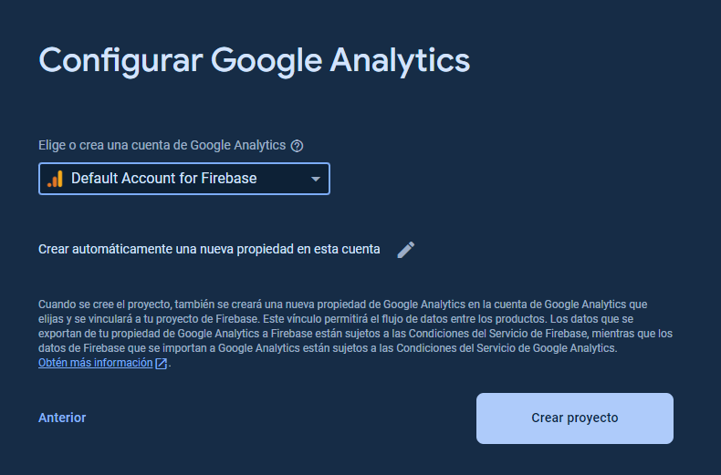

Ejecutamos el comando **npm install firebase-tools -g.** Luego iniciamos sesión desde la terminal con el comando **firebase login.**
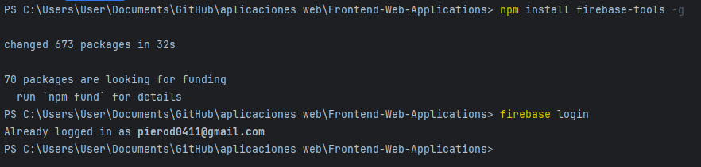

Para iniciar el hosting de la aplicación, usamos el comando **firebase init hosting.**

Elegimos el proyecto que ya habíamos creado en la página de Firebase.

Colocamos que como public directory se usará la carpeta dist.

Finalmente, ejecutamos el comando **firebase deploy --only hosting.**

URL de Frontend Web Application deployado: https://cargoapp-demo.web.app/

#### 5.2.2.8. Team Collaboration Insights during Sprint.

Para la elaboración del Frontend, nos repartimos las tareas entre cada miembro, y cada uno trabajó en las ramas feature correspondientes, para luego ir realizando los merge con la rama develop. Asimismo, nos reunimos de forma virtual a través de Google Meet para revisar juntos los avances y los merges realizados para verificar que todo funciona acorde a lo esperado.

### 5.2.3. Sprint 3

#### 5.2.3.1. Sprint Planning 3.

El tercer sprint se planeó a través de una reunión presencial en la universidad. Para ello, se hizo la siguiente tabla para registrar la información que se discutió.

|**Sprint #**|Sprint 3|
| :- | :- |
|**Sprint Planning Background**||
|Date|2024-05-13|
|Time|07:00 PM|
|Location|Presencial (En la universidad)|
|Prepared by|Delgado Corrales, Piero Gonzalo|
|Attendees (to planning meeting)|
Delgado Corrales, Piero Gonzalo

Matos Fernandez, Christian Andre

Paredes Puente, Sebastián Roberto

Salinas Torres, Salvador Antonio

Valverde Mozo, Andre Gabriel
|
|Sprint 2 Review Summary|En el sprint 2, se realizó la implementación y deployment del Frontend de la aplicación web.|
|Sprint 2 Retrospective Summary|Este segundo sprint consistió principalmente en Frontend, aunque faltaron algunas partes a desarrollar y realizar algunas mejoras en el product backlog, así como la estimación de puntos.|
|**Sprint Goal & User Stories**||
|Sprint 3 Goal|Desarrollar la parte faltante en Frontend y empezar con el desarrollo de Backend de la aplicación web.|
|Sprint 3 Velocity|80|
|Sum of Story Points|80|

#### 5.2.3.2. Sprint Backlog 3.

El objetivo de este tercer sprint es la realización de la parte faltante de Frontend y empezar con el Backend de la aplicación web. Al igual que anteriores sprints, trabajamos las tareas en una tabla en Trello: <https://trello.com/b/miduy6Jv/cargowatch-sprint-backlog-3>

<table><tr><th colspan="1" valign="top">Sprint #</th><th colspan="7" valign="top">Sprint 3</th></tr>
<tr><td colspan="2" valign="top">User Story</td><td colspan="6" valign="top">Work-Item / Task</td></tr>
<tr><td colspan="1" valign="top">Id</td><td colspan="1" valign="top">Title</td><td colspan="1" valign="top">Id</td><td colspan="1" valign="top">Title</td><td colspan="1" valign="top">Description</td><td colspan="1" valign="top">Estimation (Hours)</td><td colspan="1" valign="top">Assigned To</td><td colspan="1" valign="top">Status (To-Do / In-Process / Review / Done)</td></tr>
<tr><td colspan="1" valign="top">US29</td><td colspan="1" valign="top">Registro de datos de conductor</td><td colspan="1" valign="top">TS01</td><td colspan="1" valign="top">Implementación de registro de conductores</td><td colspan="1" valign="top">Se implementa el componente para el registro de conductores.</td><td colspan="1" valign="top">1</td><td colspan="1" valign="top">
Salvador Salinas

</td><td colspan="1" valign="top">Done</td></tr>
<tr><td colspan="1" valign="top">US30</td><td colspan="1" valign="top">Modificación de datos de conductor</td><td colspan="1" valign="top">TS02</td><td colspan="1" valign="top">Implementación de modificación de conductores</td><td colspan="1" valign="top">Se implementa el componente para la modificación de conductores.</td><td colspan="1" valign="top">1</td><td colspan="1" valign="top">Salvador Salinas</td><td colspan="1" valign="top">Done</td></tr>
<tr><td colspan="1" valign="top">US31</td><td colspan="1" valign="top">Registro de datos de vehículo</td><td colspan="1" valign="top">TS03</td><td colspan="1" valign="top">Implementación de registro de vehículos</td><td colspan="1" valign="top">Se implementa el componente para el registro de vehículos.</td><td colspan="1" valign="top">1</td><td colspan="1" valign="top">Salvador Salinas</td><td colspan="1" valign="top">Done</td></tr>
<tr><td colspan="1" valign="top">US32</td><td colspan="1" valign="top">Modificación de datos de vehículo</td><td colspan="1" valign="top">TS04</td><td colspan="1" valign="top">Implementación de modificación de vehículos</td><td colspan="1" valign="top">Se implementa el componente para la modificación de vehículos.</td><td colspan="1" valign="top">1</td><td colspan="1" valign="top">Salvador Salinas</td><td colspan="1" valign="top">Done</td></tr>
<tr><td colspan="1" valign="top">US35</td><td colspan="1" valign="top">Visualización de datos de conductor</td><td colspan="1" valign="top">TS05</td><td colspan="1" valign="top">Implementación de visualización de conductores</td><td colspan="1" valign="top">Se implementa el componente para la visualización de conductores.</td><td colspan="1" valign="top">1</td><td colspan="1" valign="top">Salvador Salinas</td><td colspan="1" valign="top">Done</td></tr>
<tr><td colspan="1" valign="top">US36</td><td colspan="1" valign="top">Visualización de datos de vehículo</td><td colspan="1" valign="top">TS06</td><td colspan="1" valign="top">Implementación de visualización de vehículos</td><td colspan="1" valign="top">Se implementa el componente para la visualización de vehículos.</td><td colspan="1" valign="top">1</td><td colspan="1" valign="top">Salvador Salinas</td><td colspan="1" valign="top">Done</td></tr>
<tr><td colspan="1" valign="top">US03</td><td colspan="1" valign="top">Notificaciones de eventos relevantes</td><td colspan="1" valign="top">TS07</td><td colspan="1" valign="top">Implementación de notificaciones de alertas</td><td colspan="1" valign="top">Se implementa la vista de alertas en la vista de GPS en tiempo real para la vista del cliente.</td><td colspan="1" valign="top">1</td><td colspan="1" valign="top">Andre Valverde</td><td colspan="1" valign="top">Done</td></tr>
<tr><td colspan="1" valign="top">US09</td><td colspan="1" valign="top">Exportación del historial de envíos</td><td colspan="1" valign="top">TS08</td><td colspan="1" valign="top">Implementación de exportación de historial</td><td colspan="1" valign="top">Se implementa el componente para la exportación del historial de envíos en el formato deseado.</td><td colspan="1" valign="top">3</td><td colspan="1" valign="top">Piero Delgado</td><td colspan="1" valign="top">Done</td></tr>
<tr><td colspan="1" valign="top">US10</td><td colspan="1" valign="top">Interfaz intuitiva y fácil de usar</td><td colspan="1" valign="top">TS09</td><td colspan="1" valign="top">Implementación de interfaz intuitiva y sencilla</td><td colspan="1" valign="top">Se implementan las vistas intuitivas y sencillas para todos los componentes trabajados.</td><td colspan="1" valign="top">2</td><td colspan="1" valign="top">Piero Delgado, Christian Matos, Sebastian Paredes, Salvador Salinas, Andre Valverde</td><td colspan="1" valign="top">Done</td></tr>
<tr><td colspan="1" valign="top">US11</td><td colspan="1" valign="top">Soporte multidispositivo y multiplataforma</td><td colspan="1" valign="top">TS10</td><td colspan="1" valign="top">Implementación de responsividad en la aplicación</td><td colspan="1" valign="top">Se implementa la responsividad en el CSS de todos los componentes trabajados</td><td colspan="1" valign="top">2</td><td colspan="1" valign="top">Piero Delgado, Christian Matos, Sebastian Paredes, Salvador Salinas, Andre Valverde</td><td colspan="1" valign="top">Done</td></tr>
<tr><td colspan="1" rowspan="3" valign="top">US12</td><td colspan="1" rowspan="3" valign="top">Personalización de visualización</td><td colspan="1" valign="top">TS11</td><td colspan="1" valign="top">Implementación de selector de tema entre claro y oscuro.</td><td colspan="1" valign="top">Se implementa un seleccionador que permita al usuario cambiar el tema de la página entre claro y oscuro.</td><td colspan="1" valign="top">1</td><td colspan="1" valign="top">Christian Matos</td><td colspan="1" valign="top">Done</td></tr>
<tr><td colspan="1" valign="top">TS12</td><td colspan="1" valign="top">Implementación de selector de vista entre cuadrícula y lista. </td><td colspan="1" valign="top">Se implementa un seleccionador que permita al usuario cambiar la vista de la página entre cuadrícula y lista.</td><td colspan="1" valign="top">1</td><td colspan="1" valign="top">Christian Matos</td><td colspan="1" valign="top">Done</td></tr>
<tr><td colspan="1" valign="top">TS13</td><td colspan="1" valign="top">Implementación de casillas de verificación para recopilación de datos y compartir con terceros.</td><td colspan="1" valign="top">Implementación de casillas de verificación que permitan al usuario seleccionar la recopilación de datos y compartir datos con terceros.</td><td colspan="1" valign="top">1</td><td colspan="1" valign="top">Christian Matos</td><td colspan="1" valign="top">Done</td></tr>
<tr><td colspan="1" rowspan="3" valign="top">US13</td><td colspan="1" rowspan="3" valign="top">Registro de usuario</td><td colspan="1" valign="top">TS14</td><td colspan="1" valign="top">Implementación de registro de usuario</td><td colspan="1" valign="top">Se crea la componente para la vista de registro de usuario.</td><td colspan="1" valign="top">1</td><td colspan="1" valign="top">Salvador Salinas</td><td colspan="1" valign="top">Done</td></tr>
<tr><td colspan="1" valign="top">TS15</td><td colspan="1" valign="top">Implementación de registro de cliente</td><td colspan="1" valign="top">Se crea la componente para el registro de un usuario cliente.</td><td colspan="1" valign="top">1</td><td colspan="1" valign="top">Salvador Salinas</td><td colspan="1" valign="top">Done</td></tr>
<tr><td colspan="1" valign="top">TS16</td><td colspan="1" valign="top">Implementación de registro de empresario</td><td colspan="1" valign="top">Se crea la componente para el registro de un usuario empresario.</td><td colspan="1" valign="top">1</td><td colspan="1" valign="top">Salvador Salinas, Sebastian Paredes</td><td colspan="1" valign="top">Done</td></tr>
<tr><td colspan="1" valign="top">US14</td><td colspan="1" valign="top">Inicio de sesión</td><td colspan="1" valign="top">TS17</td><td colspan="1" valign="top">Implementación de formulario login</td><td colspan="1" valign="top">Se crea el componente para acceder a la aplicación mediante una cuenta ya creada</td><td colspan="1" valign="top">1</td><td colspan="1" valign="top">Sebastian Paredes</td><td colspan="1" valign="top">Done</td></tr>
<tr><td colspan="1" valign="top">US15</td><td colspan="1" valign="top">Cierre de sesión</td><td colspan="1" valign="top">TS18</td><td colspan="1" valign="top">Implementación de cierre de sesión</td><td colspan="1" valign="top">Se crea el botón cierre de sesión para cuando el usuario quiere salir de su cuenta en la aplicación</td><td colspan="1" valign="top">1</td><td colspan="1" valign="top">Sebastian Paredes</td><td colspan="1" valign="top">Done</td></tr>
<tr><td colspan="1" valign="top">US16</td><td colspan="1" valign="top">Elegir plan de suscripción</td><td colspan="1" valign="top">TS19</td><td colspan="1" valign="top">Implementación de elección de plan de suscripción</td><td colspan="1" valign="top">Se implementa la opción para elegir el plan de suscripción desde la configuración.</td><td colspan="1" valign="top">1</td><td colspan="1" valign="top">Piero Delgado</td><td colspan="1" valign="top">Done</td></tr>
<tr><td colspan="1" valign="top">US17</td><td colspan="1" valign="top">Recuperación de cuenta</td><td colspan="1" valign="top">TS20</td><td colspan="1" valign="top">Implementación de recuperación de cuenta</td><td colspan="1" valign="top">Se crea el componente para que el usuario pueda recuperar su cuenta en caso se olvide la contraseña.</td><td colspan="1" valign="top">1</td><td colspan="1" valign="top">Sebastian Paredes</td><td colspan="1" valign="top">Done</td></tr>
<tr><td colspan="1" valign="top">US02</td><td colspan="1" valign="top">Seguimiento en tiempo real de envios para cliente</td><td colspan="1" valign="top">TS21</td><td colspan="1" valign="top">Implementación de la funcionalidad de seguimiento en mapa</td><td colspan="1" valign="top">Se modifica el componente map en el cual se implementa la primera versión de la funcionalidad de seguimiento en mapa utilizando Google Maps API</td><td colspan="1" valign="top">2</td><td colspan="1" valign="top">Piero Delgado</td><td colspan="1" valign="top">Done</td></tr>
<tr><td colspan="1" rowspan="2" valign="top">US33</td><td colspan="1" rowspan="2" valign="top">Seguimiento en tiempo real para empresa</td><td colspan="1" valign="top">TS22</td><td colspan="1" valign="top">Implementación de la funcionalidad de seguimiento en mapa</td><td colspan="1" valign="top">Se modifica el componente map en el cual se implementa la primera versión de la funcionalidad de seguimiento en mapa utilizando Google Maps API</td><td colspan="1" valign="top">2</td><td colspan="1" valign="top">Andre Valverde </td><td colspan="1" valign="top">Done</td></tr>
<tr><td colspan="1" valign="top">TS23</td><td colspan="1" valign="top">Implementación de vista propia del seguimiento en mapa para la empresa </td><td colspan="1" valign="top">Se modifica el componente y rutas de las partes que tienen que ver con el path para que este no utilice el path del cliente y de esta manera tengan diferencia</td><td colspan="1" valign="top">1</td><td colspan="1" valign="top">Andre Valverde </td><td colspan="1" valign="top">Done</td></tr>
<tr><td colspan="1" valign="top">US34</td><td colspan="1" valign="top">Historial de envíos realizados</td><td colspan="1" valign="top">TS24</td><td colspan="1" valign="top">Implementación de vista propia del historial de envíos para la empresa </td><td colspan="1" valign="top">Se modifica el componente de historial de envíos y rutas de las partes que tienen que ver con el path para que este no utilice el path del cliente y de esta manera tengan diferencia</td><td colspan="1" valign="top">1</td><td colspan="1" valign="top">Andre Valverde</td><td colspan="1" valign="top">Done</td></tr>
<tr><td colspan="1" valign="top">US37</td><td colspan="1" valign="top">Visualización de datos de cliente</td><td colspan="1" valign="top">TS25</td><td colspan="1" valign="top">Implementación de visualización de clientes</td><td colspan="1" valign="top">Se implementa el componente para la visualización de clientes.</td><td colspan="1" valign="top">1</td><td colspan="1" valign="top">Salvador Salinas</td><td colspan="1" valign="top">Done</td></tr>
<tr><td colspan="1" rowspan="4" valign="top">US38</td><td colspan="1" rowspan="4" valign="top">Uso de nuestra API para gestionar usuarios</td><td colspan="1" valign="top">TS26</td><td colspan="1" valign="top">Implementación de protocolos HTTP para usuarios</td><td colspan="1" valign="top">Se implementan los protocolos HTTP para los usuarios dentro de nuestra API.</td><td colspan="1" valign="top">2</td><td colspan="1" valign="top">Salvador Salinas</td><td colspan="1" valign="top">Done</td></tr>
<tr><td colspan="1" valign="top">TS27</td><td colspan="1" valign="top">Implementación de protocolos HTTP para clientes</td><td colspan="1" valign="top">Se implementan los protocolos HTTP para los clientes dentro de nuestra API.</td><td colspan="1" valign="top">1</td><td colspan="1" valign="top">Salvador Salinas</td><td colspan="1" valign="top">Done</td></tr>
<tr><td colspan="1" valign="top">TS28</td><td colspan="1" valign="top">Implementación de protocolos HTTP para empresarios</td><td colspan="1" valign="top">Se implementan los protocolos HTTP para los empresarios dentro de nuestra API.</td><td colspan="1" valign="top">1</td><td colspan="1" valign="top">Christian Matos</td><td colspan="1" valign="top">Done</td></tr>
<tr><td colspan="1" valign="top">TS29</td><td colspan="1" valign="top">Implementación de protocolos HTTP para configuraciones</td><td colspan="1" valign="top">Se implementan los protocolos HTTP para las configuraciones dentro de nuestra API.</td><td colspan="1" valign="top">2</td><td colspan="1" valign="top">Christian Matos</td><td colspan="1" valign="top">Done</td></tr>
<tr><td colspan="1" rowspan="7" valign="top">US39</td><td colspan="1" rowspan="7" valign="top">Uso de nuestra API para gestionar los datos de viajes</td><td colspan="1" valign="top">TS30</td><td colspan="1" valign="top">Implementación de protocolos HTTP para conductores</td><td colspan="1" valign="top">Se implementan los protocolos HTTP para los conductores dentro de nuestra API.</td><td colspan="1" valign="top">1</td><td colspan="1" valign="top">Piero Delgado</td><td colspan="1" valign="top">Done</td></tr>
<tr><td colspan="1" valign="top">TS31</td><td colspan="1" valign="top">Implementación de protocolos HTTP para vehículos</td><td colspan="1" valign="top">Se implementan los protocolos HTTP para los vehículos dentro de nuestra API.</td><td colspan="1" valign="top">1</td><td colspan="1" valign="top">Piero Delgado</td><td colspan="1" valign="top">Done</td></tr>
<tr><td colspan="1" valign="top">TS32</td><td colspan="1" valign="top">Implementación de protocolos HTTP para viajes</td><td colspan="1" valign="top">Se implementan los protocolos HTTP para los viajes dentro de nuestra API.</td><td colspan="1" valign="top">2</td><td colspan="1" valign="top">Piero Delgado</td><td colspan="1" valign="top">Done</td></tr>
<tr><td colspan="1" valign="top">TS33</td><td colspan="1" valign="top">Implementación de protocolos HTTP para gastos</td><td colspan="1" valign="top">Se implementan los protocolos HTTP para los gastos dentro de nuestra API.</td><td colspan="1" valign="top">1</td><td colspan="1" valign="top">Sebastián Paredes</td><td colspan="1" valign="top">Done</td></tr>
<tr><td colspan="1" valign="top">TS34</td><td colspan="1" valign="top">Implementación de protocolos HTTP para evidencias</td><td colspan="1" valign="top">Se implementan los protocolos HTTP para las evidencias dentro de nuestra API.</td><td colspan="1" valign="top">1</td><td colspan="1" valign="top">Sebastián Paredes</td><td colspan="1" valign="top">Done</td></tr>
<tr><td colspan="1" valign="top">TS35</td><td colspan="1" valign="top">Implementación de protocolos HTTP para viajes en progreso</td><td colspan="1" valign="top">Se implementan los protocolos HTTP para los viajes en progreso dentro de nuestra API.</td><td colspan="1" valign="top">2</td><td colspan="1" valign="top">Andre Valverde</td><td colspan="1" valign="top">Done</td></tr>
<tr><td colspan="1" valign="top">TS36</td><td colspan="1" valign="top">Implementación de protocolos HTTP para alertas</td><td colspan="1" valign="top">Se implementan los protocolos HTTP para las alertas dentro de nuestra API.</td><td colspan="1" valign="top">1</td><td colspan="1" valign="top">Andre Valverde</td><td colspan="1" valign="top">Done</td></tr>
</table>

#### 5.2.3.3. Development Evidence for Sprint Review.

A continuación, se muestran los commits realizados en los repositorios, acorde a lo trabajado en el Sprint Backlog 3.

Repositorio Frontend: https://github.com/Grupo-2-Apps-Web/Frontend-Web-Applications

Repositorio Backend: https://github.com/Grupo-2-Apps-Web/Web-Services

|**Repository**|**Branch**|**Commit Id**|**Commit Message**|**Commited on (Date)**|
| :- | :- | :- | :- | :- |
|Grupo-2-Apps-Web/Frontend-Web-Applications|feature/db-json|7c1ae14|[feat: removed deployment files & changed baseURL to json-server](https://github.com/Grupo-2-Apps-Web/Frontend-Web-Applications/commit/7c1ae14cdf20fe0b2c435fc90799ff953eae5f3e)|14/05/2024|
|Grupo-2-Apps-Web/Frontend-Web-Applications|feature/configuration|7a4f937|
[feat: added configuration page & route](https://github.com/Grupo-2-Apps-Web/Frontend-Web-Applications/commit/7a4f9378964a769d5b94273154b53227b4f32e33)

|14/05/2024|
|Grupo-2-Apps-Web/Frontend-Web-Applications|feature/configuration|2120e3e|[feat: added base html & css](https://github.com/Grupo-2-Apps-Web/Frontend-Web-Applications/commit/2120e3ed91d9df4729fd96d4f3d9b4c317307e06)|14/05/2024|
|Grupo-2-Apps-Web/Frontend-Web-Applications|feature/configuration|a3b7beb|
[feat: added functionality to action buttons](https://github.com/Grupo-2-Apps-Web/Frontend-Web-Applications/commit/a3b7beb78bfad7a196616d76ad7d4c442b0acf2e)

|14/05/2024|
|Grupo-2-Apps-Web/Frontend-Web-Applications|feature/configuration|c3dd830|
[feat: added subscription selection and its route](https://github.com/Grupo-2-Apps-Web/Frontend-Web-Applications/commit/c3dd8302182d5b4b288c012af1ce0f95d271cd3b)

|14/05/2024|
|Grupo-2-Apps-Web/Frontend-Web-Applications|feature/configuration|f1c7fec|[feat: added payment form and route](https://github.com/Grupo-2-Apps-Web/Frontend-Web-Applications/commit/f1c7fec05faa1ae6921e225efae81941329023c7)|14/05/2024|
|Grupo-2-Apps-Web/Frontend-Web-Applications|feature/db-json|19e2455|
[fix: modify data.json for users](https://github.com/Grupo-2-Apps-Web/Frontend-Web-Applications/commit/19e2455ee76434e053020240ee31e57bff512eec)

|14/05/2024|
|Grupo-2-Apps-Web/Frontend-Web-Applications|feature/register|d221f00|
[feat: added register for client and entrepreneur](https://github.com/Grupo-2-Apps-Web/Frontend-Web-Applications/commit/d221f0070c532be7e181adc5363149f8a2beaf2a)

|14/05/2024|
|Grupo-2-Apps-Web/Frontend-Web-Applications|feature/register|84cf42c|
[feat: added routes for register components](https://github.com/Grupo-2-Apps-Web/Frontend-Web-Applications/commit/84cf42c0a43463c13fa47145ab1ff2d2188f0fda)

|14/05/2024|
|Grupo-2-Apps-Web/Frontend-Web-Applications|feature/signup-and-login |d4ca803|
[feat: sections login, register and recover account added](https://github.com/Grupo-2-Apps-Web/Frontend-Web-Applications/commit/d4ca803b570cc1760facf052331a37deaa3586f7)

|15/05/2024|
|Grupo-2-Apps-Web/Frontend-Web-Applications|feature/register|e0ac90c|
[Feat: Changed register card styles in Entrepreneur View.](https://github.com/Grupo-2-Apps-Web/Frontend-Web-Applications/commit/e0ac90cdcc9b074ed66fe5a28856281ce1943bf6)

|15/05/2024|
|Grupo-2-Apps-Web/Frontend-Web-Applications|feature/configuration|ee65853|
[feat: added switcher-theme, switcher-view-data & data-collection](https://github.com/Grupo-2-Apps-Web/Frontend-Web-Applications/commit/ee65853fe101d524ce57b41a6c5cf079db69d471)

|19/05/2024|
|Grupo-2-Apps-Web/Frontend-Web-Applications|feature/visualization|31c4c70|
[feat: Install googleMapsAPI](https://github.com/Grupo-2-Apps-Web/Frontend-Web-Applications/commit/31c4c705bada4199de3033b0e8517c3931eb7e8c)

|21/05/2024|
|Grupo-2-Apps-Web/Frontend-Web-Applications|feature/map|75417d5|
[feat: Update map.component (Test functionality)](https://github.com/Grupo-2-Apps-Web/Frontend-Web-Applications/commit/75417d59f5439b8020b740064a1fd7069484a505)

|21/05/2024|
|Grupo-2-Apps-Web/Frontend-Web-Applications|feature/configuration|0ec903ff|
[fix: fixed view dark theme](https://github.com/Grupo-2-Apps-Web/Frontend-Web-Applications/commit/0ec903f37cb55e10e63e206f770f4bf79fee7d6f)

|21/05/2024|
|Grupo-2-Apps-Web/Frontend-Web-Applications|feature/configuration|0695515|
[Merge pull request](https://github.com/Grupo-2-Apps-Web/Frontend-Web-Applications/commit/0695515ecda9606b3ed49a0d3485f2e4ad9131df) [#20](https://github.com/Grupo-2-Apps-Web/Frontend-Web-Applications/pull/20) [from Grupo-2-Apps-Web/feature/configuration](https://github.com/Grupo-2-Apps-Web/Frontend-Web-Applications/commit/0695515ecda9606b3ed49a0d3485f2e4ad9131df)

|21/05/2024|
|Grupo-2-Apps-Web/Frontend-Web-Applications|feature/map|e019718|
[Merge pull request](https://github.com/Grupo-2-Apps-Web/Frontend-Web-Applications/commit/e019718da72591172c470c588809701c40e464f1) [#19](https://github.com/Grupo-2-Apps-Web/Frontend-Web-Applications/pull/19) [from Grupo-2-Apps-Web/feature/map](https://github.com/Grupo-2-Apps-Web/Frontend-Web-Applications/commit/e019718da72591172c470c588809701c40e464f1)

|21/05/2024|
|Grupo-2-Apps-Web/Frontend-Web-Applications|feature/signup-and-login |5776b0a|
[Fix: store.js fixed](https://github.com/Grupo-2-Apps-Web/Frontend-Web-Applications/commit/5776b0aadebda2b73a309aac5f7288400becbed0)

|21/05/2024|
|Grupo-2-Apps-Web/Frontend-Web-Applications|feature/signup-and-login|8cdfd9b|
[fix: fix register users components and css](https://github.com/Grupo-2-Apps-Web/Frontend-Web-Applications/commit/8cdfd9bd6afeb796a1911dd34442bf1e2c175eea)

|21/05/2024|
|Grupo-2-Apps-Web/Frontend-Web-Applications|feature/signup-and-login |65cdbde|
[Merge branch 'develop' into feature/signup-and-login](https://github.com/Grupo-2-Apps-Web/Frontend-Web-Applications/commit/65cdbdefc29722474958109a9e2a533c5a482c6e)

|21/05/2024|
|Grupo-2-Apps-Web/Frontend-Web-Applications|feature/signup-and-login |1585cf0|
[fix: fixed missing sign](https://github.com/Grupo-2-Apps-Web/Frontend-Web-Applications/commit/1585cf031ce349a04191f42ab3b51c9be80dc89e)

|21/05/2024|
|Grupo-2-Apps-Web/Frontend-Web-Applications|feature/signup-and-login |aece384|
[fix: fixed css on recover account component](https://github.com/Grupo-2-Apps-Web/Frontend-Web-Applications/commit/aece3845c2512a1c6ed52528e6bd4509d0a9a781)

|21/05/2024|
|Grupo-2-Apps-Web/Frontend-Web-Applications|feature/signup-and-login |773f5c3|
[Merge pull request](https://github.com/Grupo-2-Apps-Web/Frontend-Web-Applications/commit/773f5c3f399b9e3d54f0fba6e76cc0073d44a742) [#23](https://github.com/Grupo-2-Apps-Web/Frontend-Web-Applications/pull/23) [from Grupo-2-Apps-Web/feature/signup-and-login](https://github.com/Grupo-2-Apps-Web/Frontend-Web-Applications/commit/773f5c3f399b9e3d54f0fba6e76cc0073d44a742)

<h4></h4>

|21/05/2024|
|Grupo-2-Apps-Web/Frontend-Web-Applications|feature/visualization|32c270e|
[feat: Update Views on Entrepreneur (path)](https://github.com/Grupo-2-Apps-Web/Frontend-Web-Applications/commit/32c270e25230feeaee0edfeb346e1cf38484c925)

|22/05/2024|
|Grupo-2-Apps-Web/Frontend-Web-Applications|feature/visualization|fb0d1b4|
[feat: added missing functionality for updating subscription data](https://github.com/Grupo-2-Apps-Web/Frontend-Web-Applications/commit/fb0d1b47ff6065622ded1f5eb1468687ed17be33)

|23/05/2024|
|Grupo-2-Apps-Web/Frontend-Web-Applications|feature/configuration|60894f8|
[fix: fixed buttons of sidebar & configuration dissapeared when reloading](https://github.com/Grupo-2-Apps-Web/Frontend-Web-Applications/commit/60894f8bfb793ebe61f8c416212c0c080a9f9094)

|23/05/2024|
|Grupo-2-Apps-Web/Frontend-Web-Applications|feature/configuration|1afd9a8|
[feat: added configuration saving functionality](https://github.com/Grupo-2-Apps-Web/Frontend-Web-Applications/commit/1afd9a8ee83bf92cc3b6f2c15e5ff93b477aa882)

|23/05/2024|
|Grupo-2-Apps-Web/Frontend-Web-Applications|feature/configuration|446c811|
[Merge pull request](https://github.com/Grupo-2-Apps-Web/Frontend-Web-Applications/commit/446c8116ab61bb49fe5984aafa0a2ceb45b9e086) [#24](https://github.com/Grupo-2-Apps-Web/Frontend-Web-Applications/pull/24) [from Grupo-2-Apps-Web/feature/configuration](https://github.com/Grupo-2-Apps-Web/Frontend-Web-Applications/commit/446c8116ab61bb49fe5984aafa0a2ceb45b9e086)

|23/05/2024|
|Grupo-2-Apps-Web/Frontend-Web-Applications|feature/signup-and-login |c582cef|
[fix: fixed user registration and email validation](https://github.com/Grupo-2-Apps-Web/Frontend-Web-Applications/commit/c582cef64b0e9ec3039c8cfadae2347d19393aab)

|23/05/2024|
|Grupo-2-Apps-Web/Frontend-Web-Applications|feature/db-json|6aafb40|
[refactor: changed data json file location](https://github.com/Grupo-2-Apps-Web/Frontend-Web-Applications/commit/6aafb40bb1d81fbd5c6c664b17c0eb2e7196977e)

|23/05/2024|
|Grupo-2-Apps-Web/Frontend-Web-Applications|feature/signup-and-login |e91f23c|
[Merge pull request](https://github.com/Grupo-2-Apps-Web/Frontend-Web-Applications/commit/e91f23c0e39f04eae1caa14e0f7c2a89a39ccd55) [#26](https://github.com/Grupo-2-Apps-Web/Frontend-Web-Applications/pull/26) [from Grupo-2-Apps-Web/feature/signup-and-login](https://github.com/Grupo-2-Apps-Web/Frontend-Web-Applications/commit/e91f23c0e39f04eae1caa14e0f7c2a89a39ccd55)

|23/05/2024|
|Grupo-2-Apps-Web/Frontend-Web-Applications|feature/db-json|24fc9e5|refactor: changed folder organization to ddd|25/05/2024|
|Grupo-2-Apps-Web/Frontend-Web-Applications|feature/db-json|1f0a7e2|feat: improved services to use base service and improve models|25/05/2024|
|Grupo-2-Apps-Web/Frontend-Web-Applications|feature/db-json|6292b38|feat: changed db.json for user bounded context & updated components|25/05/2024|
|Grupo-2-Apps-Web/Frontend-Web-Applications|feature/db-json|ab45388|feat: updated expenses in db.json and components|25/05/2024|
|Grupo-2-Apps-Web/Frontend-Web-Applications|feature/db-json|c21bb60|feat: added alert endpoint and improve trip functionality|25/05/2024|
|Grupo-2-Apps-Web/Frontend-Web-Applications|feature/signup-and-login|6e277ce|fix: fixed error in login and register|25/05/2024|
|Grupo-2-Apps-Web/Frontend-Web-Applications|feature/db-json|f094999|feat: change camel case to snake case|25/05/2024|
|Grupo-2-Apps-Web/Frontend-Web-Applications|feature/map|d73ae44|fix: fixed data not showing in map or ongoingtrips|25/05/2024|
|Grupo-2-Apps-Web/Frontend-Web-Applications|feature/register|40a7d0c|fix: fixed error when trying to modify an expense or trip|25/05/2024|
|Grupo-2-Apps-Web/Frontend-Web-Applications|feature/visualization|720bb58|feat: added driver, vehicle, and entrepreneur information in “trip-description”|25/05/2024|
|Grupo-2-Apps-Web/Frontend-Web-Applications|feature/register|bcdc442|feat: added register driver and vehicle components|25/05/2024|
|Grupo-2-Apps-Web/Frontend-Web-Applications|feature/register|727eb33|fix: update plates registration|25/05/2024|
|Grupo-2-Apps-Web/Frontend-Web-Applications|feature/register|d966ebe|feat: modify request for driver dni and vehicle plate|25/05/2024|
|Grupo-2-Apps-Web/Frontend-Web-Applications|feature/visualization|bd8d15e|fix: responsive and method filter section Record for Clients fixed|25/05/2024|
|Grupo-2-Apps-Web/Frontend-Web-Applications|feature/register|fee1a05|feat: added functions to getByAttribute in service|25/05/2024|
|Grupo-2-Apps-Web/Frontend-Web-Applications|feature/register|c969adb|feat: added modify driver and vehicle components|25/05/2024|
|Grupo-2-Apps-Web/Frontend-Web-Applications|feature/map|89344b6|feat: Added button “Return in Map View”|26/05/2024|
|Grupo-2-Apps-Web/Frontend-Web-Applications|feature/alerts|eb98708|feat: added alert registration for entrepreneur|26/05/2024|
|Grupo-2-Apps-Web/Frontend-Web-Applications|feature/visualization|6ea4466|feat: drivers and vehicles visualization lists|26/05/2024|
|Grupo-2-Apps-Web/Frontend-Web-Applications|feature/visualization|1507c39|feat: driver and vehicle description views|26/05/2024|
|Grupo-2-Apps-Web/Frontend-Web-Applications|feature/visualization|f7587a5|fix: remove X from dialog component that didnt work|26/05/2024|
|Grupo-2-Apps-Web/Frontend-Web-Applications|feature/export|4f7e013|feat: added export dialog & functionality|27/05/2024|
|Grupo-2-Apps-Web/Frontend-Web-Applications|feature/visualization|fb954ca|feat: added store to view only user trips|27/05/2024|
|Grupo-2-Apps-Web/Frontend-Web-Applications|feature/visualization|0397966|fix: responsive for section Record for clients fixed|27/05/2024|
|Grupo-2-Apps-Web/Frontend-Web-Applications|feature/visualization|6570ada|fix: responsive fixed|27/05/2024|
|Grupo-2-Apps-Web/Frontend-Web-Applications|feature/visualization|3f96873|style: driver section responsive fixed|27/05/2024|
|Grupo-2-Apps-Web/Frontend-Web-Applications|feature/visualization|a2c40ac|style: adjust responsiveness for vehicles view|27/05/2024|
|Grupo-2-Apps-Web/Frontend-Web-Applications|feature/visualization|444c98f|style: adjust responsive toolbar|27/05/2024|
|Grupo-2-Apps-Web/Frontend-Web-Applications|feature/visualization|cbad6ca|feat: only user ongoingtrips, expenses, statistics displayed|27/05/2024|
|Grupo-2-Apps-Web/Frontend-Web-Applications|feature/visualization|4bb2362|fix: if statement for response & catch error|27/05/2024|
|Grupo-2-Apps-Web/Frontend-Web-Applications|feature/visualization|5ed855a|feat: clients view for entrepreneur|27/05/2024|
|Grupo-2-Apps-Web/Frontend-Web-Applications|feature/export|54d093a|feat: added export with filtered trips|30/05/2024|
|Grupo-2-Apps-Web/Frontend-Web-Applications|feature/visualization|47826ca|fix: solved error in expense definition|30/05/2024|
|Grupo-2-Apps-Web/Web-Services|main|9a2d257|chore: initial setup for project|31/05/2024|
|Grupo-2-Apps-Web/Web-Services|feature/us39|879a5a7|feat: added drivers and vehicles http requests|31/05/2024|
|Grupo-2-Apps-Web/Web-Services|feature/us39|8bb3296|feat: partially added trip http requests|31/05/2024|
|Grupo-2-Apps-Web/Web-Services|feature/us39|c7ac899|fix: changed name value object attribute to tripName|01/06/2024|
|Grupo-2-Apps-Web/Web-Services|feature/us38|0d304df|feat: added users http requests|01/06/2024|
|Grupo-2-Apps-Web/Web-Services|feature/us39|b928f02|feat: added expenses http requests|01/06/2024|
|Grupo-2-Apps-Web/Web-Services|feature/us39|04c3c6f|fix: corrected the foreign key from expense|01/06/2024|
|Grupo-2-Apps-Web/Web-Services|feature/us39|560c48e|feat: added evidences http requests|01/06/2024|
|Grupo-2-Apps-Web/Web-Services|feature/us39|dbef586|feat: validation for creation of expense and evidence objects added|01/06/2024|
|Grupo-2-Apps-Web/Web-Services|feature/us38|401414a|feat: added clients http requests|01/06/2024|
|Grupo-2-Apps-Web/Web-Services|feature/us38|9cd19ae|feat: added entrepreneurs http requests|02/06/2024|
|Grupo-2-Apps-Web/Web-Services|feature/us39|4093628|feat: added alerts http requests|02/06/2024|
|Grupo-2-Apps-Web/Web-Services|feature/us39|ac68d2a|feat: Added OngoingTrips http requests|02/06/2024|
|Grupo-2-Apps-Web/Web-Services|feature/us38|0c0bb46|feat: added configuration http requests|02/06/2024|
|Grupo-2-Apps-Web/Web-Services|feature/us38|2f35829|feat: added validation in configuration|02/06/2024|
|Grupo-2-Apps-Web/Web-Services|develop|b40f22e|Merge pull request #3 from Grupo-2-Apps-Web/feature/us38|02/06/2024|
|Grupo-2-Apps-Web/Web-Services|feature/us39|b9d7339|feat: added client id & entrepreneur id for trips|02/06/2024|
|Grupo-2-Apps-Web/Web-Services|develop|796c160|Merge pull request #5 from Grupo-2-Apps-Web/feature/us39|02/06/2024|
|Grupo-2-Apps-Web/Web-Services|develop|6f6fea2|feat: added connect string to deployed database|02/06/2024|
|Grupo-2-Apps-Web/Web-Services|develop|bd249b1|fix: changed logoIma to logoImage|02/06/2024|
|Grupo-2-Apps-Web/Web-Services|develop|7f1ef40|fix: renamed logoIma in http get to LogoImage|02/06/2024|
|Grupo-2-Apps-Web/Frontend-Web-Applications|feature/db-json|4890e30|feat: changed entities to cammelCase|03/06/2024|
|Grupo-2-Apps-Web/Web-Services|develop|39e53e1|feat: added cors policy to allow api request from frontend|03/06/2024|
|Grupo-2-Apps-Web/Web-Services|develop|fb0883b|feat: added swagger for azure deployment|03/06/2024|
|Grupo-2-Apps-Web/Frontend-Web-Applications|feature/db-json|8d7cbcf|feat: updated user functionality to work with backend|03/06/2024|
|Grupo-2-Apps-Web/Frontend-Web-Applications|feature/db-json|1f54dc2|fix: search bar for register-list, client-list, driver-list, vehicle-list fixed|03/06/2024|
|Grupo-2-Apps-Web/Frontend-Web-Applications|feature/db-json|cb94b42|feat: modified attributes to CamelCase|03/06/2024|
|Grupo-2-Apps-Web/Web-Services|feature/us39|4c8c141|feat: added new constructor to alert, evidence, ongoingtrip & expense|04/06/2024|
|Grupo-2-Apps-Web/Web-Services|feature/us39|6d38b22|feat: added try catch functionality to post and update methods|04/06/2024|
|Grupo-2-Apps-Web/Frontend-Web-Applications|feature/db-json|4f63f18|fix: solved register and modify expense functionality|04/06/2024|
|Grupo-2-Apps-Web/Frontend-Web-Applications|feature/db-json|a158b13|fix: attributes name for trip-registration fixed|04/06/2024|
|Grupo-2-Apps-Web/Web-Services|feature/us39|e33aac8|feat: fix id in OngoingTripCommandService|04/06/2024|
|Grupo-2-Apps-Web/Web-Services|feature/us39|45f8d23|feat: Add try-catch error handling for duplicate TripId in Expense creation|05/06/2024|
|Grupo-2-Apps-Web/Web-Services|feature/us39|e9d38df|feat: Add try-catch error handling for duplicate TripId in Evidence and OngoingTrip creation|05/06/2024|
|Grupo-2-Apps-Web/Frontend-Web-Applications|release|7bf354f|feat: deployed frontend for sprint 3|05/06/2024|
|Grupo-2-Apps-Web/Frontend-Web-Applications|main|c2a099b|release v2.0: Sprint 3 Release|05/06/2024|

#### 5.2.3.4. Testing Suite Evidence for Sprint Review.

Se realizaron los acceptance tests para las historias de usuario trabajadas y se registraron en el repositorio de la siguiente forma.

Repositorio Acceptance Tests: https://github.com/Grupo-2-Apps-Web/Acceptance-Tests

|**Repository**|**Branch**|**Commit Id**|**Commit Message**|**Commited on (Date)**|
| :- | :- | :- | :- | :- |
|Grupo-2-Apps-Web/Acceptance-Tests|main|250ad81|fix: update user story codes|26/05/2024|
|Grupo-2-Apps-Web/Acceptance-Tests|main|100c981|feat: added US09, US16, US18 acceptance tests|04/06/2024|
|Grupo-2-Apps-Web/Acceptance-Tests|main|5b35a8e|feat: added us29-us37|04/06/2024|
|Grupo-2-Apps-Web/Acceptance-Tests|main|6943e63|feat: Added US11, US39, US03|05/06/2024|
|Grupo-2-Apps-Web/Acceptance-Tests|main|5526bb3|feat: US13, US14, US15, US17 added|05/06/2024|
|Grupo-2-Apps-Web/Acceptance-Tests|main|39fc378|Update US17.feature|05/06/2024|
|Grupo-2-Apps-Web/Acceptance-Tests|main|55535f0|feat: US10,US12,US38 added|06/06/2024|
|Grupo-2-Apps-Web/Web-Services|develop|d89776a|feat: added unit test for backend|05/06/2024|

Se han implementado los Units Tests para los endpoints del Web Service creados en este Sprint.
Para ello, se creó la solución de CargoApp.UnitTests y se vinculó al proyecto del WebService para utilizar sus entidades y servicios.

Asimismo, cada Unit Test tiene distintas validaciones para cada situación como puede ser crear una entidad, obtener una entidad por id, obtener todas las entidades de un endpoint o actualizar.  Además, se validó que los Unit Tests no devuelvan errores al ejecutarse.

#### 5.2.3.5. Execution Evidence for Sprint Review.

Se implementaron todas las historias de usuario en el sprint backlog 3. Al finalizar todas las historias de usuario previstas para este sprint, se demostró un compromiso extraordinario con el éxito del proyecto y la entrega de valor al cliente. Para mostrar la ejecución, se grabó el siguiente video que presenta todos los procesos logrados:

URL de video: [Video de ejecución del Web Services y Front End](https://upcedupe-my.sharepoint.com/:v:/g/personal/u202214162_upc_edu_pe/EUWoK1zsX-RJi2UQTULn8X0BB40kdFIJwulGBjsPDJrigQ?e=dIItFP&nav=eyJyZWZlcnJhbEluZm8iOnsicmVmZXJyYWxBcHAiOiJTdHJlYW1XZWJBcHAiLCJyZWZlcnJhbFZpZXciOiJTaGFyZURpYWxvZy1MaW5rIiwicmVmZXJyYWxBcHBQbGF0Zm9ybSI6IldlYiIsInJlZmVycmFsTW9kZSI6InZpZXcifX0%3D)

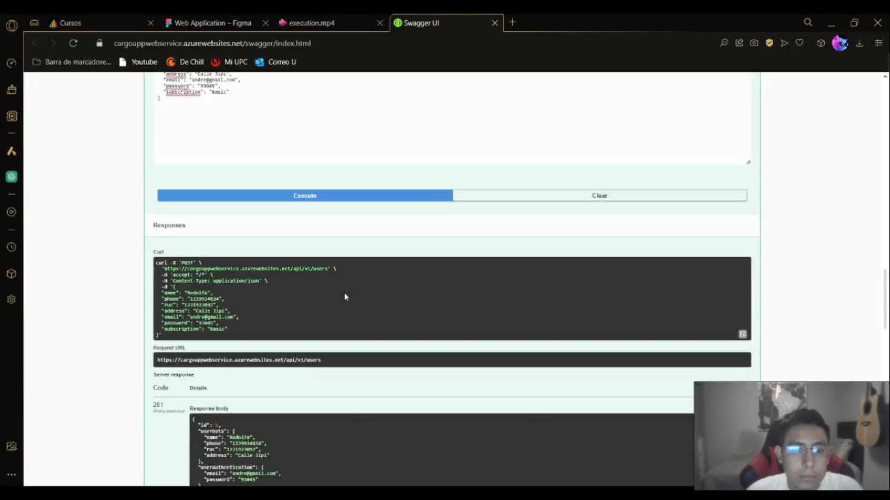

#### 5.2.3.6. Services Documentation Evidence for Sprint Review.
Para este sprint, hemos implementado una primera versión de la API para nuestro proyecto con la mayoría de endpoints necesarios para su funcionamiento.

Enlace al repositorio de Web Services: https://github.com/Grupo-2-Apps-Web/Web-Services

|Método|Endpoint (https://cargoappwebservice.azurewebsites.net)|Descripción|
|--|--|--|
|GET|/api/v1/users|Se obtiene toda la lista de usuarios|
|GET|/api/v1/clients|Se obtiene toda la lista de clientes|
|GET|/api/v1/entrepreneurs|Se obtiene toda la lista de empresarios|
|GET|/api/v1/configurations|Se obtiene toda la lista de las configuraciones de los usuarios|
|GET|/api/v1/drivers|Se obtiene toda la lista de conductores|
|GET|/api/v1/vehicles|Se obtiene toda la lista de vehículos|
|GET|/api/v1/trips|Se obtiene toda la lista de viajes|
|GET|/api/v1/evidences|Se obtiene toda la lista de evidencias|
|GET|/api/v1/expenses|Se obtiene toda la lista de gastos|
|GET|/api/v1/alerts|Se obtiene toda la lista de las alertas|
|GET|/api/v1/ongoing-trips|Se obtiene toda la lista de viajes en progreso|
|GET|/api/v1/users/{id}|Se obtiene un usuario por ID|
|GET|/api/v1/clients/{id}|Se obtiene un cliente por ID|
|GET|/api/v1/entrepreneurs/{id}|Se obtiene un empresario por ID|
|GET|/api/v1/configurations/{id}|Se obtiene una configuración de usuario por ID|
|GET|/api/v1/drivers/{id}|Se obtiene un conductor por ID|
|GET|/api/v1/vehicles/{id}|Se obtiene un vehículo por ID|
|GET|/api/v1/trips/{id}|Se obtiene un viaje por ID|
|GET|/api/v1/evidences/{id}|Se obtiene una evidencia por ID|
|GET|/api/v1/expenses/{id}|Se obtiene un gasto por ID|
|GET|/api/v1/alerts/{id}|Se obtiene una alerta por ID|
|GET|/api/v1/ongoing-trips/{id}|Se obtiene un viaje en progreso por ID|
|PUT|/api/v1/users/{id}|Se actualiza la información de un usuario por ID|
|PUT|/api/v1/configurations/{id}|Se actualiza la información de una configuración de un usuario por ID|
|PUT|/api/v1/drivers/{id}|Se actualiza la información de un conductor por ID|
|PUT|/api/v1/vehicles/{id}|Se actualiza la información de un vehículo por ID|
|PUT|/api/v1/trips/{id}|Se actualiza la información de un viaje por ID|
|PUT|/api/v1/evidences/{id}|Se actualiza la información de una evidencia por ID|
|PUT|/api/v1/expenses/{id}|Se actualiza la información de un gasto por ID|
|PUT|/api/v1/ongoing-trips/{id}|Se actualiza la información de un viaje en progreso por ID|
|POST|/api/v1/users|Se publica un nuevo usuario|
|POST|/api/v1/clients|Se publica un nuevo cliente|
|POST|/api/v1/entrepreneurs|Se publica un nuevo empresario|
|POST|/api/v1/configurations|Se publica una nueva configuración de un usuario|
|POST|/api/v1/drivers|Se publica un nuevo conductor|
|POST|/api/v1/vehicles|Se publica un nuevo vehículo|
|POST|/api/v1/trips|Se publica un nuevo viaje|
|POST|/api/v1/evidences|Se publica una nueva evidencia|
|POST|/api/v1/expenses|Se publica un nuevo gasto|
|POST|/api/v1/alerts|Se publica una nueva alerta|
|POST|/api/v1/ongoing-trips|Se publica un nuevo viaje en progreso|

**EVIDENCIAS**

**User BC Endpoints**

**Endpoint: https://cargoappwebservice.azurewebsites.net/api/v1/users**

|Método|GET|
|--|--|
|Parámetros|Ninguno|
|Resultado||

|Método|POST|
|--|--|
|Parámetros|Body: name, phone, ruc, address, email, password y subscription|
|Resultado|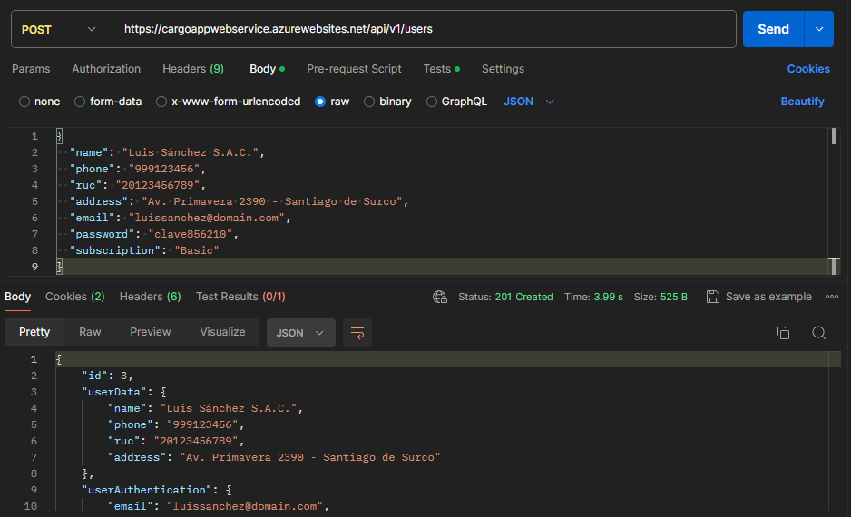|

**Endpoint: https://cargoappwebservice.azurewebsites.net/api/v1/users/{userId}**

|Método|GET|
|--|--|
|Parámetros|{userId}: Id del usuario|
|Resultado||

|Método|PUT|
|--|--|
|Parámetros|{userId}: Id del usuario, Body: name, phone, ruc, address, email, password y subscription|
|Resultado||

**Endpoint: https://cargoappwebservice.azurewebsites.net/api/v1/clients**

|Método|POST|
|--|--|
|Parámetros|Body: userId|
|Resultado||

|Método|GET|
|--|--|
|Parámetros|Ninguno|
|Resultado||

**Endpoint: https://cargoappwebservice.azurewebsites.net/api/v1/clients/{clientId}**

|Método|GET|
|--|--|
|Parámetros|{clientId}: Id del cliente|
|Resultado||

**Endpoint: https://cargoappwebservice.azurewebsites.net/api/v1/entrepreneurs**

|Método|POST|
|--|--|
|Parámetros|Body: userId,logoImage|
|Resultado||

|Método|GET|
|--|--|
|Parámetros|Ninguno|
|Resultado||

**Endpoint: https://cargoappwebservice.azurewebsites.net/api/v1/entrepreneurs/{entrepreneurId}**

|Método|GET|
|--|--|
|Parámetros|{entrepreneurId}: id del entrepreneur|
|Resultado||

**Endpoint: https://cargoappwebservice.azurewebsites.net/api/v1/configurations**

|Método|POST|
|--|--|
|Parámetros|Body: userId, theme, view, allowDataCollection, updateDataSharing|
|Resultado||

|Método|GET|
|--|--|
|Parámetros|Ninguno|
|Resultado||

**Endpoint: https://cargoappwebservice.azurewebsites.net/api/v1/configurations/{configurationId}**

|Método|PUT|
|--|--|
|Parámetros|{configurationId}: Id de la configuración, Body: theme, view, allowDataCollection, updateDataSharing|
|Resultado||

|Método|GET|
|--|--|
|Parámetros|{configurationId}: Id de la configuración|
|Resultado||

**Registration BC Endpoints**

**Endpoint: https://cargoappwebservice.azurewebsites.net/api/v1/vehicles**

|Método|GET|
|--|--|
|Parámetros|Ninguno|
|Resultado||

|Método|POST|
|--|--|
|Parámetros| Body: model, plate, tractorPlate, maxLoad y volume|
|Resultado||

**Endpoint: https://cargoappwebservice.azurewebsites.net/api/v1/vehicles/{vehicleId}**

|Método|GET|
|--|--|
|Parámetros|{vehicleId}: Id del vehículo|
|Resultado||

|Método|PUT|
|--|--|
|Parámetros|{vehicleId}: Id del vehículo, Body: model, plate, tractorPlate, maxLoad y volume|
|Resultado||

**Endpoint: https://cargoappwebservice.azurewebsites.net/api/v1/drivers**

|Método|GET|
|--|--|
|Parámetros|Ninguno|
|Resultado||

|Método|POST|
|--|--|
|Parámetros|Body: name, dni, license y contactNumber|
|Resultado||

**Endpoint: https://cargoappwebservice.azurewebsites.net/api/v1/drivers/{driverId}**

|Método|GET|
|--|--|
|Parámetros|{driverId}: Id del conductor|
|Resultado||

|Método|PUT|
|--|--|
|Parámetros|{driverId}: Id del conductor, Body: name, dni, license y contactNumber|
|Resultado||

**Endpoint: https://cargoappwebservice.azurewebsites.net/api/v1/trips**

|Método|GET|
|--|--|
|Parámetros|Ninguno|
|Resultado||

|Método|POST|
|--|--|
|Parámetros|Body: name, type, weight, loadLocation, loadDate, unloadLocation, unloadDate, driverId, vehicleId, clientId, entrepreneurId|
|Resultado||

**Endpoint: https://cargoappwebservice.azurewebsites.net/api/v1/trips/{tripId}**

|Método|GET|
|--|--|
|Parámetros|{tripId}: Id del viaje|
|Resultado||

|Método|PUT|
|--|--|
|Parámetros|{tripId}: Id del viaje, Body: name, type, weight, loadLocation, loadDate, unloadLocation, unloadDate, driverId, vehicleId, clientId, entrepreneurId|
|Resultado||

**Endpoint: https://cargoappwebservice.azurewebsites.net/api/v1/expenses**

|Método|GET|
|--|--|
|Parámetros|Ninguno|
|Resultado||

|Método|POST|
|--|--|
|Parámetros|Body: fuelAmount, fuelDescription, viaticsAmount, viaticsDescription, tollsAmount, tollsDescription, tripId|
|Resultado||

**Endpoint: https://cargoappwebservice.azurewebsites.net/api/v1/expenses/{expenseId}**

|Método|GET|
|--|--|
|Parámetros|{expenseId}: Id del expense|
|Resultado||

|Método|PUT|
|--|--|
|Parámetros|{expenseId}: Id del expense, Body: fuelAmount, fuelDescription, viaticsAmount, viaticsDescription, tollsAmount, tollsDescription, tripId|
|Resultado||

**Endpoint: https://cargoappwebservice.azurewebsites.net/api/v1/evidences**

|Método|GET|
|--|--|
|Parámetros|Ninguno|
|Resultado||

|Método|POST|
|--|--|
|Parámetros|Body: link, tripId|
|Resultado||

**Endpoint: https://cargoappwebservice.azurewebsites.net/api/v1/evidences/{evidenceId}**

|Método|GET|
|--|--|
|Parámetros|{evidenceId}: Id del evidence|
|Resultado||

|Método|PUT|
|--|--|
|Parámetros|{evidenceId}: Id del evidence, Body: link, tripId|
|Resultado||

**Endpoint: https://cargoappwebservice.azurewebsites.net/api/v1/ongoing-trips**

|Método|GET|
|--|--|
|Parámetros|Ninguno|
|Resultado||

|Método|POST|
|--|--|
|Parámetros|Body: latitude, longitude, speed, distance, tripId|
|Resultado||

**Endpoint: https://cargoappwebservice.azurewebsites.net/api/v1/ongoing-trips/{ongoingTripId}**

|Método|GET|
|--|--|
|Parámetros|{ongoingTripId}: Id del viaje en progreso|
|Resultado||

|Método|PUT|
|--|--|
|Parámetros|{ongoingTripId}: Id del viaje en progreso, Body: latitude, longitude, speed, distance|
|Resultado||

**Endpoint: https://cargoappwebservice.azurewebsites.net/api/v1/alerts**

|Método|GET|
|--|--|
|Parámetros|Ninguno|
|Resultado||

|Método|POST|
|--|--|
|Parámetros|Body: title(20), description, date, tripId|
|Resultado||

**Endpoint: https://cargoappwebservice.azurewebsites.net/api/v1/alerts/{alertId}**

|Método|GET|
|--|--|
|Parámetros|{alertId}: Id del viaje en progreso|
|Resultado||

#### 5.2.3.7. Software Deployment Evidence for Sprint Review.

Se decidió desplegar el Web Service en Microsoft Azure. Para ello, se instaló el plugin de Azure para publicar el Web Service en Rider y se conectó a Azure con las credenciales necesarias.

Asimismo, se configuró la aplicación para crear un Web App y se seleccionó Run.

Al seleccionar Run, se creó la Web App y se subieron los archivos necesarios.

Luego, se comprobó la correcta creación del Web Service, en Postman accediendo al endpoint /api/v1/trips con el método http Get y el enlace https://cargoappwebservice.azurewebsites.net/api/v1/trips

De esta manera, se comprobó que se implementó correctamente la aplicación ya que devolvió 200 OK y la lista de trips en la base de datos.

Asimismo, también se logra visualizar la vista de Swagger de la API a través del navegador en el siguiente enlace: https://cargoappwebservice.azurewebsites.net/swagger/index.html

Por otro lado, también se desplegó el Frontend Web Applications con la conexión al Web Service y las mejoras realizadas en este Sprint. Para ello, primero se volvió a ejecutar el comando npm run build.

Se actualizan los paquetes de firebase-tools con npm install.

Se comprueba que se esté logueado en firebase para el despliegue.

Luego, se empieza con el despliegue utilizando el comando firebase init hosting.

Para terminar con el despliegue luego de tener el proyecto con Firebase se utiliza el comando firebase deploy --only hosting

Finalmente, se comprueba que el proyecto se haya desplegado correctamente entrando al URL: <https://cargoapp-demo.web.app>

#### 5.2.3.8. Team Collaboration Insights during Sprint.

Para la elaboración del Frontend y Backend, nos repartimos las tareas entre cada miembro así como se especifica en el Sprint Backlog 3, y cada uno trabajó en las ramas feature correspondientes, para luego ir realizando los merge con la rama develop. Asimismo, nos reunimos de forma virtual a través de Google Meet para revisar juntos los avances y los merges realizados para verificar que todo funciona acorde a lo esperado.

**Commits trabajados en Frontend**

**Commits trabajados en Backend**

**Gráfico de estadísticas de commits**

**Gráfico de red**

### 5.2.4. Sprint 4.

#### 5.2.4.1. Sprint Planning 4.

#### 5.2.4.2. Sprint Backlog 4.

#### 5.2.4.3. Development Evidence for Sprint Review.

#### 5.2.4.4. Testing Suite Evidence for Sprint Review.

#### 5.2.4.5. Execution Evidence for Sprint Review.

#### 5.2.4.6. Services Documentation Evidence for Sprint Review.

Para este sprint, hemos implementado la segunda versión de la API para nuestro proyecto con la totalidad de endpoints para el correcto funcionamiento de nuestra aplicación.

Enlace al repositorio de Web Services: https://github.com/Grupo-2-Apps-Web/Web-Services

|Método|Endpoint (https://cargoappwebservice.azurewebsites.net)|Descripción|
|--|--|--|
|POST|/api/v1/alerts|Se publica una nueva alerta|
|GET|/api/v1/alerts|Se obtiene toda la lista de las alertas|
|GET|/api/v1/alerts/{alertId}|Se obtiene una alerta por ID|
|POST|/api/v1/authentication/sign-in|Se inicia sesión con un usuario y contraseña|
|POST|/api/v1/authentication/sign-up|Se crea una cuenta con un usuario y contraseña|
|POST|/api/v1/clients|Se publica un nuevo cliente|
|GET|/api/v1/clients|Se obtiene toda la lista de clientes|
|GET|/api/v1/clients/{clientId}|Se obtiene un cliente por ID|
|PUT|/api/v1/clients/{clientId}|Se actualiza un cliente por ID|
|GET|/api/v1/clients/{clientId}/trips|Se obtienen los viajes del cliente por su ID|
|POST|/api/v1/configurations|Se publica una nueva configuración de un usuario|
|GET|/api/v1/configurations|Se obtiene toda la lista de las configuraciones de los usuarios|
|PUT|/api/v1/configurations/{configurationId}|Se actualiza la información de una configuración de un usuario por ID|
|GET|/api/v1/configurations/{configurationId}|Se obtiene una configuración de usuario por ID|
|POST|/api/v1/drivers|Se publica un nuevo conductor|
|GET|/api/v1/drivers|Se obtiene toda la lista de conductores|
|PUT|/api/v1/drivers/{driverId}|Se actualiza la información de un conductor por ID|
|GET|/api/v1/drivers/{driverId}|Se obtiene un conductor por ID|
|POST|/api/v1/entrepreneurs|Se publica un nuevo empresario|
|GET|/api/v1/entrepreneurs|Se obtiene toda la lista de empresarios|
|GET|/api/v1/entrepreneurs/{entrepreneurId}|Se obtiene un empresario por ID|
|PUT|/api/v1/entrepreneurs/{entrepreneurId}|Se actualiza un cliente por ID|
|GET|/api/v1/entrepreneurs/{entrepreneurId}/drivers|Se obtienen los conductores designados del empresario por su ID|
|GET|/api/v1/entrepreneurs/{entrepreneurId}/vehicles|Se obtienen los vehiculos designados del empresario por su ID|
|GET|/api/v1/entrepreneurs/{entrepreneurId}/trips|Se obtienen los viajes del empresario por su ID|
|POST|/api/v1/evidences|Se publica una nueva evidencia|
|GET|/api/v1/evidences|Se obtiene toda la lista de evidencias|
|PUT|/api/v1/evidences/{evidenceId}|Se actualiza la información de una evidencia por ID|
|GET|/api/v1/evidences/{evidenceId}|Se obtiene una evidencia por ID|
|POST|/api/v1/expenses|Se publica un nuevo gasto|
|GET|/api/v1/expenses|Se obtiene toda la lista de gastos|
|PUT|/api/v1/expenses/{expenseId}|Se actualiza la información de un gasto por ID|
|GET|/api/v1/expenses/{expenseId}|Se obtiene un gasto por ID|
|POST|/api/v1/ongoing-trips|Se publica un nuevo viaje en progreso|
|GET|/api/v1/ongoing-trips|Se obtiene toda la lista de viajes en progreso|
|PUT|/api/v1/ongoing-trips/{ongoingTripId}|Se actualiza la información de un viaje en progreso por ID|
|GET|/api/v1/ongoing-trips/{ongoingTripId}|Se obtiene un viaje en progreso por ID|
|POST|/api/v1/trips|Se publica un nuevo viaje|
|GET|/api/v1/trips|Se obtiene toda la lista de viajes|
|PUT|/api/v1/trips/{tripId}|Se actualiza la información de un viaje por ID|
|GET|/api/v1/trips/{tripId}|Se obtiene un viaje por ID|
|GET|/api/v1/trips/{tripId}/alerts|Se obtiene las alertas de un viaje por ID del viaje|
|GET|/api/v1/trips/{tripId}/ongoingtrips|Se obtiene la información de un viaje en progreso por su ID del viaje|
|GET|/api/v1/trips/{tripId}/evidences|Se obtiene la evidencia fotográfica de un viaje por ID del viaje|
|GET|/api/v1/trips/{tripId}/expenses|Se obtiene la información relacionada a gastos de un viaje por ID del viaje|
|GET|/api/v1/users/{userId}|Se obtiene un usuario por ID|
|GET|/api/v1/users|Se obtiene toda la lista de usuarios|
|GET|/api/v1/users/{userId}/clients|Se obtiene la información de cliente de un usuario por ID|
|GET|/api/v1/users/{userId}/entrepreneurs|Se obtiene la información de entrepreneur de un usuario por ID|
|POST|/api/v1/vehicles|Se publica un nuevo vehículo|
|GET|/api/v1/vehicles|Se obtiene toda la lista de vehículos|
|PUT|/api/v1/vehicles/{userId}|Se actualiza la información de un vehículo por ID|
|GET|/api/v1/vehicles/{userId}|Se obtiene un vehículo por ID|

**EVIDENCIAS**

Registration BC Endpoints

**Endpoint: https://cargoappwebservice.azurewebsites.net/api/v1/trips/{tripId}/alerts**

|Método|GET|
|--|--|
|Parámetros|Ninguno|
|Resultado||

**Endpoint: https://cargoappwebservice.azurewebsites.net/api/v1/trips/{tripId}/ongoing-trips**

|Método|GET|
|--|--|
|Parámetros|Ninguno|
|Resultado||

**Endpoint: https://cargoappwebservice.azurewebsites.net/api/v1/trips/{tripId}/evidences**

|Método|GET|
|--|--|
|Parámetros|Ninguno|
|Resultado||

#### 5.2.4.7. Software Deployment Evidence for Sprint Review.

Para el despliegue de la nueva versión del API se seleccionó el proyecto y se seleccionó la opcion Publish y la opción Azure. Para hacer el despliegue del API desde el Web Service previamente creado en Azure.

Luego, se seleccionó 'Use Existing Web App' y nuestra aplicación que creamos para el despliegue de la anterior entrega.

Al seleccionar Run, se volvió a crear el API con los archivos actualizados.

Luego, se comprobó la correcta actualización del API, accediendo a Swagger desde https://cargoappwebservice.azurewebsites.net/swagger/index.html

De esta manera, se verificó que los archivos están actualizados al estar el nuevo endpoint Authentication y las funcionaidades del IAM.

Por otro lado, también se desplegó el Frontend Web Applications con la conexión al API y las mejoras realizadas en este Sprint. Para ello, primero se volvió a ejecutar el comando npm run build.

Se actualizan los paquetes de firebase-tools con npm install y corrigieron los problemas con npm audit fix.

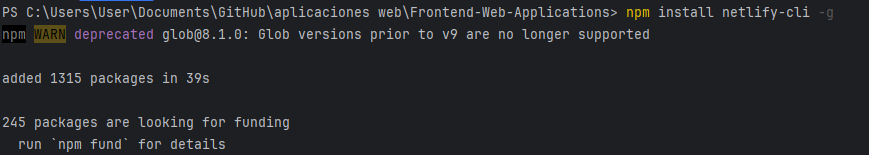

Se comprueba que se esté logueado en firebase para el despliegue.

Luego, se empieza con el despliegue utilizando el comando firebase init hosting.

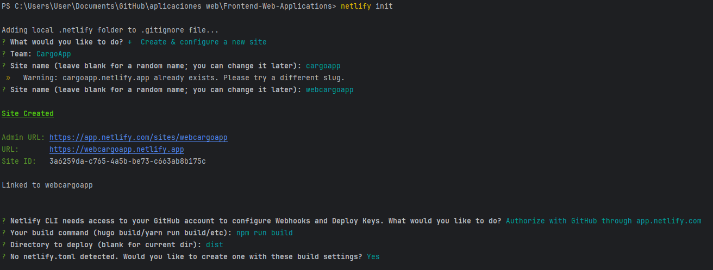

Para terminar con el despliegue luego de tener el proyecto con Firebase se utiliza el comando firebase deploy --only hosting

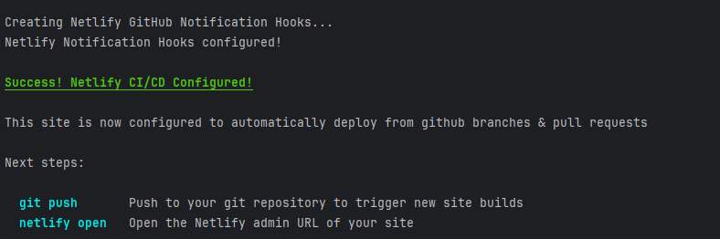

Finalmente, se comprueba que el proyecto se haya desplegado correctamente entrando al URL: https://cargoapp-demo.web.app

#### 5.2.4.8. Team Collaboration Insights during Sprint.

## 5.3. Validation Interviews.

### 5.3.1. Diseño de Entrevistas.

**Enlace a la landing page**: https://grupo-2-apps-web.github.io/Landing-Page/

**Enlace a la aplicación web**:  https://cargoapp-demo.web.app

**Para cliente**: 

<u>Sobre Landing page:</u>

1. ¿Cuál es tu impresión general de la landing page?
2. ¿Es fácil comprender la naturaleza de nuestro producto al revisar la página?
3. ¿Los elementos visuales, como imágenes y colores, son atractivos y relevantes?
4. ¿Consideras que la información proporcionada es clara y concisa, o percibes que hay demasiada o muy poca?
5. ¿El llamado a la acción es directo y convincente?
6. ¿La navegación resulta intuitiva y fácil de usar?
7. ¿Qué opinas sobre la organización y disposición de los elementos en la página?
8. ¿El contenido te brinda confianza en la calidad del producto ofrecido?
9. ¿Identificas algún aspecto confuso o que no contribuya al valor de la página?
10. ¿Qué sugerencias tendrías para mejorar la experiencia de usuario en la Landing Page estática de la aplicación, especialmente en cuanto a la navegación y presentación de información?

<u>Sobre Web application:</u>

1. ¿Qué opinas sobre la disposición y organización de la información en la aplicación para el seguimiento en tiempo real de los envíos?
2. ¿Encuentras la interfaz de usuario intuitiva y fácil de usar?
3. ¿Qué opinas de la experiencia de la gestión de alertas durante el transporte?
4. ¿Cómo describirías la experiencia de navegación al acceder al historial completo de tus envíos en la aplicación?
5. ¿Encuentras la función de búsqueda de envíos fácil de usar y eficiente en la aplicación?
6. ¿Consideras que la personalización de la visualización en la aplicación cumple con tus expectativas y necesidades?
7. ¿Los elementos visuales, como imágenes y colores, son atractivos y relevantes?
8. ¿Qué sugerencias tendrías para mejorar la experiencia de usuario en la Web Application, especialmente en cuanto a la navegación y presentación de información?

**Para empresario de gestión logística:**

<u>Sobre Landing page:</u>

1. ¿Cuál es tu impresión general de la landing page?
2. ¿Es fácil comprender la naturaleza de nuestro producto al revisar la página?
3. ¿Los elementos visuales, como imágenes y colores, son atractivos y relevantes?
4. ¿Consideras que la información proporcionada es clara y concisa, o percibes que hay demasiada o muy poca?
5. ¿El llamado a la acción es directo y convincente?
6. ¿La navegación resulta intuitiva y fácil de usar?
7. ¿Qué opinas sobre la organización y disposición de los elementos en la página?
8. ¿El contenido te brinda confianza en la calidad del producto ofrecido?
9. ¿Identificas algún aspecto confuso o que no contribuya al valor de la página?
10. ¿Qué sugerencias tendrías para mejorar la experiencia de usuario en la Landing Page estática de la aplicación, especialmente en cuanto a la navegación y presentación de información?

<u>Sobre Web application:</u>

1. ¿Qué opinas sobre la disposición y organización de la información en la aplicación para el seguimiento en tiempo real de los envíos?
2. ¿Encuentras la interfaz de usuario intuitiva y fácil de usar con la gestión de alertas durante la entrega de tus envíos?
3. ¿Qué elementos visuales o de diseño crees que podrían mejorar la experiencia de la gestión de alertas durante el transporte?
4. ¿Cómo describirías la experiencia de registro de envíos en la aplicación?
5. ¿Encuentras la función de búsqueda de envíos fácil de usar y eficiente en la aplicación?
6. ¿Consideras que la información mostrada de los clientes en la aplicación es suficiente para cubrir tus necesidades?
7. ¿Los elementos visuales, como imágenes y colores, son atractivos y relevantes?
8. ¿Qué sugerencias tendrías para mejorar la experiencia de usuario en la aplicación web, especialmente en cuanto a la navegación y presentación de información?

### 5.3.2. Registro de Entrevistas.

**Entrevista 1 - Cliente que requiere transporte**

**Entrevistador:** Salvador Salinas

**Entrevistado:** Anderson Gonza

**Link de la entrevista:** [Entrevista de Validación 1](https://youtu.be/qnlm6n4S70k)

**Resumen de la entrevista:** Para esta entrevista de validación con Anderson, se le mostró lo trabajado en la Landing Page y Web Application. Él nos comenta que le parece agradable los elementos visuales y organización usada, así como los colores, imágenes y estilos. Asimismo, comentó que la Landing Page debería mostrar un video de introducción. Igualmente, le gustó la funcionalidad de la vista en tiempo real y las alertas ya que brinda más transparencia durante el proceso del envío de transporte de carga.

-----

**Entrevista 2 - Cliente que requiere transporte**

**Entrevistador:** Piero Delgado

**Entrevistado:** Joaquin Rivadeneyra

**Link de la entrevista:** [Entrevista de Validación 2](https://youtu.be/QeZ4ZToAG_E)

**Resumen de la entrevista:**
Para esta entrevista de validación con Joaquin, se le mostró lo trabajado en la Landing Page y Web Application. Él nos comenta que le parece agradable los elementos visuales y organización usada en la parte de la aplicación web y le parece que las funcionalidades son muy útiles especialmente el seguimiento a tiempo real. Por otro lado, menciona que deberíamos mejorar la presentación del Landing page con una mejor disposición de los elementos.

-----

**Entrevista 3 - Cliente que requiere transporte**

**Entrevistador:** Andre Valverde

**Entrevistado:** Rodrigo Guerra

**Link de la entrevista:** [Entrevista de Validación 3](https://youtu.be/7HYOnvIA5Ks)

**Resumen de la entrevista:**
El entrevistado destacó que la landing page es profesional, con información clara y bien balanceada. Los elementos visuales son atractivos y la navegación es intuitiva. El llamado a la acción es convincente y el contenido genera confianza. Sugirió incluir testimonios de clientes y un video explicativo para mejorar la página. Sobre la web application, el entrevistado señaló que la información está bien organizada y la interfaz es fácil de usar. La gestión de alertas es eficiente y la función de búsqueda es rápida y efectiva. La personalización cumple con sus expectativas y los elementos visuales son relevantes

-----

**Entrevista 4 - Empresa de gestión logística de transporte**

**Entrevistador:** Christian Matos

**Entrevistado:** Valeria Cardenas

**Link de la entrevista:** [Entrevista de Validación 4](https://youtu.be/z3lqt4pCalk)

**Resumen de la entrevista:** 
En la entrevista con Valeria Cárdenas, se le presentó el trabajo en la Landing Page y la Aplicación Web. Valeria mencionó que los elementos visuales y la organización de la aplicación web le parecieron agradables, y destacó la utilidad de las funcionalidades, especialmente el seguimiento en tiempo real. No obstante, sugirió que deberíamos mejorar la presentación de la Landing Page reorganizando mejor los elementos.

-----

**Entrevista 5 - Empresa de gestión logística de transporte**

**Entrevistador:** Sebastian Paredes

**Entrevistado:** Miriam Puente

**Link de la entrevista:** [Entrevista de Validación 5](https://youtu.be/VTZnFWNc3bo)

**Resumen de la entrevista:** 
Durante la entrevista con la Sra. Miriam Puente, se le presentó tanto la landing page como la aplicación web, explicando el contenido y propósito de cada sección, así como la información mostrada. Ella comentó que los elementos visuales y la organización de la aplicación web eran adecuados, la navegación era fluida y la interfaz de usuario resultaba fácil de comprender. Además, destacó la utilidad de las funcionalidades, especialmente el poder agregar alertas para el cliente y de esta manera no preocuparse, ya que en este tiempo se ha incrementado la delincuencia y las estafas. Sin embargo, sugirió mejorar las alertas para que no se tengan que hacer constantemente y haya una manera de generarlas automáticamente.

-----

**Entrevista 6 - Empresa de gestión logística de transporte**

**Entrevistador:** Sebastian Paredes

**Entrevistado:** Roberto Paredes

**Link de la entrevista:** [Entrevista de Validación 6](https://youtu.be/vobHLgBs-wc)

**Resumen de la entrevista:** 
Durante la entrevista con el Sr. Roberto Paredes, se le presentó tanto la landing page como la aplicación web, explicando el contenido y propósito de cada sección, así como la información mostrada. Él comentó que los elementos visuales y la organización de la aplicación web eran adecuados, la navegación era fluida, y la interfaz de usuario resultaba fácil de comprender. Además, destacó la utilidad de las funcionalidades, especialmente el seguimiento en tiempo real, que aporta mayor confianza a los clientes. Sin embargo, sugirió agregar más información sobre la aplicación en la landing page.

### 5.3.3. Evaluaciones según heurísticas.
**Site o App a Evaluar:**
CargoApp
**Tareas a evaluar:**
El alcance de esta evaluación incluye la revisión de usabilidad de las siguientes tareas:
1. Creación de usuario
2. Inicio de sesión
3. Visualización de historial de viajes
4. Filtros en historial de viajes
5. Visualización de viajes en progreso
6. Visualización de información de gastos, vehículos y conductores
7. Registro de un nuevo viaje
8. Registro de gastos, vehículos y conductores
9. Visualización de alertas
10. Configuración de tipo de vista y tema
11. Elección de plan de suscripción

No están incluidas en esta versión de la evaluación las siguientes tareas:
1. Landing Page
2. Recuperación de cuenta

**ESCALA DE SEVERIDAD:**
Los errores serán puntuados tomando en cuenta la siguiente escala de severidad
| Nivel | Descripción |
|-------| ------------|
| 1 | Problema superficial: puede ser fácilmente superado por el usuario o ocurre con muy poca frecuencia. No necesita ser arreglado a no ser que exista disponibilidad de tiempo. |
| 2 | Problema menor: puede ocurrir un poco más frecuentemente o es un poco más difícil de superar para el usuario. Se le debería asignar una prioridad baja resolverlo de cara al siguiente reléase. |
| 3 | Problema mayor: ocurre frecuentemente o los usuarios no son capaces de resolverlos. Es importante que sean corregidos y se les debe asignar una prioridad alta. |
| 4 | Problema muy grave: un error de gran impacto que impide al usuario continuar con el uso de la herramienta. Es imperativo que sea corregido antes del lanzamiento. |

**TABLA DE RESUMEN:**
| #   | Problema | Escala de severidad | Heurística/principio violada(o)|
|-----|----------|---------------------|-------------------|
| 1 | Usuario logueado sigue viendo la pantalla de iniciar sesión | 3 | Usability: Usabilidad y control del usuario   |
| 2 | Incorrecta visualización de información de un viaje en progreso en celulares | 3 | Inclusive Design: Proporciona experiencias comparables |
| 3 | Incorrecta visualización del botón de gastos en celulares  | 3 | Inclusive Design: Proporciona experiencias comparables |
| 4 | Incorrecta visualización de la vista de configuración en celulares | 3 | Inclusive Design: Proporciona experiencias comparables |
| 5 | Incorrecta visualización de la vista de suscripción en celulares | 3 | Inclusive Design: Proporciona experiencias comparables |

**DESCRIPCIÓN DE PROBLEMAS:**

**PROBLEMA #1:** Usuario logueado sigue viendo la pantalla de iniciar sesión

**Severidad:** 3

**Heurística violada:** Usability: Usabilidad y control del usuario

**Problema:** Si el usuario está logueado y va al enlace inicial de la aplicación, la aplicación no lo redirecciona a su pantalla correspondiente.

**Imagen:**

**Recomendación:** Implementar una funcionalidad que detecte si el usuario está logueado y lo lleve a su vista correspondiente.

-----

**PROBLEMA #2:** Incorrecta visualización de información de un viaje en progreso en celulares

**Severidad:** 2

**Heurística violada:** Inclusive Design: Proporciona experiencias comparables

**Problema:** Si el usuario está entrando desde un dispositivo móvil, la pantalla donde se muestra la información de un viaje en progreso no se visualiza correctamente.

**Imagen:**

**Recomendación:** Cambiar la disposición de elementos en la vista de viajes en progreso para que haya más espacio para visualizar la información.

-----

**PROBLEMA #3:** Incorrecta visualización del botón de gastos en celulares

**Severidad:** 2

**Heurística violada:** Inclusive Design: Proporciona experiencias comparables

**Problema:** Si el usuario está entrando desde un dispositivo móvil, el botón para ver la información de un gasto no se visualiza completamente.

**Imagen:**

**Recomendación:** Centrar el botón de gastos y aumentar su ancho para que todo el texto esté dentro del recuadro.

-----

**PROBLEMA #4:** Incorrecta visualización de la vista de configuración en celulares

**Severidad:** 2

**Heurística violada:** Inclusive Design: Proporciona experiencias comparables

**Problema:** Si el usuario está entrando desde un dispositivo móvil, la vista de configuración no se visualiza correctamente.

**Imagen:**

**Recomendación:** Reducir el tamaño de los botones de suscripción para que todo quepa en el dispositivo.

-----

**PROBLEMA #5:** Incorrecta visualización de la vista de suscripción en celulares

**Severidad:** 2

**Heurística violada:** Inclusive Design: Proporciona experiencias comparables

**Problema:** Si el usuario está entrando desde un dispositivo móvil, la vista de selección de suscripción no se visualiza correctamente.

**Imagen:**

**Recomendación:** Cambiar la disposición de elementos en la vista de suscripción para que haya más espacio para visualizar la información.

## 5.4. Video About-the-Product.
En el vídeo se proporciona información sobre el producto CargoApp. Se mencionan las diferentes funcionalidades de la aplicación como son la visualización de envíos en tiempo real, alertas, estadísticas, etc.

Screenshot del video: 

**Enlace al vídeo de YouTube:** [Video About-the-Product Youtube](https://youtu.be/xmUHIVYzkBY)

**Enlace al vídeo de Microsoft Stream:** [Video About-The-Product Microsoft Stream](https://upcedupe-my.sharepoint.com/:v:/g/personal/u202210749_upc_edu_pe/ESgFUp5LxYdOufQGHAU0VgoBJhXBsounIy90LCYn8rD-NQ)

**Duración del vídeo:** 2:42

# Conclusiones

## Conclusiones y Recomendaciones

Gracias al proceso Lean UX, hemos logrado identificar los segmentos objetivos, nuestros competidores y las principales necesidades del mercado. Así es como desde que formulamos los Problem Statements hasta la elaboración de todo el Lean UX Canvas, cada paso nos permitió mejorar la eficiencia y la agilidad en el desarrollo de la aplicación.

Asimismo, realizamos una investigación de mercado, incluyendo entrevistas para comprender las necesidades de nuestros segmentos objetivo, y a partir de estas, es que logramos comprender los puntos que debemos agregar a nuestra aplicación para brindar el máximo valor.

Entre otras actividades realizadas, incluimos los User Persona, Empathy Map, As-Is y To-Be Scenario para ponernos en perspectiva de nuestros usuarios principales. Y gracias a esto, pudimos formular las historias de usuario y formar el Product Backlog, el cual es el corazón de nuestro proyecto.

Luego establecimos los estilos a utilizar para nuestro producto, incluyendo la tipografía, paleta de colores, íconos, sistemas de organización, entre otros. Con ello, pudimos hacer un prototipo funcional de nuestra aplicación y tener un modelo de diseño del cual guiarnos durante el desarrollo.

## Video About The Team

En el video About-The-Team cada miembro de la Startup ha mencionado cuales han sido sus roles en el desarrollo de este trabajo, que objetivos han alcanzado y como han desarrollado el Student Outcome a lo largo del proyecto.

Screenshot del video: 

**Enlace al vídeo de YouTube:** [Video About-the-Team Youtube](https://youtu.be/lAXDyMd7ILY)

**Enlace al vídeo de Microsoft Stream:** [Video About-The-Team Microsoft Stream](https://upcedupe-my.sharepoint.com/:v:/g/personal/u202210749_upc_edu_pe/EaS9UAiGhk9MrSqst5kX-CkB7IAFHrYhOms-haLiANwNVA?e=LEvjmV)

**Duración del vídeo:** 6:22

# Bibliografía

BillWagner. (2023). *.NET documentation C# Coding Conventions - C#.* Microsoft Learn. https://learn.microsoft.com/en-us/dotnet/csharp/fundamentals/coding-style/coding-conventions

*Google HTML/CSS Style Guide.* (s.f.). https://google.github.io/styleguide/htmlcssguide.html

*HTML style guide and coding conventions.* (s.f.). https://www.w3schools.com/html/html5_syntax.asp 

*JavaScript Style Guide.* (s.f.). https://www.w3schools.com/js/js_conventions.asp

Mollahosseini, A. (2021). *Make your Gherkin Specifications More Readable.* BDD Framework for NET. https://specflow.org/gherkin/gherkin-conventions-for-readable-specifications/

# Anexos

**Videos de exposiciones**

Exposición TB1: [upc-pre-202401-si730-sw53-cargowatch-tb1](https://upcedupe-my.sharepoint.com/personal/u202210749_upc_edu_pe/_layouts/15/stream.aspx?id=%2Fpersonal%2Fu202210749%5Fupc%5Fedu%5Fpe%2FDocuments%2Fupc%2Dpre%2D202401%2Dsi730%2Dsw53%2Dcargowatch%2Dtb1%2Emp4&ga=1&referrer=StreamWebApp%2EWeb&referrerScenario=AddressBarCopied%2Eview)

Exposición TP1: [upc-pre-202401-si730-sw53-cargowatch-tp1](https://upcedupe-my.sharepoint.com/:v:/g/personal/u202210749_upc_edu_pe/EbxZLzpnOJVAiGzxtUBHOB8B3hI80bMJ8q-0UCbmkMhqaw?e=TvhZJc)

Exposición TB2: [upc-pre-202401-si730-sw53-cargowatch-tb2](https://upcedupe-my.sharepoint.com/:v:/g/personal/u202210749_upc_edu_pe/ES2vJozwtD5EtN3f4s8zGz8BSFFibXU3HNc0gUXep5dFMQ?e=zHULkU)